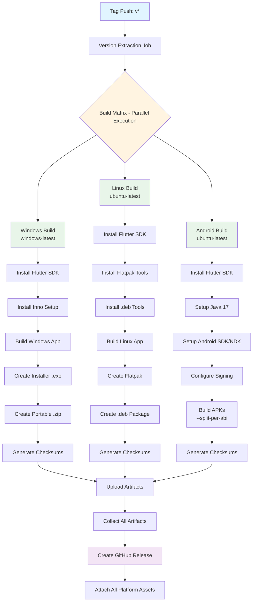

# GitHub Actions Workflows

This directory contains automated CI/CD workflows for CloudToLocalLLM.

## Workflows

### 🖥️ build-release.yml - Multi-Platform Application Builds

**Purpose**: Builds applications for Windows, Linux, and Android platforms and creates GitHub releases

**Triggers**:
- Push tags matching `v*` (e.g., `v4.5.0`)
- Manual workflow dispatch

**What it does**:
1. Extracts version information from `pubspec.yaml` or git tag
2. Builds applications for all platforms in parallel using GitHub-hosted runners
3. Installs dependencies automatically (Flutter SDK, platform-specific tools)
4. Creates platform-specific packages (installers, portable, Flatpak, .deb, APKs)
5. Generates SHA256 checksums for security verification
6. Creates GitHub release with all platform artifacts

**Supported Platforms**:
- ✅ **Windows** - Installer (.exe) and portable (.zip) - **ENABLED**
- ✅ **Linux** - Flatpak and .deb packages - **ENABLED**
- ✅ **Android** - Multi-architecture APKs (ARM64, ARMv7, x86_64) - **ENABLED**

**Infrastructure**:
- **Runners**: `windows-latest` (Windows), `ubuntu-latest` (Linux & Android) - GitHub-hosted
- **Cost**: $0/month (free for public repositories)
- **Build Time**: See [Build Times](#build-times) section below
- **Dependencies**: Automatically installed

**How to trigger**:

```bash
# Automatic (recommended)
git tag v4.5.0
git push origin v4.5.0

# Manual via GitHub CLI
gh workflow run build-release.yml --ref main -f build_type=release

# Manual via web interface
# Go to Actions → Build Desktop Apps & Create Release → Run workflow
```

**Artifacts produced**:

*Windows*:
- `CloudToLocalLLM-Windows-{version}-Setup.exe` - Windows installer
- `cloudtolocalllm-{version}-portable.zip` - Portable package
- Corresponding `.sha256` checksum files

*Linux*:
- `cloudtolocalllm-{version}.flatpak` - Universal Flatpak package (all distributions)
- `cloudtolocalllm_{version}_amd64.deb` - Debian/Ubuntu package
- Corresponding `.sha256` checksum files

*Android*:
- `cloudtolocalllm-{version}-arm64-v8a.apk` - 64-bit ARM (most modern devices)
- `cloudtolocalllm-{version}-armeabi-v7a.apk` - 32-bit ARM (older devices)
- `cloudtolocalllm-{version}-x86_64.apk` - 64-bit x86 (emulators, tablets)
- Corresponding `.sha256` checksum files

**Platform-Specific Guides**:
- **Windows**: Native builds on `windows-latest` runner
- **Linux**: See [LINUX_BUILD_GUIDE.md](../../docs/LINUX_BUILD_GUIDE.md) for Flatpak and .deb packaging
- **Android**: See [ANDROID_BUILD_GUIDE.md](../../docs/ANDROID_BUILD_GUIDE.md) for signing setup

**Troubleshooting**: See [Build Troubleshooting Guide](../../docs/BUILD_TROUBLESHOOTING.md)


## Workflow Architecture

### Multi-Platform Build Flow



### Build Times

Expected build times for each platform (with cache):

| Platform | First Build | Cached Build | Parallel Total |
|----------|-------------|--------------|----------------|
| **Windows** | ~15-20 min | ~8-12 min | - |
| **Linux** | ~12-18 min | ~6-10 min | - |
| **Android** | ~10-15 min | ~5-8 min | - |
| **All Platforms** | ~20-25 min | ~12-15 min | ✅ Parallel |

**Notes**:
- First build includes downloading SDKs and dependencies
- Cached builds reuse Flutter SDK, pub dependencies, and platform tools
- All platforms build in parallel, so total time ≈ slowest platform
- Cache hit rate typically >80% for subsequent builds

### ☁️ deploy-aks.yml - Cloud Deployment

**Purpose**: Deploys cloud services to Azure Kubernetes Service (AKS)

**Triggers**:
- Push to `main` branch (specific paths)
- Manual workflow dispatch

**What it does**:
1. Builds Docker images for web app and API backend
2. Pushes images to Docker Hub
3. Updates AKS deployments with new images
4. Configures DNS and SSL via Cloudflare
5. Waits for rollout completion

**Required Secrets**:
- `DOCKERHUB_USERNAME` - Docker Hub username
- `DOCKERHUB_TOKEN` - Docker Hub access token
- `AZURE_CLIENT_ID` - Azure service principal client ID
- `AZURE_TENANT_ID` - Azure tenant ID
- `AZURE_SUBSCRIPTION_ID` - Azure subscription ID
- `CLOUDFLARE_API_TOKEN` - Cloudflare API token

**Deployed Services**:
- Web app: https://app.cloudtolocalllm.online
- API backend: https://api.cloudtolocalllm.online

### 🔨 build-images.yml - Docker Image Builds

**Purpose**: Builds and validates Docker images for cloud services

**Triggers**:
- Push/PR to Dockerfiles or source code

**What it does**:
1. Builds Docker images for web and API
2. Validates Kubernetes manifests
3. Pushes images to Docker Hub (on main branch)

## Cost Information

### GitHub-Hosted Runners

**Public Repositories** (Current):
- ✅ **FREE** - Unlimited minutes
- ✅ No credit card required
- ✅ No setup or maintenance

**Private Repositories**:
- Free tier: 2,000 minutes/month
- Windows runners: 2x multiplier
- Estimated cost: $0-8/month for typical usage

### Cost Comparison

| Solution | Monthly Cost | Setup | Maintenance |
|----------|-------------|-------|-------------|
| GitHub-hosted (public) | **$0** | None | None |
| GitHub-hosted (private) | ~$0-8 | None | None |
| Self-hosted runner | $0-50+ | 2-4 hrs | Ongoing |
| Cloud VM | $50-200+ | 4-8 hrs | Ongoing |


## Quick Reference

### Triggering Builds

**Desktop builds (automatic)**:
```bash
git tag v4.5.0
git push origin v4.5.0
```

**Desktop builds (manual)**:
```bash
gh workflow run build-release.yml --ref main -f build_type=release
```

**Cloud deployment (automatic)**:
```bash
git push origin main  # Triggers on specific file changes
```

### Monitoring Workflows

```bash
# List recent workflow runs
gh run list --limit 10

# View specific workflow
gh run view <run-id>

# Watch workflow in real-time
gh run watch <run-id>

# Download artifacts
gh run download <run-id>
```

### Managing Caches

```bash
# List all caches
gh cache list

# Delete specific cache
gh cache delete <cache-key>

# Delete all caches (force fresh build)
gh cache list | awk '{print $1}' | xargs -I {} gh cache delete {}
```

### Debugging Failed Builds

1. **View logs**:
   - Go to Actions → Click on failed run → Click on job → Expand steps

2. **Enable debug logging**:
   - Settings → Secrets → Add `ACTIONS_STEP_DEBUG=true`

3. **Re-run failed jobs**:
   ```bash
   gh run rerun <run-id> --failed
   ```

4. **Download logs**:
   ```bash
   gh run view <run-id> --log > workflow.log
   ```

## Documentation

- **[Build Troubleshooting Guide](../../docs/BUILD_TROUBLESHOOTING.md)** - Comprehensive troubleshooting
- **[CI/CD Setup Guide](../../docs/CICD_SETUP_GUIDE.md)** - Complete setup instructions
- **[GitHub Actions Docs](https://docs.github.com/en/actions)** - Official documentation

## Support

For issues with workflows:
1. Check [Build Troubleshooting Guide](../../docs/BUILD_TROUBLESHOOTING.md)
2. Review workflow logs in GitHub Actions
3. Open an issue with `ci/cd` label

---

**Last Updated**: 2024-11-15  
**Maintained By**: CloudToLocalLLM Team
