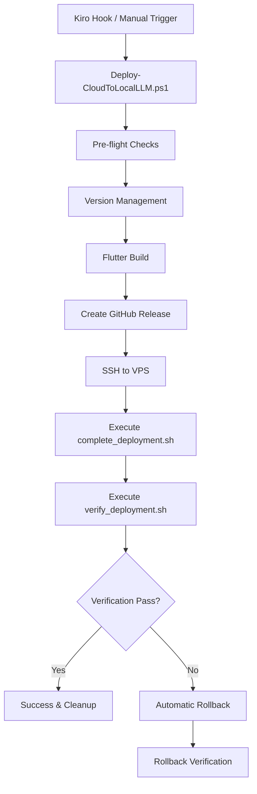

# Design Document

## Overview

The automated deployment workflow will create a unified PowerShell-based deployment system that orchestrates the complete CloudToLocalLLM deployment process from Windows development environment to Linux VPS. The design leverages existing deployment scripts and infrastructure while providing a single entry point that can be triggered manually or via Kiro hooks.

## Architecture

### High-Level Flow
```
Windows Development Environment
├── PowerShell Master Script (Deploy-CloudToLocalLLM.ps1)
├── WSL2 Integration (for Linux commands)
├── Flutter Build (Windows native)
├── Create GitHub Release
├── SSH to VPS
└── Execute existing VPS deployment scripts
    ├── complete_deployment.sh
    ├── verify_deployment.sh
    └── Git-based rollback (if needed)
```

### Component Interaction


## Components and Interfaces

### 1. Master PowerShell Script (Deploy-CloudToLocalLLM.ps1)

**Purpose**: Main orchestration script that coordinates the entire deployment workflow with complete transparency

**Key Functions**:
- Platform detection and WSL2 integration with command visibility
- Pre-flight environment validation with detailed output
- Version management coordination with file change tracking
- Flutter build execution with real-time build output streaming
- VPS connection and deployment with SSH command visibility
- Error handling and rollback coordination with detailed logging

**Transparency Features**:
- **Command Echo**: Shows exact commands before execution
- **Real-time Output**: Streams command output as it happens
- **File Tracking**: Shows which files are being modified
- **Network Visibility**: Displays SSH connections and responses
- **Timing Information**: Shows duration of each operation
- **Debug Mode**: Additional verbose information when requested

**Interface**:
```powershell
Deploy-CloudToLocalLLM.ps1 [
    -Environment <Local|Staging|Production>
    -SkipBuild
    -SkipVerification
    -Force
    -AutoRollback
    -Verbose                    # Shows additional debugging info
    -ShowCommands              # Displays commands before execution
    -StreamOutput              # Real-time output streaming (default: true)
]
```

### 2. WSL2 Integration Module

**Purpose**: Provides seamless integration with WSL2 Ubuntu 24.04 for executing Linux commands when needed

**Key Functions**:
- WSL Ubuntu 24.04 validation and initialization
- SSH key synchronization between Windows and WSL
- Linux command execution via WSL Ubuntu 24.04
- Path conversion between Windows and WSL formats

**Interface**: Uses existing BuildEnvironmentUtilities.ps1 functions:
- `Invoke-WSLCommand -DistroName 'Ubuntu-24.04'`
- `Test-WSLDistribution -DistroName 'Ubuntu-24.04'`
- `Sync-SSHKeys`

### 3. Version Management Integration

**Purpose**: Integrates with existing PowerShell version management system for automated versioning

**Key Functions**:
- Calls existing version_manager.ps1 script
- Updates all version files consistently (pubspec.yaml, version.json, etc.)
- Commits version changes to Git
- Handles version rollback if needed

**Interface**: Wraps existing version_manager.ps1 commands:
```powershell
Update-ProjectVersion -IncrementType <build|patch|minor|major>
Commit-VersionChanges
Rollback-VersionChanges
```

### 4. GitHub Release Manager

**Purpose**: Creates GitHub releases with proper versioning and release notes

**Key Functions**:
- Creates GitHub release using GitHub CLI (gh)
- Generates release notes from recent commits
- Tags the release with proper version
- Uploads build artifacts if needed

**Interface**:
```powershell
New-GitHubRelease -Version <version> -ReleaseNotes <notes>
Test-GitHubCLI
Get-ReleaseNotes -FromVersion <version> -ToVersion <version>
```

### 5. VPS Deployment Orchestrator

**Purpose**: Manages SSH connection and execution of existing VPS deployment scripts

**Key Functions**:
- SSH connection management with key authentication
- Remote script execution with proper error handling
- Log streaming from VPS to local console
- Timeout and retry logic for network operations

**Interface**:
```powershell
Invoke-VPSDeployment -VPSHost <host> -VPSUser <user> -ProjectPath <path>
Invoke-VPSVerification -VPSHost <host> -VPSUser <user>
Invoke-VPSRollback -VPSHost <host> -VPSUser <user>
```

### 5. Kiro Hook Integration

**Purpose**: Provides hook configuration for automated deployment triggers

**Hook Configuration**:
```json
{
  "name": "Deploy to VPS",
  "description": "Deploy CloudToLocalLLM to production VPS",
  "trigger": "manual",
  "command": "powershell",
  "args": ["-ExecutionPolicy", "Bypass", "-File", "scripts/Deploy-CloudToLocalLLM.ps1", "-Environment", "Production", "-Force"],
  "workingDirectory": ".",
  "timeout": 1800
}
```

## Real-Time Transparency Framework

### Live Command Execution with Streaming Output

**Real-Time Command Execution Pattern**:
```powershell
function Invoke-TransparentCommand {
    param(
        [string]$Command,
        [string]$Description,
        [string]$WorkingDirectory = $null
    )
    
    Write-Host "🔧 EXECUTING: $Description" -ForegroundColor Cyan
    Write-Host "   Command: $Command" -ForegroundColor Gray
    if ($WorkingDirectory) {
        Write-Host "   Working Directory: $WorkingDirectory" -ForegroundColor Gray
    }
    Write-Host "   Started: $(Get-Date -Format 'HH:mm:ss')" -ForegroundColor Gray
    Write-Host ""
    
    # Stream output in real-time with timestamps
    $process = Start-Process -FilePath "cmd" -ArgumentList "/c", $Command -NoNewWindow -PassThru -RedirectStandardOutput -RedirectStandardError
    
    # Read output streams in real-time
    while (!$process.HasExited) {
        if ($process.StandardOutput.Peek() -ne -1) {
            $line = $process.StandardOutput.ReadLine()
            Write-Host "$(Get-Date -Format 'HH:mm:ss') | $line" -ForegroundColor White
        }
        if ($process.StandardError.Peek() -ne -1) {
            $line = $process.StandardError.ReadLine()
            Write-Host "$(Get-Date -Format 'HH:mm:ss') | ERROR: $line" -ForegroundColor Red
        }
        Start-Sleep -Milliseconds 100
    }
    
    # Read any remaining output
    while ($process.StandardOutput.Peek() -ne -1) {
        $line = $process.StandardOutput.ReadLine()
        Write-Host "$(Get-Date -Format 'HH:mm:ss') | $line" -ForegroundColor White
    }
    while ($process.StandardError.Peek() -ne -1) {
        $line = $process.StandardError.ReadLine()
        Write-Host "$(Get-Date -Format 'HH:mm:ss') | ERROR: $line" -ForegroundColor Red
    }
    
    $process.WaitForExit()
    $exitCode = $process.ExitCode
    
    Write-Host ""
    Write-Host "   Completed: $(Get-Date -Format 'HH:mm:ss')" -ForegroundColor Gray
    Write-Host "   Exit Code: $exitCode" -ForegroundColor $(if($exitCode -eq 0){'Green'}else{'Red'})
    Write-Host ""
    
    return $exitCode
}
```

**Real-Time SSH Command Execution**:
```powershell
function Invoke-TransparentSSH {
    param(
        [string]$Host,
        [string]$User,
        [string]$Command,
        [string]$Description
    )
    
    Write-Host "🌐 SSH EXECUTING: $Description" -ForegroundColor Magenta
    Write-Host "   SSH Target: $User@$Host" -ForegroundColor Gray
    Write-Host "   Remote Command: $Command" -ForegroundColor Gray
    Write-Host "   Started: $(Get-Date -Format 'HH:mm:ss')" -ForegroundColor Gray
    Write-Host ""
    
    # Execute SSH with real-time output streaming
    $sshProcess = Start-Process -FilePath "ssh" -ArgumentList "$User@$Host", $Command -NoNewWindow -PassThru -RedirectStandardOutput -RedirectStandardError
    
    # Stream SSH output in real-time with timestamps
    while (!$sshProcess.HasExited) {
        if ($sshProcess.StandardOutput.Peek() -ne -1) {
            $line = $sshProcess.StandardOutput.ReadLine()
            Write-Host "$(Get-Date -Format 'HH:mm:ss') | REMOTE: $line" -ForegroundColor Cyan
        }
        if ($sshProcess.StandardError.Peek() -ne -1) {
            $line = $sshProcess.StandardError.ReadLine()
            Write-Host "$(Get-Date -Format 'HH:mm:ss') | REMOTE ERROR: $line" -ForegroundColor Red
        }
        Start-Sleep -Milliseconds 100
    }
    
    # Read any remaining output
    while ($sshProcess.StandardOutput.Peek() -ne -1) {
        $line = $sshProcess.StandardOutput.ReadLine()
        Write-Host "$(Get-Date -Format 'HH:mm:ss') | REMOTE: $line" -ForegroundColor Cyan
    }
    while ($sshProcess.StandardError.Peek() -ne -1) {
        $line = $sshProcess.StandardError.ReadLine()
        Write-Host "$(Get-Date -Format 'HH:mm:ss') | REMOTE ERROR: $line" -ForegroundColor Red
    }
    
    $sshProcess.WaitForExit()
    $exitCode = $sshProcess.ExitCode
    
    Write-Host ""
    Write-Host "   SSH Completed: $(Get-Date -Format 'HH:mm:ss')" -ForegroundColor Gray
    Write-Host "   SSH Exit Code: $exitCode" -ForegroundColor $(if($exitCode -eq 0){'Green'}else{'Red'})
    Write-Host ""
    
    return $exitCode
}
```

**Real-Time WSL Command Execution**:
```powershell
function Invoke-TransparentWSL {
    param(
        [string]$Distribution,
        [string]$Command,
        [string]$Description
    )
    
    Write-Host "🐧 WSL EXECUTING: $Description" -ForegroundColor Yellow
    Write-Host "   Distribution: $Distribution" -ForegroundColor Gray
    Write-Host "   Command: $Command" -ForegroundColor Gray
    Write-Host "   Started: $(Get-Date -Format 'HH:mm:ss')" -ForegroundColor Gray
    Write-Host ""
    
    # Execute WSL command with real-time output streaming
    $wslProcess = Start-Process -FilePath "wsl" -ArgumentList "-d", $Distribution, "bash", "-c", $Command -NoNewWindow -PassThru -RedirectStandardOutput -RedirectStandardError
    
    # Stream WSL output in real-time with timestamps
    while (!$wslProcess.HasExited) {
        if ($wslProcess.StandardOutput.Peek() -ne -1) {
            $line = $wslProcess.StandardOutput.ReadLine()
            Write-Host "$(Get-Date -Format 'HH:mm:ss') | WSL: $line" -ForegroundColor Yellow
        }
        if ($wslProcess.StandardError.Peek() -ne -1) {
            $line = $wslProcess.StandardError.ReadLine()
            Write-Host "$(Get-Date -Format 'HH:mm:ss') | WSL ERROR: $line" -ForegroundColor Red
        }
        Start-Sleep -Milliseconds 100
    }
    
    # Read any remaining output
    while ($wslProcess.StandardOutput.Peek() -ne -1) {
        $line = $wslProcess.StandardOutput.ReadLine()
        Write-Host "$(Get-Date -Format 'HH:mm:ss') | WSL: $line" -ForegroundColor Yellow
    }
    while ($wslProcess.StandardError.Peek() -ne -1) {
        $line = $wslProcess.StandardError.ReadLine()
        Write-Host "$(Get-Date -Format 'HH:mm:ss') | WSL ERROR: $line" -ForegroundColor Red
    }
    
    $wslProcess.WaitForExit()
    $exitCode = $wslProcess.ExitCode
    
    Write-Host ""
    Write-Host "   WSL Completed: $(Get-Date -Format 'HH:mm:ss')" -ForegroundColor Gray
    Write-Host "   WSL Exit Code: $exitCode" -ForegroundColor $(if($exitCode -eq 0){'Green'}else{'Red'})
    Write-Host ""
    
    return $exitCode
}
```

### File Operation Visibility

**File Change Tracking**:
```powershell
function Update-FileWithVisibility {
    param(
        [string]$FilePath,
        [string]$NewContent,
        [string]$Description
    )
    
    Write-Host "📝 FILE UPDATE: $Description" -ForegroundColor Green
    Write-Host "   File: $FilePath" -ForegroundColor Gray
    
    if (Test-Path $FilePath) {
        $oldContent = Get-Content $FilePath -Raw
        Write-Host "   Status: Modifying existing file" -ForegroundColor Gray
        
        # Show diff if verbose
        if ($VerbosePreference -ne 'SilentlyContinue') {
            Write-Host "   Changes:" -ForegroundColor Gray
            # Simple diff display
            $oldLines = $oldContent -split "`n"
            $newLines = $NewContent -split "`n"
            # Show first few different lines
            for ($i = 0; $i -lt [Math]::Min($oldLines.Length, $newLines.Length); $i++) {
                if ($oldLines[$i] -ne $newLines[$i]) {
                    Write-Host "     - $($oldLines[$i])" -ForegroundColor Red
                    Write-Host "     + $($newLines[$i])" -ForegroundColor Green
                    break
                }
            }
        }
    } else {
        Write-Host "   Status: Creating new file" -ForegroundColor Gray
    }
    
    Set-Content -Path $FilePath -Value $NewContent
    Write-Host "   ✅ File updated successfully" -ForegroundColor Green
    Write-Host ""
}
```

### Progress and Status Visibility

**Enhanced Progress Reporting**:
```powershell
function Write-DeploymentProgress {
    param(
        [string]$Phase,
        [string]$Step,
        [int]$PercentComplete,
        [string]$CurrentOperation,
        [string]$Details = ""
    )
    
    $timestamp = Get-Date -Format "HH:mm:ss"
    
    Write-Host ""
    Write-Host "⏱️  [$timestamp] PHASE: $Phase ($PercentComplete%)" -ForegroundColor Cyan
    Write-Host "   Step: $Step" -ForegroundColor White
    Write-Host "   Operation: $CurrentOperation" -ForegroundColor Gray
    
    if ($Details) {
        Write-Host "   Details: $Details" -ForegroundColor Gray
    }
    
    # Progress bar
    $progressBar = "█" * ($PercentComplete / 5) + "░" * (20 - ($PercentComplete / 5))
    Write-Host "   Progress: [$progressBar] $PercentComplete%" -ForegroundColor Green
    Write-Host ""
}
```

## Data Models

### Deployment Configuration
```powershell
class DeploymentConfig {
    [string]$Environment
    [string]$VPSHost
    [string]$VPSUser
    [string]$VPSProjectPath
    [string]$WSLDistribution = 'Ubuntu-24.04'
    [bool]$SkipBuild
    [bool]$SkipVerification
    [bool]$AutoRollback
    [int]$TimeoutSeconds
}
```

### Deployment Status
```powershell
class DeploymentStatus {
    [string]$Phase
    [string]$Status  # NotStarted, InProgress, Completed, Failed
    [datetime]$StartTime
    [datetime]$EndTime
    [string[]]$Messages
    [string]$ErrorDetails
    [bool]$RollbackRequired
}
```

### VPS Connection Info
```powershell
class VPSConnection {
    [string]$Host
    [string]$User
    [string]$ProjectPath
    [string]$SSHKeyPath
    [int]$Port = 22
    [int]$TimeoutSeconds = 30
}
```

## Error Handling

### Error Categories
1. **Pre-flight Errors**: Environment validation failures
2. **Build Errors**: Flutter build or version management failures
3. **Connection Errors**: SSH or network connectivity issues
4. **Deployment Errors**: VPS deployment script failures
5. **Verification Errors**: Post-deployment validation failures

### Error Handling Strategy
```powershell
try {
    # Deployment phase execution
} catch [PreflightException] {
    Write-LogError "Pre-flight check failed: $($_.Exception.Message)"
    exit 1
} catch [BuildException] {
    Write-LogError "Build failed: $($_.Exception.Message)"
    # No rollback needed for build failures
    exit 2
} catch [DeploymentException] {
    Write-LogError "Deployment failed: $($_.Exception.Message)"
    if ($AutoRollback) {
        Invoke-DeploymentRollback
    }
    exit 3
} catch [VerificationException] {
    Write-LogError "Verification failed: $($_.Exception.Message)"
    if ($AutoRollback) {
        Invoke-DeploymentRollback
    }
    exit 4
}
```

### Rollback Procedures
1. **Git-based Rollback**: Uses existing VPS Git repository to revert to previous commit
2. **Service Restart**: Restarts containers with previous version
3. **Verification**: Runs verification scripts to ensure rollback success
4. **Notification**: Provides clear status of rollback operation

## Testing Strategy

### Unit Testing
- PowerShell Pester tests for individual functions
- Mock WSL and SSH operations for isolated testing
- Test error handling and edge cases

### Integration Testing
- End-to-end deployment testing in staging environment
- WSL integration testing with different distributions
- SSH connectivity and authentication testing
- Version management integration testing

### Validation Testing
- Kiro hook integration testing
- Manual deployment testing
- Rollback scenario testing
- Performance and timeout testing

### Test Structure
```
tests/
├── unit/
│   ├── Deploy-CloudToLocalLLM.Tests.ps1
│   ├── WSLIntegration.Tests.ps1
│   └── VersionManagement.Tests.ps1
├── integration/
│   ├── EndToEnd.Tests.ps1
│   ├── VPSConnection.Tests.ps1
│   └── KiroHook.Tests.ps1
└── fixtures/
    ├── mock-vps-responses.json
    └── test-configurations.json
```

## Implementation Phases

### Phase 1: Core PowerShell Script
- Create main Deploy-CloudToLocalLLM.ps1 script
- Implement basic workflow orchestration
- Add logging and error handling framework
- Integrate with existing BuildEnvironmentUtilities.ps1

### Phase 2: WSL and Version Management Integration
- Implement WSL command execution
- Integrate with existing version_manager.sh
- Add SSH key synchronization
- Test version management workflow

### Phase 3: VPS Deployment Integration
- Implement SSH connection management
- Integrate with existing complete_deployment.sh
- Add remote script execution with logging
- Implement timeout and retry logic

### Phase 4: Verification and Rollback
- Integrate with existing verify_deployment.sh
- Implement automatic rollback procedures
- Add comprehensive error handling
- Test rollback scenarios

### Phase 5: Kiro Hook Integration
- Create Kiro hook configuration
- Test hook execution and logging
- Add hook-specific error handling
- Document hook setup and usage

### Phase 6: Testing and Documentation
- Implement comprehensive test suite
- Create user documentation
- Add troubleshooting guides
- Performance optimization and final testing