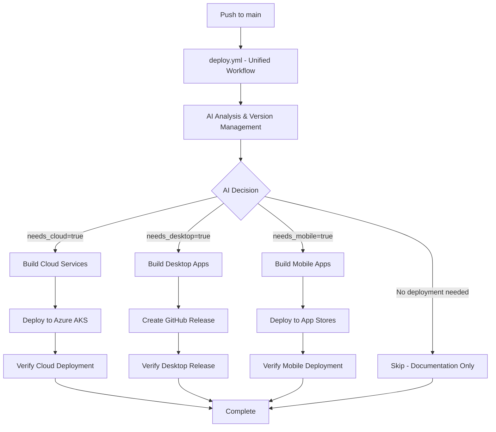

# CI/CD Workflow Streamlining Design Document

## Overview

This design outlines the streamlining of CloudToLocalLLM's CI/CD system to reduce complexity while preserving the AI-powered decision making that provides intelligent version management and deployment decisions. The current system uses multiple orchestrated workflows with complex branch management and repository dispatch mechanisms. The streamlined design consolidates these into a simpler, more maintainable architecture.

## Architecture

### Current Architecture Issues

The existing CI/CD system has several complexity issues:

1. **Multiple Orchestrated Workflows**: `version-and-distribute.yml` orchestrates `deploy-aks.yml` via repository dispatch
2. **Platform Branch Management**: Creates and manages separate `cloud`, `desktop`, and `mobile` branches
3. **Complex Trigger Mechanisms**: Uses repository dispatch events instead of direct triggers
4. **Distributed Status**: Deployment status spread across multiple workflow runs
5. **Debugging Complexity**: Failures require debugging across multiple workflows

### Proposed Streamlined Architecture

The new architecture uses a single intelligent workflow that deploys to any platform based on AI analysis:



### Key Architectural Changes

1. **Single Primary Workflow**: Consolidate all CI/CD logic into one workflow
2. **Direct Triggers**: Use standard GitHub Actions triggers instead of repository dispatch
3. **Simplified Branch Management**: Deploy directly from main branch without platform branches
4. **Integrated Status**: All deployment status visible in single workflow run
5. **Preserved AI Intelligence**: Keep AI analysis for version management and deployment decisions

## Components and Interfaces

### Core Components

#### 1. Unified CI/CD Workflow (`deploy.yml` - New)
- **Purpose**: Single workflow handling all deployment types based on AI analysis
- **Triggers**: Push to main branch (direct), manual dispatch
- **Responsibilities**:
  - AI-powered change analysis (integrated)
  - Version management (integrated)
  - Conditional building (cloud services, desktop apps, mobile apps)
  - Conditional deployment (Azure AKS, GitHub releases, app stores)
  - Verification and cleanup
- **Intelligence**: AI determines which platforms need deployment

#### 2. AI Analysis Engine (Enhanced)
- **Purpose**: Intelligent decision making for versions and deployments
- **Components**:
  - Gemini CLI integration
  - Gemini 2.0 Flash model
  - File change analysis
  - Commit message parsing
- **Outputs**: Version bump type, deployment decisions, reasoning

#### 3. Multi-Platform Build System
- **Purpose**: Efficient conditional building based on AI decisions
- **Components**:
  - Platform-specific change detection
  - Conditional building (cloud services, desktop apps, mobile apps)
  - Multi-platform image/artifact management
  - Caching optimization across platforms
- **Current Focus**: Cloud services (web, api-backend, streaming-proxy, postgres)
- **Future Ready**: Desktop and mobile build matrices when needed

#### 4. Multi-Platform Deployment Orchestrator
- **Purpose**: Coordinated deployment to appropriate platforms based on AI decisions
- **Components**:
  - Cloud: Dependency-aware deployment to Azure AKS (postgres → api → streaming-proxy → web)
  - Desktop: GitHub release creation with installers and portable packages
  - Mobile: App store deployment (future)
  - Health verification for each platform
  - Rollback capabilities
  - Unified status reporting

### Interface Specifications

#### AI Analysis Interface
```yaml
Input:
  - current_version: string
  - commits: array of commit objects
  - changed_files: array of file paths
  - force_patterns: array of file patterns

Output:
  - bump_type: "major" | "minor" | "patch"
  - new_version: string (semantic version)
  - needs_cloud: boolean
  - reasoning: string
```

#### Build Matrix Interface
```yaml
Input:
  - changed_files: array of file paths
  - previous_deployment_tag: string

Output:
  - services_to_build: array of service names
  - build_matrix: array of build configurations
```

## Data Models

### Workflow State Model
```yaml
WorkflowState:
  version:
    current: string
    new: string
    bump_type: string
  analysis:
    ai_reasoning: string
    changed_files: array
    deployment_decision: boolean
  build:
    services: array of ServiceBuild
    status: "pending" | "building" | "complete" | "failed"
  deployment:
    status: "pending" | "deploying" | "complete" | "failed"
    services_deployed: array
    health_checks: array of HealthCheck
```

### Service Build Model
```yaml
ServiceBuild:
  name: string
  changed: boolean
  image_tag: string
  build_status: "pending" | "building" | "complete" | "failed"
  build_duration: number
```

### Health Check Model
```yaml
HealthCheck:
  service: string
  endpoint: string
  status: "pending" | "healthy" | "unhealthy"
  response_time: number
  timestamp: string
```

## Correctness Properties

*A property is a characteristic or behavior that should hold true across all valid executions of a system-essentially, a formal statement about what the system should do. Properties serve as the bridge between human-readable specifications and machine-verifiable correctness guarantees.*

### Property 1: Direct Deployment Triggering
*For any* push to the main branch containing changes to deployment-relevant files, the system should trigger deployment directly without intermediate orchestration workflows
**Validates: Requirements 1.1**

### Property 2: Workflow Consolidation
*For any* deployment process, all build and deployment activities should be handled within a single primary workflow run
**Validates: Requirements 6.1**

### Property 3: AI Version Analysis Accuracy
*For any* set of commits and file changes, the AI analysis should consider both commit messages and file changes when determining version bump decisions
**Validates: Requirements 2.1**

### Property 4: AI Decision Enforcement
*For any* AI analysis failure, the system should fail the workflow and require manual intervention without fallback mechanisms
**Validates: Requirements 2.5, 5.1, 5.2**

### Property 5: Performance Requirements
*For any* typical deployment, the complete process should finish within 15 minutes from trigger to completion
**Validates: Requirements 4.1**

### Property 6: Version Management Performance
*For any* version analysis and bumping operation, the process should complete within 2 minutes
**Validates: Requirements 4.4**

### Property 7: Branch Management Simplification
*For any* deployment, the system should deploy directly from the main branch without creating platform-specific branches
**Validates: Requirements 7.1, 7.2**

### Property 8: File Pattern Deployment Triggering
*For any* changes to files in web/, lib/, services/, k8s/, config/ directories, the system should trigger cloud deployment
**Validates: Requirements 8.1**

### Property 9: Authentication File Priority
*For any* changes to authentication-related files, the system should always trigger cloud deployment regardless of other factors
**Validates: Requirements 8.2**

### Property 10: Documentation Skip Optimization
*For any* changes that only affect documentation or non-functional files, the system should skip deployment to optimize resource usage
**Validates: Requirements 8.3**

### Property 11: Status Consolidation
*For any* deployment process, all status information should be available within the single primary workflow run
**Validates: Requirements 6.2, 6.5**

### Property 12: Error Visibility
*For any* deployment failure, the error should be visible in the primary workflow without requiring cross-workflow debugging
**Validates: Requirements 6.3**

### Property 13: AI Retry Logic
*For any* AI service rate limiting, the system should implement exponential backoff retry logic before failing
**Validates: Requirements 5.3**

### Property 14: Deployment Logging
*For any* deployment decision, the system should log the file patterns that triggered the deployment
**Validates: Requirements 8.4**

### Property 15: Parallel Service Deployment
*For any* multiple independent services requiring deployment, the system should deploy them concurrently where dependencies allow
**Validates: Requirements 4.5**

## Error Handling

### AI Analysis Failures
- **Timeout Handling**: 60-second timeout with clear error messages
- **Rate Limiting**: Exponential backoff retry (1s, 2s, 4s, 8s) before failure
- **Service Unavailability**: Immediate failure with actionable error message
- **Invalid Responses**: JSON validation with detailed parsing error logs

### Build Failures
- **Service Build Failures**: Continue building other services, report all failures at end
- **Docker Registry Issues**: Retry with exponential backoff, fail after 3 attempts
- **Cache Misses**: Graceful degradation to full builds without caching

### Deployment Failures
- **Health Check Failures**: Detailed logging of failed endpoints and response codes
- **Rollback Triggers**: Automatic rollback on critical service failures
- **Partial Deployment Failures**: Clear reporting of which services succeeded/failed

## Testing Strategy

### Unit Testing Approach
- **AI Analysis Module**: Test with various commit message and file change combinations
- **File Pattern Matching**: Test deployment triggering logic with different file change scenarios
- **Version Validation**: Test semantic version increment logic
- **Build Matrix Generation**: Test service selection based on file changes

### Property-Based Testing Approach

The system will use **fast-check** (JavaScript property-based testing library) to verify correctness properties:

**Configuration Requirements**:
- Minimum 100 iterations per property test
- Each property test tagged with format: `**Feature: cicd-workflow-streamlining, Property {number}: {property_text}**`
- Single property-based test per correctness property

**Property Test Examples**:
```javascript
// Property 1: Direct Deployment Triggering
fc.assert(fc.property(
  fc.array(fc.string()), // changed files
  (changedFiles) => {
    const hasDeploymentFiles = changedFiles.some(file => 
      file.startsWith('web/') || file.startsWith('lib/') || 
      file.startsWith('services/') || file.startsWith('k8s/') || 
      file.startsWith('config/')
    );
    const shouldTriggerDeployment = analyzeDeploymentNeed(changedFiles);
    return hasDeploymentFiles ? shouldTriggerDeployment : true;
  }
), { numRuns: 100 });
```

### Integration Testing
- **End-to-End Workflow Testing**: Test complete workflow execution with various change scenarios
- **AI Service Integration**: Test AI analysis with real API calls and mock responses
- **Deployment Verification**: Test actual deployment to staging environment

### Performance Testing
- **Deployment Time Measurement**: Verify 15-minute deployment time requirement
- **Version Analysis Performance**: Verify 2-minute version management requirement
- **Parallel Build Efficiency**: Measure build time improvements from parallelization

## Implementation Plan

### Phase 1: Unified Workflow Creation
1. Create new `deploy.yml` workflow that consolidates all deployment logic
2. Integrate AI analysis directly into the new workflow
3. Implement conditional jobs based on AI decisions (needs_cloud, needs_desktop, needs_mobile)
4. Add comprehensive logging and status reporting

### Phase 2: Multi-Platform Build System
1. Implement intelligent change detection for all platforms
2. Add conditional build matrices (cloud services, desktop apps, mobile apps)
3. Optimize caching across all build types
4. Add build performance monitoring

### Phase 3: Multi-Platform Deployment Integration
1. Consolidate all deployment logic into single workflow
2. Implement platform-specific deployment strategies
3. Add comprehensive health checking for all platforms
4. Implement automated rollback mechanisms

### Phase 4: Testing and Validation
1. Implement property-based tests for all correctness properties
2. Add integration tests for complete cloud workflow
3. Performance testing and optimization for cloud deployment
4. Documentation and runbook creation

### Phase 5: Migration and Cleanup
1. Remove `version-and-distribute.yml` orchestrator workflow
2. Remove `deploy-aks.yml` and `build-release.yml` (replaced by unified `deploy.yml`)
3. Clean up platform branches (cloud, desktop, mobile) and related automation
4. Update documentation and team training

### Future Phase 6: Platform Extension (When Ready)
1. Extend AI analysis to support desktop and mobile platform detection
2. Create additional workflows for desktop and mobile builds
3. Implement platform-specific build matrices
4. Add platform-specific deployment and distribution mechanisms