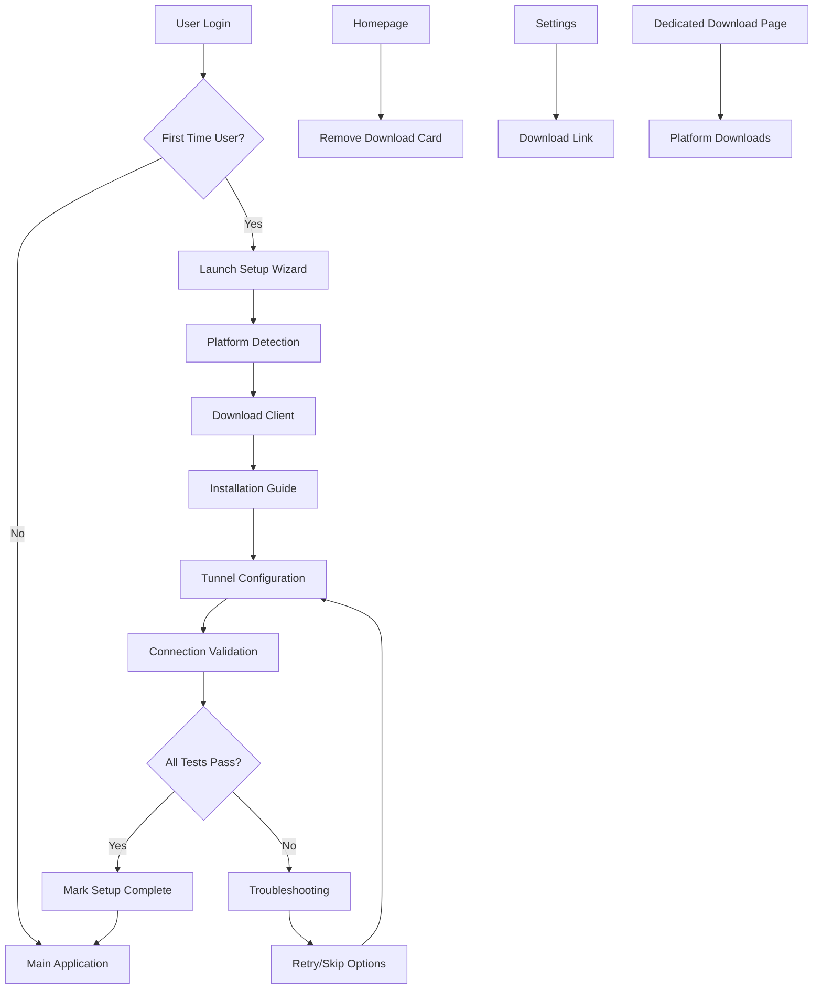

# Design Document

## Overview

The first-time setup wizard will be a multi-step guided experience that appears when new users first log into CloudToLocalLLM. The wizard will help users download and install the appropriate desktop client for their platform, establish a tunnel connection, and validate that everything is working correctly. Additionally, the existing download card will be completely removed from the homepage and made available only through the setup wizard, web settings, and a dedicated download page.

## Architecture

### High-Level Flow
```
User Login → Check Setup Status → First-Time Setup Wizard → Desktop Client Download → Installation Guide → Tunnel Setup → Validation → Main App
```

### Component Interaction


## Components and Interfaces

### 1. Setup Status Detection Service

**Purpose**: Determines if a user needs to go through the first-time setup wizard

**Key Functions**:
- Check user's setup completion status from database
- Validate existing desktop client connections
- Determine if wizard should be shown or skipped

**Interface**:
```dart
class SetupStatusService {
  Future<bool> isFirstTimeUser(String userId);
  Future<void> markSetupComplete(String userId);
  Future<bool> hasActiveDesktopConnection(String userId);
  Future<void> resetSetupStatus(String userId);
}
```

**Data Model**:
```dart
class UserSetupStatus {
  final String userId;
  final bool isSetupComplete;
  final DateTime? setupCompletedAt;
  final String? lastConnectedClientVersion;
  final Map<String, dynamic>? setupPreferences;
}
```

### 2. First-Time Setup Wizard Component

**Purpose**: Multi-step wizard interface that guides users through the setup process

**Key Functions**:
- User container creation and configuration
- Platform detection and client recommendation
- Step-by-step navigation with progress tracking
- Download link generation and tracking
- Installation instruction display
- Connection validation and testing

**Interface**:
```dart
class FirstTimeSetupWizard extends StatefulWidget {
  final Function(bool success) onSetupComplete;
  final bool allowSkip;
}

class SetupWizardState {
  int currentStep;
  String? userContainerId;
  bool isContainerCreated;
  PlatformType detectedPlatform;
  String? selectedDownloadOption;
  bool isDownloadComplete;
  bool isInstallationComplete;
  bool isTunnelConfigured;
  bool isValidationComplete;
  Map<String, dynamic> setupData;
}
```

**Wizard Steps**:
1. **Welcome & Overview** - Explain what CloudToLocalLLM does and why desktop client is needed
2. **Container Creation** - Create user's isolated streaming proxy container
3. **Platform Detection** - Detect OS and show recommended download options
4. **Download Client** - Provide download links and track download completion
5. **Installation Guide** - Platform-specific installation instructions with visuals
6. **Tunnel Configuration** - Guide through establishing connection between web and desktop
7. **Validation & Testing** - Test connection and validate everything works
8. **Completion** - Success message and transition to main app

### 3. User Container Creation Service

**Purpose**: Creates and configures isolated streaming proxy containers for new users

**Key Functions**:
- Create new Docker container for user isolation
- Configure container with user-specific settings
- Start container and verify it's running
- Register container with management system
- Handle container creation failures and cleanup

**Interface**:
```dart
class UserContainerService {
  Future<String> createUserContainer(String userId);
  Future<bool> configureContainer(String containerId, Map<String, String> config);
  Future<bool> startContainer(String containerId);
  Future<bool> validateContainerHealth(String containerId);
  Future<void> cleanupFailedContainer(String containerId);
}

class ContainerCreationResult {
  final bool success;
  final String? containerId;
  final String? errorMessage;
  final Map<String, dynamic> containerInfo;
}
```

### 4. Platform Detection Service

**Purpose**: Automatically detects user's operating system and provides appropriate download options

**Key Functions**:
- Browser-based OS detection using user agent
- Fallback manual platform selection
- Platform-specific download option generation
- Installation instruction customization

**Interface**:
```dart
enum PlatformType { windows, linux, macos, unknown }

class PlatformDetectionService {
  PlatformType detectPlatform();
  List<DownloadOption> getDownloadOptions(PlatformType platform);
  String getInstallationInstructions(PlatformType platform, String downloadType);
}

class DownloadOption {
  final String name;
  final String description;
  final String downloadUrl;
  final String fileSize;
  final String installationType; // 'msi', 'zip', 'appimage', 'deb', 'dmg'
}
```

### 5. Download Management Service

**Purpose**: Manages download links, tracking, and validation

**Key Functions**:
- Generate secure download URLs
- Track download completion (where possible)
- Validate downloaded files
- Provide download mirrors/alternatives

**Interface**:
```dart
class DownloadManagementService {
  Future<String> generateDownloadUrl(String platform, String packageType);
  Future<bool> validateDownload(String filePath);
  Future<List<String>> getAlternativeDownloadUrls(String platform);
  void trackDownloadEvent(String userId, String platform, String packageType);
}
```

### 6. Installation Guide Component

**Purpose**: Provides platform-specific installation instructions with visual aids

**Key Functions**:
- Display step-by-step installation instructions
- Show platform-specific screenshots/animations
- Handle different installation methods per platform
- Provide troubleshooting for common installation issues

**Interface**:
```dart
class InstallationGuide extends StatelessWidget {
  final PlatformType platform;
  final String installationType;
  final Function() onInstallationComplete;
  final Function(String error) onInstallationError;
}

class InstallationStep {
  final String title;
  final String description;
  final String? imageUrl;
  final List<String> commands;
  final List<String> troubleshootingTips;
}
```

### 7. Tunnel Configuration Service

**Purpose**: Helps users establish and validate the tunnel connection between web app and desktop client

**Key Functions**:
- Generate tunnel configuration parameters
- Test tunnel connectivity
- Validate desktop client communication
- Provide connection troubleshooting

**Interface**:
```dart
class TunnelConfigurationService {
  Future<TunnelConfig> generateTunnelConfig(String userId);
  Future<bool> testTunnelConnection(TunnelConfig config);
  Future<bool> validateDesktopClientConnection(String userId);
  Future<List<String>> getTroubleshootingSteps(String errorType);
}

class TunnelConfig {
  final String tunnelId;
  final String connectionUrl;
  final String authToken;
  final Map<String, String> headers;
  final int timeoutSeconds;
}
```

### 8. Connection Validation Service

**Purpose**: Comprehensive testing to ensure the setup is working correctly

**Key Functions**:
- Test web app to desktop client communication
- Validate local LLM accessibility
- Test streaming functionality
- Generate validation reports

**Interface**:
```dart
class ConnectionValidationService {
  Future<ValidationResult> runComprehensiveTest(String userId);
  Future<bool> testDesktopClientPing(String userId);
  Future<bool> testLocalLLMConnection(String userId);
  Future<bool> testStreamingFunctionality(String userId);
}

class ValidationResult {
  final bool isSuccessful;
  final List<ValidationTest> tests;
  final String? errorMessage;
  final List<String> troubleshootingSteps;
}

class ValidationTest {
  final String name;
  final bool passed;
  final String? details;
  final Duration duration;
}
```

### 9. Homepage Modification Service

**Purpose**: Removes the download card from the homepage and manages download access points

**Key Functions**:
- Remove download card component from homepage
- Add download links to settings page
- Create dedicated download page
- Maintain download analytics

**Interface**:
```dart
class DownloadAccessService {
  Widget buildSettingsDownloadSection();
  Widget buildDedicatedDownloadPage();
  void trackDownloadPageAccess(String source); // 'settings', 'direct', 'wizard'
}
```

### 10. Dedicated Download Page

**Purpose**: Simple, standalone page for downloading desktop clients

**Key Features**:
- Clean, minimal design focused solely on downloads
- Automatic platform detection with manual override
- Direct download links for all supported platforms
- Basic installation instructions
- No authentication required (public page)

**Page Structure**:
```
┌─────────────────────────────────────────────────────────────┐
│ CloudToLocalLLM Desktop Client Downloads                    │
├─────────────────────────────────────────────────────────────┤
│                                                             │
│ Choose your platform:                                       │
│                                                             │
│ ┌─────────────┐ ┌─────────────┐ ┌─────────────┐            │
│ │   Windows   │ │    Linux    │ │    macOS    │            │
│ │             │ │             │ │             │            │
│ │ [MSI] [ZIP] │ │ [DEB] [IMG] │ │    [DMG]    │            │
│ └─────────────┘ └─────────────┘ └─────────────┘            │
│                                                             │
│ Installation Instructions:                                  │
│ • Download the appropriate file for your system            │
│ • Run the installer or extract the archive                 │
│ • Launch the application and follow setup wizard          │
│                                                             │
└─────────────────────────────────────────────────────────────┘
```

**Interface**:
```dart
class DownloadPage extends StatelessWidget {
  @override
  Widget build(BuildContext context) {
    return Scaffold(
      appBar: AppBar(title: Text('Download Desktop Client')),
      body: DownloadPageContent(),
    );
  }
}

class DownloadPageContent extends StatelessWidget {
  final PlatformType detectedPlatform;
  final List<DownloadOption> allDownloadOptions;
}
```

## Data Models

### User Setup Progress
```dart
class SetupProgress {
  final String userId;
  final int currentStep;
  final Map<String, bool> completedSteps;
  final DateTime startedAt;
  final DateTime? lastUpdatedAt;
  final Map<String, dynamic> stepData;
  final List<String> encounteredErrors;
}
```

### Platform Configuration
```dart
class PlatformConfig {
  final PlatformType platform;
  final List<DownloadOption> downloadOptions;
  final List<InstallationStep> installationSteps;
  final Map<String, String> troubleshootingGuides;
  final List<String> requiredDependencies;
}
```

### Setup Analytics
```dart
class SetupAnalytics {
  final String userId;
  final DateTime startTime;
  final DateTime? completionTime;
  final bool wasSuccessful;
  final int stepsCompleted;
  final List<String> errorsEncountered;
  final PlatformType platform;
  final String downloadOption;
  final Duration totalDuration;
}
```

## Error Handling

### Error Categories
1. **Platform Detection Errors**: Unable to detect OS or unsupported platform
2. **Download Errors**: Download failures, corrupted files, network issues
3. **Installation Errors**: Installation failures, permission issues, missing dependencies
4. **Connection Errors**: Tunnel setup failures, network connectivity issues
5. **Validation Errors**: Desktop client not responding, LLM connection failures

### Error Handling Strategy
```dart
class SetupErrorHandler {
  void handlePlatformDetectionError(Exception error) {
    // Show manual platform selection
    // Log error for analytics
  }
  
  void handleDownloadError(DownloadException error) {
    // Offer alternative download methods
    // Provide troubleshooting steps
    // Allow retry or skip
  }
  
  void handleInstallationError(InstallationException error) {
    // Show platform-specific troubleshooting
    // Provide manual installation guide
    // Offer support contact information
  }
  
  void handleConnectionError(ConnectionException error) {
    // Provide network troubleshooting steps
    // Test firewall and port configurations
    // Offer manual configuration options
  }
}
```

### Recovery Mechanisms
1. **Step Retry**: Allow users to retry failed steps
2. **Skip Options**: Allow skipping non-critical steps with warnings
3. **Progress Saving**: Save progress to allow resuming later
4. **Alternative Paths**: Provide alternative setup methods when primary fails
5. **Manual Configuration**: Fallback to manual setup instructions

## User Interface Design

### Wizard Layout
```
┌─────────────────────────────────────────────────────────────┐
│ CloudToLocalLLM Setup                              [Step 2/8] │
├─────────────────────────────────────────────────────────────┤
│ ●●○○○○○○  Progress Bar                                       │
├─────────────────────────────────────────────────────────────┤
│                                                             │
│  [Step Content Area]                                        │
│                                                             │
│  Platform-specific instructions, download buttons,          │
│  progress indicators, validation results, etc.              │
│                                                             │
├─────────────────────────────────────────────────────────────┤
│ [Back]                                    [Skip]   [Next]   │
└─────────────────────────────────────────────────────────────┘
```

### Step-Specific Designs

**Step 1: Welcome**
- CloudToLocalLLM logo and branding
- Brief explanation of what the service does
- Overview of setup process
- "Get Started" button

**Step 2: Container Creation**
- Progress indicator for container creation
- Explanation of user isolation and security
- Real-time status updates
- Container health validation
- Error handling with retry options

**Step 3: Platform Detection**
- Detected platform display
- Recommended download option highlighted
- Alternative options available
- Manual platform selection if detection fails

**Step 4: Download**
- Download buttons for each option
- File size and description
- Download progress indicator (if possible)
- "I've downloaded the file" confirmation

**Step 5: Installation**
- Platform-specific installation steps
- Screenshots or animated GIFs
- Command line instructions where needed
- "Installation complete" confirmation

**Step 6: Tunnel Configuration**
- Connection parameters display (using created container)
- Desktop client configuration instructions
- Real-time connection status
- Troubleshooting expandable sections

**Step 7: Validation**
- Test progress indicators
- Real-time test results
- Success/failure indicators
- Detailed error messages with solutions

**Step 8: Completion**
- Success celebration
- Summary of what was configured
- Next steps and tips
- "Start Using CloudToLocalLLM" button

### Responsive Design
- Mobile-friendly wizard layout
- Touch-friendly buttons and interactions
- Readable text on small screens
- Simplified steps for mobile users

## Testing Strategy

### Unit Testing
- Individual service method testing
- Platform detection accuracy testing
- Download URL generation testing
- Validation logic testing

### Integration Testing
- End-to-end wizard flow testing
- Cross-platform compatibility testing
- Download and installation process testing
- Tunnel connection establishment testing

### User Experience Testing
- Wizard usability testing
- Error scenario handling testing
- Mobile responsiveness testing
- Accessibility compliance testing

### Performance Testing
- Wizard loading time testing
- Download speed and reliability testing
- Connection validation performance testing
- Analytics and tracking performance testing

## Implementation Phases

### Phase 1: Core Wizard Framework
- Create wizard component structure
- Implement step navigation and progress tracking
- Add basic platform detection
- Create setup status management

### Phase 2: Download Integration
- Implement download option generation
- Add platform-specific download links
- Create installation guide components
- Remove download card from homepage

### Phase 3: Tunnel Configuration
- Implement tunnel setup service
- Add connection validation logic
- Create troubleshooting components
- Add error handling and recovery

### Phase 4: Validation and Testing
- Implement comprehensive validation tests
- Add connection monitoring
- Create analytics and tracking
- Add accessibility features

### Phase 5: Polish and Optimization
- Improve user interface and experience
- Add animations and visual feedback
- Optimize performance and loading times
- Complete testing and bug fixes

## Security Considerations

### Data Privacy
- Minimal data collection during setup
- Secure storage of setup preferences
- No sensitive information in client-side storage
- Compliance with privacy regulations

### Download Security
- Secure download URLs with expiration
- File integrity validation
- Protection against malicious downloads
- Secure communication channels

### Connection Security
- Encrypted tunnel configuration
- Secure authentication tokens
- Protection against man-in-the-middle attacks
- Regular security validation

## Analytics and Monitoring

### Setup Metrics
- Setup completion rates by platform
- Common failure points and error rates
- Average setup time and user engagement
- Download success rates and preferences

### User Behavior
- Step abandonment rates
- Most common troubleshooting needs
- Platform distribution and trends
- Feature usage after setup completion

### Performance Monitoring
- Wizard loading and response times
- Download speeds and reliability
- Connection establishment success rates
- Error frequency and resolution rates