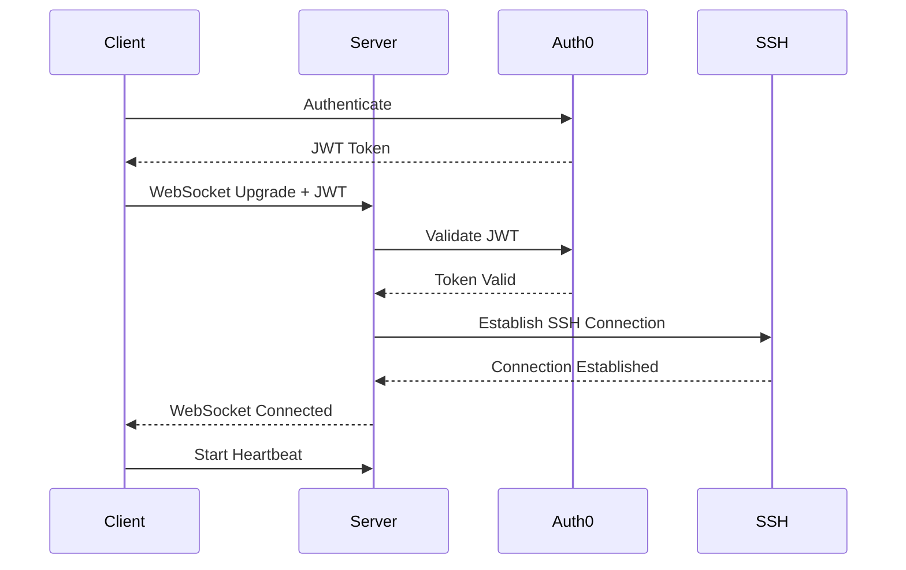
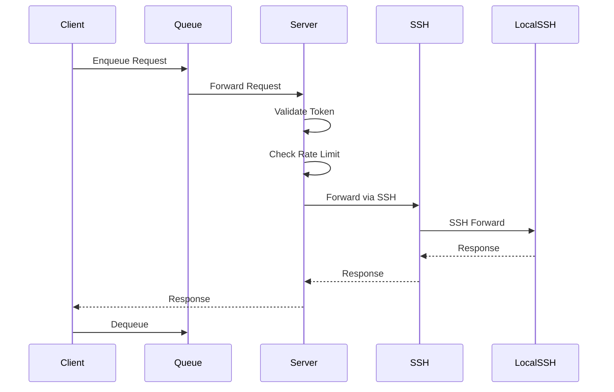
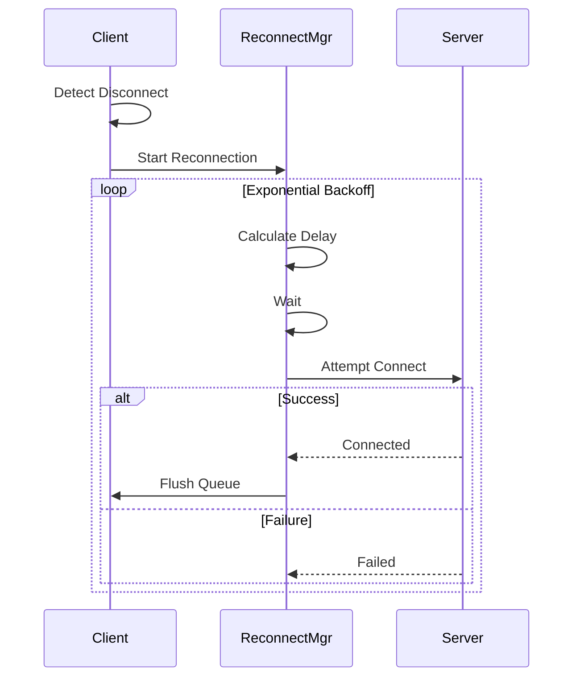

# Design Document: SSH WebSocket Tunnel Enhancement

## Overview

This design document outlines the architecture and implementation approach for enhancing the SSH-over-WebSocket tunnel system in CloudToLocalLLM. The enhancements focus on production-ready features including connection resilience, comprehensive error handling, performance monitoring, multi-tenant security, and developer experience improvements.

### Current State

The existing tunnel implementation provides basic SSH-over-WebSocket functionality:
- Client-side: `lib/services/tunnel_service.dart` manages tunnel connections
- Server-side: `services/streaming-proxy/` handles WebSocket connections and SSH forwarding
- Authentication: JWT tokens from Auth0 for user identification
- Transport: WebSocket for firewall traversal, SSH for secure tunneling

### Design Goals

1. **Reliability**: Automatic recovery from network failures with zero data loss
2. **Performance**: Sub-100ms latency overhead with support for 1000+ concurrent connections
3. **Security**: Multi-tenant isolation with comprehensive audit logging
4. **Observability**: Real-time metrics and structured logging for troubleshooting
5. **Developer Experience**: Clear APIs, comprehensive documentation, and testing infrastructure

### Design Principles

- **Fail-safe defaults**: Conservative settings that work for most users
- **Progressive enhancement**: Advanced features available but not required
- **Separation of concerns**: Clear boundaries between transport, protocol, and application layers
- **Testability**: All components designed for unit and integration testing
- **Backward compatibility**: Existing clients continue to work during rollout


## Monitoring and Observability Architecture

This specification uses native Node.js and Flutter modules for monitoring and observability:

### Server-Side Monitoring (Node.js)
- **Prometheus Metrics**: Use `prom-client` library to expose metrics in Prometheus format
- **OpenTelemetry Tracing**: Use `@opentelemetry/sdk-node` for distributed tracing and span collection
- **Structured Logging**: Implement JSON-formatted structured logging with correlation IDs
- **Health Checks**: Native Express.js endpoints for Kubernetes liveness and readiness probes

### Client-Side Monitoring (Flutter)
- **Metrics Collection**: Native Dart implementation for tracking connection and request metrics
- **Performance Tracking**: Use Dart's `Stopwatch` and timing utilities for latency measurement
- **Error Categorization**: Native Dart error handling and categorization system
- **Diagnostics**: Dart-based diagnostic test suite for connection troubleshooting


## Architecture

### System Components

```
┌─────────────────────────────────────────────────────────────────┐
│                        Desktop/Web Client                        │
├─────────────────────────────────────────────────────────────────┤
│  ┌──────────────────┐  ┌──────────────────┐  ┌───────────────┐ │
│  │  Tunnel Service  │  │  Request Queue   │  │  Metrics      │ │
│  │  - Connection    │  │  - Priority      │  │  - Latency    │ │
│  │  - Reconnection  │  │  - Backpressure  │  │  - Throughput │ │
│  │  - Health Check  │  │  - Persistence   │  │  - Errors     │ │
│  └──────────────────┘  └──────────────────┘  └───────────────┘ │
│           │                      │                     │         │
│           └──────────────────────┴─────────────────────┘         │
│                              │                                   │
│                    ┌─────────▼─────────┐                        │
│                    │  WebSocket Client │                        │
│                    │  - Heartbeat      │                        │
│                    │  - Compression    │                        │
│                    │  - TLS 1.3        │                        │
│                    └─────────┬─────────┘                        │
└──────────────────────────────┼──────────────────────────────────┘
                               │
                    WebSocket  │  (wss://)
                               │
┌──────────────────────────────▼──────────────────────────────────┐
│                      Streaming Proxy Server                      │
├─────────────────────────────────────────────────────────────────┤
│  ┌──────────────────┐  ┌──────────────────┐  ┌───────────────┐ │
│  │  WebSocket       │  │  Auth Middleware │  │  Rate Limiter │ │
│  │  Handler         │  │  - JWT Validate  │  │  - Per User   │ │
│  │  - Upgrade       │  │  - Token Refresh │  │  - Per IP     │ │
│  │  - Heartbeat     │  │  - Audit Log     │  │  - DDoS       │ │
│  └────────┬─────────┘  └────────┬─────────┘  └───────┬───────┘ │
│           │                     │                     │         │
│           └─────────────────────┴─────────────────────┘         │
│                              │                                   │
│                    ┌─────────▼─────────┐                        │
│                    │  Connection Pool  │                        │
│                    │  - Per User       │                        │
│                    │  - SSH Sessions   │                        │
│                    │  - Cleanup        │                        │
│                    └─────────┬─────────┘                        │
│                              │                                   │
│  ┌──────────────────┐  ┌─────▼──────────┐  ┌───────────────┐  │
│  │  Metrics         │  │  SSH Tunnel    │  │  Circuit      │  │
│  │  Collector       │  │  Manager       │  │  Breaker      │  │
│  │  - Prometheus    │  │  - Forward     │  │  - Failure    │  │
│  │  - OpenTelemetry │  │  - Multiplex   │  │  - Recovery   │  │
│  └──────────────────┘  └────────┬───────┘  └───────────────┘  │
└──────────────────────────────────┼──────────────────────────────┘
                                   │
                        SSH over   │  WebSocket
                                   │
┌──────────────────────────────────▼──────────────────────────────┐
│                      Local SSH Server                            │
│                      (User's Machine)                            │
└─────────────────────────────────────────────────────────────────┘
```

### Component Responsibilities

#### Client-Side Components

**TunnelService** (`lib/services/tunnel_service.dart`)
- Manages WebSocket connection lifecycle
- Implements reconnection logic with exponential backoff
- Maintains connection state and health metrics
- Provides API for tunnel operations

**RequestQueue** (new component)
- Queues requests during network issues or high load
- Implements priority-based processing
- Persists high-priority requests to disk
- Provides backpressure signals

**MetricsCollector** (new component)
- Tracks client-side performance metrics
- Calculates connection quality indicators
- Exposes metrics to UI components
- Logs metrics for debugging

**WebSocketClient** (enhanced)
- Handles WebSocket protocol details
- Implements ping/pong heartbeat
- Manages compression and encryption
- Handles connection upgrades

#### Server-Side Components

**WebSocketHandler** (`services/streaming-proxy/src/websocket-handler.js`)
- Accepts and upgrades WebSocket connections
- Implements heartbeat monitoring
- Manages connection lifecycle
- Routes messages to appropriate handlers

**AuthMiddleware** (new component)
- Validates JWT tokens on every request
- Handles token expiration and refresh
- Implements audit logging
- Enforces user isolation

**RateLimiter** (new component)
- Per-user rate limiting (100 req/min)
- Per-IP rate limiting for DDoS protection
- Configurable limits per user tier
- Metrics for rate limit violations

**ConnectionPool** (new component)
- Manages SSH connections per user
- Implements connection limits (max 3 per user)
- Handles connection cleanup
- Provides connection reuse

**SSHTunnelManager** (enhanced)
- Manages SSH protocol operations
- Implements channel multiplexing
- Handles SSH keep-alive
- Provides error recovery

**CircuitBreaker** (new component)
- Detects cascading failures
- Stops forwarding after threshold
- Implements automatic recovery
- Provides failure metrics

**MetricsCollector** (new component)
- Collects server-side metrics
- Exposes Prometheus endpoints
- Implements OpenTelemetry tracing
- Aggregates multi-instance metrics


## Components and Interfaces

### Client-Side Interfaces

#### TunnelService Interface

```dart
class TunnelService extends ChangeNotifier {
  // Connection Management
  Future<void> connect({
    required String serverUrl,
    required String authToken,
    TunnelConfig? config,
  });
  
  Future<void> disconnect({bool graceful = true});
  
  Future<void> reconnect();
  
  // Request Operations
  Future<TunnelResponse> forwardRequest(TunnelRequest request);
  
  // State Management
  TunnelConnectionState get connectionState;
  TunnelHealthMetrics get healthMetrics;
  
  // Configuration
  void updateConfig(TunnelConfig config);
  TunnelConfig get currentConfig;
  
  // Diagnostics
  Future<DiagnosticReport> runDiagnostics();
}

enum TunnelConnectionState {
  disconnected,
  connecting,
  connected,
  reconnecting,
  error,
}

class TunnelConfig {
  final int maxReconnectAttempts;
  final Duration reconnectBaseDelay;
  final Duration requestTimeout;
  final int maxQueueSize;
  final bool enableCompression;
  final bool enableAutoReconnect;
  final LogLevel logLevel;
  
  // Predefined profiles
  static TunnelConfig stableNetwork();
  static TunnelConfig unstableNetwork();
  static TunnelConfig lowBandwidth();
}

class TunnelHealthMetrics {
  final Duration uptime;
  final int reconnectCount;
  final double averageLatency;
  final double packetLoss;
  final ConnectionQuality quality;
  final int queuedRequests;
  final int successfulRequests;
  final int failedRequests;
}

enum ConnectionQuality {
  excellent, // < 50ms latency, < 1% loss
  good,      // < 100ms latency, < 3% loss
  fair,      // < 200ms latency, < 5% loss
  poor,      // > 200ms latency or > 5% loss
}
```

#### RequestQueue Interface

```dart
class RequestQueue {
  // Queue Operations
  Future<void> enqueue(TunnelRequest request, {RequestPriority priority = RequestPriority.normal});
  
  Future<TunnelRequest?> dequeue();
  
  void clear();
  
  // State
  int get size;
  bool get isFull;
  bool get isEmpty;
  double get fillPercentage;
  
  // Persistence
  Future<void> persistHighPriorityRequests();
  Future<void> restorePersistedRequests();
  
  // Backpressure
  Stream<BackpressureSignal> get backpressureStream;
}

enum RequestPriority {
  high,    // Interactive user requests
  normal,  // Batch operations
  low,     // Background tasks
}

class BackpressureSignal {
  final double queueFillPercentage;
  final bool shouldThrottle;
  final String? message;
}
```

#### MetricsCollector Interface

```dart
class MetricsCollector {
  // Metric Recording
  void recordRequest({
    required Duration latency,
    required bool success,
    String? errorType,
  });
  
  void recordConnection({
    required TunnelConnectionState state,
    String? reason,
  });
  
  void recordReconnection({
    required int attemptNumber,
    required bool success,
    Duration? delay,
  });
  
  // Metric Retrieval
  TunnelMetrics getMetrics({Duration? window});
  
  // Export
  Map<String, dynamic> exportPrometheusFormat();
  Map<String, dynamic> exportJson();
}

class TunnelMetrics {
  final int totalRequests;
  final int successfulRequests;
  final int failedRequests;
  final double successRate;
  final Duration averageLatency;
  final Duration p95Latency;
  final Duration p99Latency;
  final int reconnectionCount;
  final Duration totalUptime;
  final Map<String, int> errorCounts;
}
```

### Server-Side Interfaces

#### WebSocketHandler Interface

```typescript
interface WebSocketHandler {
  // Connection Management
  handleUpgrade(req: Request, socket: Socket, head: Buffer): Promise<void>;
  handleConnection(ws: WebSocket, req: Request): Promise<void>;
  handleDisconnect(ws: WebSocket, code: number, reason: string): Promise<void>;
  
  // Message Handling
  handleMessage(ws: WebSocket, message: Buffer): Promise<void>;
  handlePing(ws: WebSocket): void;
  handlePong(ws: WebSocket): void;
  
  // Health Monitoring
  startHeartbeat(ws: WebSocket): void;
  stopHeartbeat(ws: WebSocket): void;
  checkConnectionHealth(): Promise<HealthStatus>;
}

interface HealthStatus {
  activeConnections: number;
  healthyConnections: number;
  unhealthyConnections: number;
  averageLatency: number;
}
```

#### AuthMiddleware Interface

```typescript
interface AuthMiddleware {
  // Token Validation
  validateToken(token: string): Promise<TokenValidationResult>;
  refreshToken(token: string): Promise<string>;
  
  // User Context
  getUserContext(token: string): Promise<UserContext>;
  
  // Audit Logging
  logAuthAttempt(userId: string, success: boolean, reason?: string): void;
  logAuthEvent(event: AuthEvent): void;
}

interface TokenValidationResult {
  valid: boolean;
  userId?: string;
  expiresAt?: Date;
  error?: string;
}

interface UserContext {
  userId: string;
  tier: UserTier;
  permissions: string[];
  rateLimit: RateLimitConfig;
}

enum UserTier {
  FREE = 'free',
  PREMIUM = 'premium',
  ENTERPRISE = 'enterprise',
}

interface RateLimitConfig {
  requestsPerMinute: number;
  maxConcurrentConnections: number;
  maxQueueSize: number;
}
```

#### ConnectionPool Interface

```typescript
interface ConnectionPool {
  // Connection Management
  getConnection(userId: string): Promise<SSHConnection>;
  releaseConnection(userId: string, connection: SSHConnection): void;
  closeConnection(userId: string): Promise<void>;
  closeAllConnections(): Promise<void>;
  
  // State
  getActiveConnections(userId: string): number;
  getTotalConnections(): number;
  
  // Cleanup
  cleanupStaleConnections(maxIdleTime: number): Promise<number>;
}

interface SSHConnection {
  id: string;
  userId: string;
  createdAt: Date;
  lastUsedAt: Date;
  channelCount: number;
  
  // Operations
  forward(request: ForwardRequest): Promise<ForwardResponse>;
  close(): Promise<void>;
  isHealthy(): boolean;
}
```

#### RateLimiter Interface

```typescript
interface RateLimiter {
  // Rate Limiting
  checkLimit(userId: string, ip: string): Promise<RateLimitResult>;
  recordRequest(userId: string, ip: string): void;
  
  // Configuration
  setUserLimit(userId: string, limit: RateLimitConfig): void;
  setGlobalLimit(limit: RateLimitConfig): void;
  
  // Metrics
  getViolations(window: Duration): RateLimitViolation[];
}

interface RateLimitResult {
  allowed: boolean;
  remaining: number;
  resetAt: Date;
  retryAfter?: number;
}

interface RateLimitViolation {
  userId: string;
  ip: string;
  timestamp: Date;
  requestCount: number;
  limit: number;
}
```

#### CircuitBreaker Interface

```typescript
interface CircuitBreaker {
  // State Management
  execute<T>(operation: () => Promise<T>): Promise<T>;
  
  getState(): CircuitState;
  
  // Configuration
  configure(config: CircuitBreakerConfig): void;
  
  // Manual Control
  open(): void;
  close(): void;
  reset(): void;
  
  // Metrics
  getMetrics(): CircuitBreakerMetrics;
}

enum CircuitState {
  CLOSED = 'closed',     // Normal operation
  OPEN = 'open',         // Blocking requests
  HALF_OPEN = 'half_open', // Testing recovery
}

interface CircuitBreakerConfig {
  failureThreshold: number;
  successThreshold: number;
  timeout: number;
  resetTimeout: number;
}

interface CircuitBreakerMetrics {
  state: CircuitState;
  failureCount: number;
  successCount: number;
  lastFailureTime?: Date;
  lastStateChange: Date;
}
```


## Data Models

### Connection State Model

```dart
class TunnelConnection {
  final String id;
  final String userId;
  final String serverUrl;
  final DateTime connectedAt;
  DateTime lastActivityAt;
  TunnelConnectionState state;
  int reconnectAttempts;
  List<ConnectionEvent> eventHistory;
  TunnelHealthMetrics metrics;
  
  // Serialization for persistence
  Map<String, dynamic> toJson();
  factory TunnelConnection.fromJson(Map<String, dynamic> json);
}

class ConnectionEvent {
  final DateTime timestamp;
  final ConnectionEventType type;
  final String? message;
  final Map<String, dynamic>? metadata;
}

enum ConnectionEventType {
  connected,
  disconnected,
  reconnecting,
  reconnected,
  error,
  healthCheck,
  configChanged,
}
```

### Request Model

```dart
class TunnelRequest {
  final String id;
  final String userId;
  final RequestPriority priority;
  final DateTime createdAt;
  final Duration timeout;
  final Map<String, String> headers;
  final Uint8List payload;
  final int retryCount;
  
  // Metadata for tracking
  final String? correlationId;
  final Map<String, dynamic>? metadata;
}

class TunnelResponse {
  final String requestId;
  final int statusCode;
  final Map<String, String> headers;
  final Uint8List payload;
  final Duration latency;
  final DateTime receivedAt;
}
```

### Error Model

```dart
class TunnelError {
  final String id;
  final TunnelErrorCategory category;
  final String code;
  final String message;
  final String userMessage;
  final String? suggestion;
  final DateTime timestamp;
  final StackTrace? stackTrace;
  final Map<String, dynamic>? context;
  
  // Error categorization
  bool get isRetryable;
  bool get isUserActionable;
  String get documentationUrl;
}

enum TunnelErrorCategory {
  network,        // DNS, connection refused, timeout
  authentication, // Invalid token, expired token
  configuration,  // Invalid settings, missing config
  server,         // Server error, unavailable
  protocol,       // SSH error, WebSocket error
  unknown,        // Unexpected errors
}

// Predefined error codes
class TunnelErrorCodes {
  static const String connectionRefused = 'TUNNEL_001';
  static const String authenticationFailed = 'TUNNEL_002';
  static const String tokenExpired = 'TUNNEL_003';
  static const String serverUnavailable = 'TUNNEL_004';
  static const String rateLimitExceeded = 'TUNNEL_005';
  static const String queueFull = 'TUNNEL_006';
  static const String requestTimeout = 'TUNNEL_007';
  static const String sshError = 'TUNNEL_008';
  static const String websocketError = 'TUNNEL_009';
  static const String configurationError = 'TUNNEL_010';
}
```

### Metrics Model

```typescript
interface ServerMetrics {
  // Connection Metrics
  activeConnections: number;
  totalConnections: number;
  connectionRate: number; // connections/second
  
  // Request Metrics
  requestCount: number;
  successCount: number;
  errorCount: number;
  successRate: number;
  
  // Performance Metrics
  averageLatency: number;
  p50Latency: number;
  p95Latency: number;
  p99Latency: number;
  
  // Throughput Metrics
  bytesReceived: number;
  bytesSent: number;
  requestsPerSecond: number;
  
  // Error Metrics
  errorsByCategory: Record<string, number>;
  errorRate: number;
  
  // User Metrics
  activeUsers: number;
  requestsByUser: Record<string, number>;
  
  // System Metrics
  memoryUsage: number;
  cpuUsage: number;
  uptime: number;
  
  // Timestamp
  timestamp: Date;
  window: Duration;
}

interface UserMetrics {
  userId: string;
  connectionCount: number;
  requestCount: number;
  successRate: number;
  averageLatency: number;
  dataTransferred: number;
  rateLimitViolations: number;
  lastActivity: Date;
}
```

### Configuration Model

```typescript
interface ServerConfig {
  // WebSocket Configuration
  websocket: {
    port: number;
    path: string;
    pingInterval: number;
    pongTimeout: number;
    maxFrameSize: number;
    compression: boolean;
  };
  
  // SSH Configuration
  ssh: {
    keepAliveInterval: number;
    maxChannelsPerConnection: number;
    compression: boolean;
    algorithms: {
      kex: string[];
      cipher: string[];
      mac: string[];
    };
  };
  
  // Rate Limiting
  rateLimit: {
    global: RateLimitConfig;
    perUser: Record<UserTier, RateLimitConfig>;
    perIp: RateLimitConfig;
  };
  
  // Connection Management
  connection: {
    maxConnectionsPerUser: number;
    idleTimeout: number;
    staleConnectionCheckInterval: number;
  };
  
  // Circuit Breaker
  circuitBreaker: CircuitBreakerConfig;
  
  // Monitoring
  monitoring: {
    metricsEnabled: boolean;
    metricsPort: number;
    tracingEnabled: boolean;
    logLevel: string;
  };
}
```

### Diagnostic Model

```dart
class DiagnosticReport {
  final DateTime timestamp;
  final List<DiagnosticTest> tests;
  final DiagnosticSummary summary;
  
  bool get allTestsPassed => tests.every((t) => t.passed);
}

class DiagnosticTest {
  final String name;
  final String description;
  final bool passed;
  final Duration duration;
  final String? errorMessage;
  final Map<String, dynamic>? details;
}

class DiagnosticSummary {
  final int totalTests;
  final int passedTests;
  final int failedTests;
  final Duration totalDuration;
  final List<String> recommendations;
}

// Diagnostic test types
enum DiagnosticTestType {
  dnsResolution,
  websocketConnectivity,
  sshAuthentication,
  tunnelEstablishment,
  dataTransfer,
  latencyTest,
  throughputTest,
}
```


## Error Handling

### Error Handling Strategy

The system implements a layered error handling approach:

1. **Detection Layer**: Catch errors at the source (WebSocket, SSH, network)
2. **Classification Layer**: Categorize errors by type and severity
3. **Recovery Layer**: Attempt automatic recovery when possible
4. **Notification Layer**: Inform user with actionable messages
5. **Logging Layer**: Record detailed error context for debugging

### Error Categories and Handling

#### Network Errors

**Detection:**
- Connection refused
- DNS resolution failure
- Timeout
- Network unreachable

**Handling:**
- Automatic reconnection with exponential backoff
- Queue pending requests
- Display connection status to user
- Log network conditions

**User Message:**
```
"Connection lost. Reconnecting automatically..."
Suggestion: "Check your internet connection"
```

#### Authentication Errors

**Detection:**
- Invalid JWT token
- Expired token
- Missing token
- Insufficient permissions

**Handling:**
- Distinguish between expired and invalid tokens
- Trigger token refresh for expired tokens
- Redirect to login for invalid tokens
- Log authentication attempts

**User Message:**
```
"Authentication expired. Please log in again."
Suggestion: "Click here to re-authenticate"
```

#### Configuration Errors

**Detection:**
- Invalid configuration values
- Missing required settings
- Incompatible settings

**Handling:**
- Validate configuration on load
- Provide default values
- Show validation errors in UI
- Prevent invalid configurations

**User Message:**
```
"Invalid configuration: Max queue size must be between 10 and 1000"
Suggestion: "Reset to default settings"
```

#### Server Errors

**Detection:**
- Server unavailable (503)
- Internal server error (500)
- Rate limit exceeded (429)
- Service overloaded

**Handling:**
- Implement circuit breaker pattern
- Queue requests during outages
- Exponential backoff for retries
- Graceful degradation

**User Message:**
```
"Server temporarily unavailable. Retrying in 30 seconds..."
Suggestion: "Your requests are queued and will be sent automatically"
```

#### Protocol Errors

**Detection:**
- SSH handshake failure
- WebSocket upgrade failure
- Protocol version mismatch
- Compression error

**Handling:**
- Fallback to uncompressed mode
- Retry with different protocol options
- Log protocol details
- Provide diagnostic information

**User Message:**
```
"Connection protocol error. Trying alternative method..."
Suggestion: "Run diagnostics for detailed information"
```

### Error Recovery Strategies

#### Automatic Recovery

```dart
class ErrorRecoveryStrategy {
  Future<bool> attemptRecovery(TunnelError error) async {
    switch (error.category) {
      case TunnelErrorCategory.network:
        return await _recoverFromNetworkError(error);
      
      case TunnelErrorCategory.authentication:
        return await _recoverFromAuthError(error);
      
      case TunnelErrorCategory.server:
        return await _recoverFromServerError(error);
      
      default:
        return false;
    }
  }
  
  Future<bool> _recoverFromNetworkError(TunnelError error) async {
    // Implement exponential backoff reconnection
    for (int attempt = 1; attempt <= maxAttempts; attempt++) {
      await Future.delayed(_calculateBackoff(attempt));
      
      if (await _testConnection()) {
        await _reconnect();
        await _flushQueuedRequests();
        return true;
      }
    }
    return false;
  }
  
  Duration _calculateBackoff(int attempt) {
    // Exponential backoff with jitter
    final baseDelay = Duration(seconds: 2);
    final maxDelay = Duration(seconds: 60);
    final exponential = baseDelay * pow(2, attempt - 1);
    final jitter = Random().nextDouble() * 0.3; // 30% jitter
    
    final delay = exponential * (1 + jitter);
    return delay > maxDelay ? maxDelay : delay;
  }
}
```

#### Circuit Breaker Implementation

```typescript
class CircuitBreakerImpl implements CircuitBreaker {
  private state: CircuitState = CircuitState.CLOSED;
  private failureCount = 0;
  private successCount = 0;
  private lastFailureTime?: Date;
  private resetTimer?: NodeJS.Timeout;
  
  async execute<T>(operation: () => Promise<T>): Promise<T> {
    if (this.state === CircuitState.OPEN) {
      throw new Error('Circuit breaker is OPEN');
    }
    
    try {
      const result = await operation();
      this.onSuccess();
      return result;
    } catch (error) {
      this.onFailure();
      throw error;
    }
  }
  
  private onSuccess(): void {
    this.failureCount = 0;
    
    if (this.state === CircuitState.HALF_OPEN) {
      this.successCount++;
      if (this.successCount >= this.config.successThreshold) {
        this.close();
      }
    }
  }
  
  private onFailure(): void {
    this.failureCount++;
    this.lastFailureTime = new Date();
    
    if (this.failureCount >= this.config.failureThreshold) {
      this.open();
    }
  }
  
  private open(): void {
    this.state = CircuitState.OPEN;
    this.successCount = 0;
    
    // Schedule automatic reset
    this.resetTimer = setTimeout(() => {
      this.halfOpen();
    }, this.config.resetTimeout);
    
    this.emitStateChange();
  }
  
  private halfOpen(): void {
    this.state = CircuitState.HALF_OPEN;
    this.failureCount = 0;
    this.successCount = 0;
    this.emitStateChange();
  }
  
  private close(): void {
    this.state = CircuitState.CLOSED;
    this.failureCount = 0;
    this.successCount = 0;
    this.emitStateChange();
  }
}
```

### Error Logging

All errors are logged with structured context:

```typescript
interface ErrorLog {
  timestamp: Date;
  errorId: string;
  category: TunnelErrorCategory;
  code: string;
  message: string;
  userId?: string;
  connectionId?: string;
  correlationId?: string;
  stackTrace?: string;
  context: {
    connectionState?: string;
    reconnectAttempts?: number;
    queueSize?: number;
    lastSuccessfulRequest?: Date;
    networkConditions?: NetworkConditions;
  };
}
```

### Diagnostic Mode

When users encounter persistent issues, diagnostic mode provides detailed testing:

```dart
class TunnelDiagnostics {
  Future<DiagnosticReport> runFullDiagnostics() async {
    final tests = <DiagnosticTest>[];
    
    // Test 1: DNS Resolution
    tests.add(await _testDnsResolution());
    
    // Test 2: WebSocket Connectivity
    tests.add(await _testWebSocketConnectivity());
    
    // Test 3: SSH Authentication
    tests.add(await _testSshAuthentication());
    
    // Test 4: Tunnel Establishment
    tests.add(await _testTunnelEstablishment());
    
    // Test 5: Data Transfer
    tests.add(await _testDataTransfer());
    
    // Test 6: Latency
    tests.add(await _testLatency());
    
    // Test 7: Throughput
    tests.add(await _testThroughput());
    
    return DiagnosticReport(
      timestamp: DateTime.now(),
      tests: tests,
      summary: _generateSummary(tests),
    );
  }
  
  Future<DiagnosticTest> _testDnsResolution() async {
    final stopwatch = Stopwatch()..start();
    try {
      final addresses = await InternetAddress.lookup(serverHost);
      stopwatch.stop();
      
      return DiagnosticTest(
        name: 'DNS Resolution',
        description: 'Resolve server hostname to IP address',
        passed: addresses.isNotEmpty,
        duration: stopwatch.elapsed,
        details: {'addresses': addresses.map((a) => a.address).toList()},
      );
    } catch (e) {
      stopwatch.stop();
      return DiagnosticTest(
        name: 'DNS Resolution',
        description: 'Resolve server hostname to IP address',
        passed: false,
        duration: stopwatch.elapsed,
        errorMessage: e.toString(),
      );
    }
  }
}
```


## Testing Strategy

### Testing Pyramid

```
                    ┌─────────────────┐
                    │   E2E Tests     │  (10%)
                    │  - Full flows   │
                    │  - Integration  │
                    └─────────────────┘
                  ┌───────────────────────┐
                  │  Integration Tests    │  (30%)
                  │  - Component pairs    │
                  │  - API contracts      │
                  └───────────────────────┘
              ┌─────────────────────────────────┐
              │        Unit Tests               │  (60%)
              │  - Individual components        │
              │  - Business logic               │
              │  - Error handling               │
              └─────────────────────────────────┘
```

### Unit Tests

**Coverage Target:** 80%+ for all tunnel-related code

**Client-Side Unit Tests:**

```dart
// Test: TunnelService connection management
group('TunnelService', () {
  test('should connect successfully with valid credentials', () async {
    final service = TunnelService();
    await service.connect(
      serverUrl: 'wss://test.example.com',
      authToken: 'valid-token',
    );
    
    expect(service.connectionState, TunnelConnectionState.connected);
  });
  
  test('should implement exponential backoff on reconnection', () async {
    final service = TunnelService();
    final delays = <Duration>[];
    
    // Mock connection failures
    for (int i = 1; i <= 5; i++) {
      final delay = service.calculateBackoff(i);
      delays.add(delay);
    }
    
    // Verify exponential growth
    expect(delays[1] > delays[0], isTrue);
    expect(delays[2] > delays[1], isTrue);
    expect(delays[3] > delays[2], isTrue);
  });
  
  test('should queue requests during disconnection', () async {
    final service = TunnelService();
    final queue = service.requestQueue;
    
    // Disconnect
    await service.disconnect();
    
    // Attempt to send request
    final request = TunnelRequest(id: '1', payload: Uint8List(10));
    service.forwardRequest(request);
    
    expect(queue.size, 1);
  });
});

// Test: RequestQueue priority handling
group('RequestQueue', () {
  test('should dequeue high priority requests first', () async {
    final queue = RequestQueue(maxSize: 100);
    
    await queue.enqueue(TunnelRequest(id: '1'), priority: RequestPriority.normal);
    await queue.enqueue(TunnelRequest(id: '2'), priority: RequestPriority.high);
    await queue.enqueue(TunnelRequest(id: '3'), priority: RequestPriority.low);
    
    final first = await queue.dequeue();
    expect(first?.id, '2'); // High priority
  });
  
  test('should emit backpressure signal when 80% full', () async {
    final queue = RequestQueue(maxSize: 10);
    final signals = <BackpressureSignal>[];
    
    queue.backpressureStream.listen((signal) {
      signals.add(signal);
    });
    
    // Fill to 80%
    for (int i = 0; i < 8; i++) {
      await queue.enqueue(TunnelRequest(id: '$i'));
    }
    
    expect(signals.isNotEmpty, isTrue);
    expect(signals.last.shouldThrottle, isTrue);
  });
});

// Test: Error categorization
group('TunnelError', () {
  test('should categorize network errors correctly', () {
    final error = TunnelError.fromException(
      SocketException('Connection refused'),
    );
    
    expect(error.category, TunnelErrorCategory.network);
    expect(error.isRetryable, isTrue);
  });
  
  test('should provide user-friendly messages', () {
    final error = TunnelError(
      code: TunnelErrorCodes.authenticationFailed,
      category: TunnelErrorCategory.authentication,
    );
    
    expect(error.userMessage, isNotEmpty);
    expect(error.suggestion, isNotNull);
  });
});
```

**Server-Side Unit Tests:**

```typescript
// Test: AuthMiddleware token validation
describe('AuthMiddleware', () => {
  it('should validate valid JWT tokens', async () => {
    const middleware = new AuthMiddleware();
    const token = generateValidToken();
    
    const result = await middleware.validateToken(token);
    
    expect(result.valid).toBe(true);
    expect(result.userId).toBeDefined();
  });
  
  it('should reject expired tokens', async () => {
    const middleware = new AuthMiddleware();
    const token = generateExpiredToken();
    
    const result = await middleware.validateToken(token);
    
    expect(result.valid).toBe(false);
    expect(result.error).toContain('expired');
  });
  
  it('should log authentication attempts', async () => {
    const middleware = new AuthMiddleware();
    const logSpy = jest.spyOn(middleware, 'logAuthAttempt');
    
    await middleware.validateToken('invalid-token');
    
    expect(logSpy).toHaveBeenCalledWith(
      expect.any(String),
      false,
      expect.any(String)
    );
  });
});

// Test: RateLimiter
describe('RateLimiter', () => {
  it('should allow requests within limit', async () => {
    const limiter = new RateLimiter();
    limiter.setUserLimit('user1', { requestsPerMinute: 100 });
    
    const result = await limiter.checkLimit('user1', '127.0.0.1');
    
    expect(result.allowed).toBe(true);
    expect(result.remaining).toBe(99);
  });
  
  it('should block requests exceeding limit', async () => {
    const limiter = new RateLimiter();
    limiter.setUserLimit('user1', { requestsPerMinute: 2 });
    
    // Make 2 requests
    await limiter.checkLimit('user1', '127.0.0.1');
    await limiter.checkLimit('user1', '127.0.0.1');
    
    // Third request should be blocked
    const result = await limiter.checkLimit('user1', '127.0.0.1');
    
    expect(result.allowed).toBe(false);
    expect(result.retryAfter).toBeGreaterThan(0);
  });
});

// Test: CircuitBreaker
describe('CircuitBreaker', () => {
  it('should open after failure threshold', async () => {
    const breaker = new CircuitBreakerImpl({
      failureThreshold: 5,
      successThreshold: 2,
      timeout: 1000,
      resetTimeout: 5000,
    });
    
    // Trigger 5 failures
    for (let i = 0; i < 5; i++) {
      try {
        await breaker.execute(() => Promise.reject(new Error('fail')));
      } catch {}
    }
    
    expect(breaker.getState()).toBe(CircuitState.OPEN);
  });
  
  it('should transition to half-open after reset timeout', async () => {
    const breaker = new CircuitBreakerImpl({
      failureThreshold: 1,
      successThreshold: 2,
      timeout: 1000,
      resetTimeout: 100,
    });
    
    // Open the circuit
    try {
      await breaker.execute(() => Promise.reject(new Error('fail')));
    } catch {}
    
    expect(breaker.getState()).toBe(CircuitState.OPEN);
    
    // Wait for reset
    await new Promise(resolve => setTimeout(resolve, 150));
    
    expect(breaker.getState()).toBe(CircuitState.HALF_OPEN);
  });
});
```

### Integration Tests

**Test Scenarios:**

1. **End-to-End Connection Flow**
```dart
testWidgets('should establish tunnel and forward request', (tester) async {
  // Setup
  final service = TunnelService();
  await service.connect(
    serverUrl: testServerUrl,
    authToken: testToken,
  );
  
  // Wait for connection
  await tester.pumpAndSettle();
  
  // Send request
  final response = await service.forwardRequest(
    TunnelRequest(
      id: '1',
      payload: utf8.encode('test data'),
    ),
  );
  
  // Verify
  expect(response.statusCode, 200);
  expect(response.payload, isNotEmpty);
});
```

2. **Reconnection After Network Failure**
```dart
testWidgets('should reconnect after network interruption', (tester) async {
  final service = TunnelService();
  await service.connect(serverUrl: testServerUrl, authToken: testToken);
  
  // Simulate network failure
  await simulateNetworkFailure();
  
  // Wait for reconnection
  await tester.pumpAndSettle(Duration(seconds: 10));
  
  // Verify reconnection
  expect(service.connectionState, TunnelConnectionState.connected);
  expect(service.healthMetrics.reconnectCount, greaterThan(0));
});
```

3. **Request Queuing During Disconnection**
```typescript
describe('Request Queuing Integration', () => {
  it('should queue and flush requests during reconnection', async () => {
    const client = new TunnelClient();
    await client.connect();
    
    // Disconnect
    await client.disconnect();
    
    // Queue requests
    const promises = [
      client.forwardRequest({ id: '1', data: 'test1' }),
      client.forwardRequest({ id: '2', data: 'test2' }),
      client.forwardRequest({ id: '3', data: 'test3' }),
    ];
    
    // Reconnect
    await client.connect();
    
    // Wait for all requests to complete
    const responses = await Promise.all(promises);
    
    expect(responses).toHaveLength(3);
    responses.forEach(r => expect(r.statusCode).toBe(200));
  });
});
```

4. **Multi-Tenant Isolation**
```typescript
describe('Multi-Tenant Isolation', () => {
  it('should isolate users from each other', async () => {
    const user1Client = new TunnelClient({ token: user1Token });
    const user2Client = new TunnelClient({ token: user2Token });
    
    await user1Client.connect();
    await user2Client.connect();
    
    // User 1 sends request
    const user1Response = await user1Client.forwardRequest({
      id: '1',
      data: 'user1-data',
    });
    
    // User 2 should not see user 1's data
    const user2Metrics = await user2Client.getMetrics();
    
    expect(user2Metrics.requestCount).toBe(0);
  });
});
```

### Load Tests

**Test Scenarios:**

1. **Concurrent Connections**
```typescript
describe('Load Test: Concurrent Connections', () => {
  it('should handle 1000 concurrent connections', async () => {
    const clients = [];
    
    // Create 1000 clients
    for (let i = 0; i < 1000; i++) {
      clients.push(new TunnelClient({ token: generateToken() }));
    }
    
    // Connect all clients
    const startTime = Date.now();
    await Promise.all(clients.map(c => c.connect()));
    const connectTime = Date.now() - startTime;
    
    // Verify
    expect(connectTime).toBeLessThan(10000); // < 10 seconds
    
    // Check server metrics
    const metrics = await getServerMetrics();
    expect(metrics.activeConnections).toBe(1000);
  });
});
```

2. **High Request Rate**
```typescript
describe('Load Test: Request Throughput', () => {
  it('should handle 1000 requests per second', async () => {
    const client = new TunnelClient();
    await client.connect();
    
    const requestCount = 10000;
    const startTime = Date.now();
    
    // Send requests
    const promises = [];
    for (let i = 0; i < requestCount; i++) {
      promises.push(client.forwardRequest({ id: `${i}`, data: 'test' }));
    }
    
    await Promise.all(promises);
    const duration = (Date.now() - startTime) / 1000;
    const rps = requestCount / duration;
    
    expect(rps).toBeGreaterThan(1000);
  });
});
```

### Chaos Tests

**Test Scenarios:**

1. **Random Network Failures**
```dart
test('should recover from random network failures', () async {
  final service = TunnelService();
  await service.connect(serverUrl: testServerUrl, authToken: testToken);
  
  // Simulate random failures over 5 minutes
  final chaos = ChaosSimulator(
    duration: Duration(minutes: 5),
    failureRate: 0.1, // 10% failure rate
  );
  
  await chaos.run(() async {
    // Send requests continuously
    for (int i = 0; i < 100; i++) {
      try {
        await service.forwardRequest(TunnelRequest(id: '$i'));
      } catch (e) {
        // Expected failures
      }
      await Future.delayed(Duration(seconds: 1));
    }
  });
  
  // Verify recovery
  expect(service.connectionState, TunnelConnectionState.connected);
  expect(service.healthMetrics.successRate, greaterThan(0.85));
});
```

2. **Server Crashes**
```typescript
describe('Chaos Test: Server Crashes', () => {
  it('should recover from server crashes', async () => {
    const client = new TunnelClient();
    await client.connect();
    
    // Crash server after 10 seconds
    setTimeout(() => crashServer(), 10000);
    
    // Restart server after 20 seconds
    setTimeout(() => startServer(), 20000);
    
    // Send requests continuously
    const results = [];
    for (let i = 0; i < 60; i++) {
      try {
        const response = await client.forwardRequest({ id: `${i}` });
        results.push({ success: true, response });
      } catch (error) {
        results.push({ success: false, error });
      }
      await sleep(1000);
    }
    
    // Verify recovery
    const successRate = results.filter(r => r.success).length / results.length;
    expect(successRate).toBeGreaterThan(0.8);
  });
});
```

### CI/CD Integration

```yaml
# .github/workflows/tunnel-tests.yml
name: Tunnel Tests

on: [push, pull_request]

jobs:
  unit-tests:
    runs-on: ubuntu-latest
    steps:
      - uses: actions/checkout@v2
      - name: Run Flutter unit tests
        run: flutter test --coverage
      - name: Run Node.js unit tests
        run: npm test -- --coverage
      - name: Upload coverage
        uses: codecov/codecov-action@v2
        with:
          files: ./coverage/lcov.info
          fail_ci_if_error: true
          
  integration-tests:
    runs-on: ubuntu-latest
    steps:
      - uses: actions/checkout@v2
      - name: Start test server
        run: npm run test:server
      - name: Run integration tests
        run: flutter test integration_test/
        
  load-tests:
    runs-on: ubuntu-latest
    steps:
      - uses: actions/checkout@v2
      - name: Run load tests
        run: npm run test:load
      - name: Check performance metrics
        run: npm run test:performance-check
```


## Implementation Details

### Connection Resilience Implementation

#### Exponential Backoff with Jitter

```dart
class ReconnectionManager {
  final int maxAttempts;
  final Duration baseDelay;
  final Duration maxDelay;
  final Random _random = Random();
  
  int _currentAttempt = 0;
  Timer? _reconnectTimer;
  
  Future<void> attemptReconnection(Future<void> Function() connectFn) async {
    _currentAttempt = 0;
    
    while (_currentAttempt < maxAttempts) {
      _currentAttempt++;
      
      try {
        await connectFn();
        _currentAttempt = 0; // Reset on success
        return;
      } catch (e) {
        if (_currentAttempt >= maxAttempts) {
          throw TunnelError(
            code: TunnelErrorCodes.maxReconnectAttemptsExceeded,
            message: 'Failed to reconnect after $maxAttempts attempts',
          );
        }
        
        final delay = _calculateBackoff(_currentAttempt);
        await Future.delayed(delay);
      }
    }
  }
  
  Duration _calculateBackoff(int attempt) {
    // Exponential: 2^(attempt-1) * baseDelay
    final exponential = baseDelay * pow(2, attempt - 1);
    
    // Add jitter: ±30% randomness
    final jitter = _random.nextDouble() * 0.6 - 0.3; // -0.3 to +0.3
    final withJitter = exponential * (1 + jitter);
    
    // Cap at maxDelay
    return withJitter > maxDelay ? maxDelay : withJitter;
  }
  
  void cancel() {
    _reconnectTimer?.cancel();
    _currentAttempt = 0;
  }
}
```

#### Request Queue with Persistence

```dart
class PersistentRequestQueue {
  final int maxSize;
  final PriorityQueue<QueuedRequest> _queue;
  final String _persistenceKey = 'tunnel_queued_requests';
  
  Future<void> enqueue(TunnelRequest request, RequestPriority priority) async {
    if (_queue.length >= maxSize) {
      throw QueueFullException('Request queue is full');
    }
    
    final queuedRequest = QueuedRequest(
      request: request,
      priority: priority,
      enqueuedAt: DateTime.now(),
    );
    
    _queue.add(queuedRequest);
    
    // Persist high-priority requests
    if (priority == RequestPriority.high) {
      await _persistRequest(queuedRequest);
    }
    
    _checkBackpressure();
  }
  
  Future<TunnelRequest?> dequeue() async {
    if (_queue.isEmpty) return null;
    
    final queuedRequest = _queue.removeFirst();
    await _removePersisted(queuedRequest.request.id);
    
    return queuedRequest.request;
  }
  
  Future<void> _persistRequest(QueuedRequest request) async {
    final prefs = await SharedPreferences.getInstance();
    final existing = prefs.getStringList(_persistenceKey) ?? [];
    existing.add(jsonEncode(request.toJson()));
    await prefs.setStringList(_persistenceKey, existing);
  }
  
  Future<void> restorePersistedRequests() async {
    final prefs = await SharedPreferences.getInstance();
    final persisted = prefs.getStringList(_persistenceKey) ?? [];
    
    for (final json in persisted) {
      try {
        final queuedRequest = QueuedRequest.fromJson(jsonDecode(json));
        _queue.add(queuedRequest);
      } catch (e) {
        // Skip corrupted entries
      }
    }
    
    await prefs.remove(_persistenceKey);
  }
  
  void _checkBackpressure() {
    final fillPercentage = _queue.length / maxSize;
    
    if (fillPercentage >= 0.8) {
      _backpressureController.add(BackpressureSignal(
        queueFillPercentage: fillPercentage,
        shouldThrottle: true,
        message: 'Queue is ${(fillPercentage * 100).toInt()}% full',
      ));
    }
  }
}

class QueuedRequest implements Comparable<QueuedRequest> {
  final TunnelRequest request;
  final RequestPriority priority;
  final DateTime enqueuedAt;
  
  @override
  int compareTo(QueuedRequest other) {
    // Higher priority first
    final priorityCompare = other.priority.index.compareTo(priority.index);
    if (priorityCompare != 0) return priorityCompare;
    
    // Earlier timestamp first (FIFO within same priority)
    return enqueuedAt.compareTo(other.enqueuedAt);
  }
}
```

### WebSocket Management Implementation

#### Heartbeat Mechanism

```dart
class WebSocketHeartbeat {
  final WebSocketChannel channel;
  final Duration pingInterval;
  final Duration pongTimeout;
  
  Timer? _pingTimer;
  Timer? _pongTimer;
  DateTime? _lastPongReceived;
  
  void start() {
    _pingTimer = Timer.periodic(pingInterval, (_) => _sendPing());
    
    channel.stream.listen(
      (message) {
        if (message == 'pong') {
          _onPongReceived();
        }
      },
      onError: (error) => _onError(error),
      onDone: () => _onDisconnect(),
    );
  }
  
  void _sendPing() {
    try {
      channel.sink.add('ping');
      
      // Start pong timeout
      _pongTimer?.cancel();
      _pongTimer = Timer(pongTimeout, () => _onPongTimeout());
    } catch (e) {
      _onError(e);
    }
  }
  
  void _onPongReceived() {
    _lastPongReceived = DateTime.now();
    _pongTimer?.cancel();
  }
  
  void _onPongTimeout() {
    // Connection is dead
    _onError(TimeoutException('Pong timeout - connection lost'));
  }
  
  void stop() {
    _pingTimer?.cancel();
    _pongTimer?.cancel();
  }
}
```

#### Connection Pool

```typescript
class ConnectionPoolImpl implements ConnectionPool {
  private connections: Map<string, SSHConnection[]> = new Map();
  private readonly maxConnectionsPerUser: number;
  
  async getConnection(userId: string): Promise<SSHConnection> {
    const userConnections = this.connections.get(userId) || [];
    
    // Check for available connection
    const available = userConnections.find(c => c.isHealthy() && c.channelCount < 10);
    if (available) {
      available.lastUsedAt = new Date();
      return available;
    }
    
    // Check connection limit
    if (userConnections.length >= this.maxConnectionsPerUser) {
      throw new Error(`Connection limit exceeded for user ${userId}`);
    }
    
    // Create new connection
    const connection = await this.createConnection(userId);
    userConnections.push(connection);
    this.connections.set(userId, userConnections);
    
    return connection;
  }
  
  releaseConnection(userId: string, connection: SSHConnection): void {
    connection.lastUsedAt = new Date();
    // Connection remains in pool for reuse
  }
  
  async closeConnection(userId: string): Promise<void> {
    const userConnections = this.connections.get(userId);
    if (!userConnections) return;
    
    await Promise.all(userConnections.map(c => c.close()));
    this.connections.delete(userId);
  }
  
  async cleanupStaleConnections(maxIdleTime: number): Promise<number> {
    let cleaned = 0;
    const now = Date.now();
    
    for (const [userId, connections] of this.connections.entries()) {
      const stale = connections.filter(c => {
        const idleTime = now - c.lastUsedAt.getTime();
        return idleTime > maxIdleTime;
      });
      
      for (const connection of stale) {
        await connection.close();
        cleaned++;
      }
      
      const remaining = connections.filter(c => !stale.includes(c));
      if (remaining.length === 0) {
        this.connections.delete(userId);
      } else {
        this.connections.set(userId, remaining);
      }
    }
    
    return cleaned;
  }
  
  private async createConnection(userId: string): Promise<SSHConnection> {
    // Implementation depends on SSH library
    // This is a placeholder
    return new SSHConnectionImpl(userId);
  }
}
```

### Metrics Collection Implementation

#### Client-Side Metrics

```dart
class MetricsCollectorImpl implements MetricsCollector {
  final List<RequestMetric> _requestHistory = [];
  final List<ConnectionEvent> _connectionHistory = [];
  final int _maxHistorySize = 1000;
  
  @override
  void recordRequest({
    required Duration latency,
    required bool success,
    String? errorType,
  }) {
    final metric = RequestMetric(
      timestamp: DateTime.now(),
      latency: latency,
      success: success,
      errorType: errorType,
    );
    
    _requestHistory.add(metric);
    
    // Trim history
    if (_requestHistory.length > _maxHistorySize) {
      _requestHistory.removeAt(0);
    }
  }
  
  @override
  TunnelMetrics getMetrics({Duration? window}) {
    final now = DateTime.now();
    final cutoff = window != null ? now.subtract(window) : null;
    
    final relevantRequests = cutoff != null
        ? _requestHistory.where((m) => m.timestamp.isAfter(cutoff)).toList()
        : _requestHistory;
    
    if (relevantRequests.isEmpty) {
      return TunnelMetrics.empty();
    }
    
    final successful = relevantRequests.where((m) => m.success).length;
    final failed = relevantRequests.length - successful;
    
    final latencies = relevantRequests.map((m) => m.latency).toList()
      ..sort();
    
    final errorCounts = <String, int>{};
    for (final request in relevantRequests) {
      if (request.errorType != null) {
        errorCounts[request.errorType!] = 
            (errorCounts[request.errorType!] ?? 0) + 1;
      }
    }
    
    return TunnelMetrics(
      totalRequests: relevantRequests.length,
      successfulRequests: successful,
      failedRequests: failed,
      successRate: successful / relevantRequests.length,
      averageLatency: _calculateAverage(latencies),
      p95Latency: _calculatePercentile(latencies, 0.95),
      p99Latency: _calculatePercentile(latencies, 0.99),
      errorCounts: errorCounts,
    );
  }
  
  Duration _calculateAverage(List<Duration> durations) {
    if (durations.isEmpty) return Duration.zero;
    final total = durations.fold<int>(0, (sum, d) => sum + d.inMicroseconds);
    return Duration(microseconds: total ~/ durations.length);
  }
  
  Duration _calculatePercentile(List<Duration> sorted, double percentile) {
    if (sorted.isEmpty) return Duration.zero;
    final index = (sorted.length * percentile).ceil() - 1;
    return sorted[index.clamp(0, sorted.length - 1)];
  }
  
  @override
  Map<String, dynamic> exportPrometheusFormat() {
    final metrics = getMetrics();
    
    return {
      'tunnel_requests_total': metrics.totalRequests,
      'tunnel_requests_success_total': metrics.successfulRequests,
      'tunnel_requests_failed_total': metrics.failedRequests,
      'tunnel_request_success_rate': metrics.successRate,
      'tunnel_request_latency_avg_ms': metrics.averageLatency.inMilliseconds,
      'tunnel_request_latency_p95_ms': metrics.p95Latency.inMilliseconds,
      'tunnel_request_latency_p99_ms': metrics.p99Latency.inMilliseconds,
    };
  }
}
```

#### Server-Side Metrics

```typescript
class ServerMetricsCollector {
  private metrics: ServerMetrics;
  private requestHistory: RequestRecord[] = [];
  
  recordRequest(userId: string, latency: number, success: boolean, errorType?: string): void {
    const record: RequestRecord = {
      userId,
      timestamp: new Date(),
      latency,
      success,
      errorType,
    };
    
    this.requestHistory.push(record);
    this.updateMetrics();
  }
  
  private updateMetrics(): void {
    const now = Date.now();
    const oneMinuteAgo = now - 60000;
    
    // Filter to last minute
    const recentRequests = this.requestHistory.filter(
      r => r.timestamp.getTime() > oneMinuteAgo
    );
    
    const successful = recentRequests.filter(r => r.success).length;
    const failed = recentRequests.length - successful;
    
    const latencies = recentRequests.map(r => r.latency).sort((a, b) => a - b);
    
    this.metrics = {
      requestCount: recentRequests.length,
      successCount: successful,
      errorCount: failed,
      successRate: recentRequests.length > 0 ? successful / recentRequests.length : 0,
      averageLatency: this.calculateAverage(latencies),
      p50Latency: this.calculatePercentile(latencies, 0.5),
      p95Latency: this.calculatePercentile(latencies, 0.95),
      p99Latency: this.calculatePercentile(latencies, 0.99),
      requestsPerSecond: recentRequests.length / 60,
      timestamp: new Date(),
      window: 60000,
    };
  }
  
  getPrometheusMetrics(): string {
    const lines: string[] = [];
    
    lines.push(`# HELP tunnel_requests_total Total number of tunnel requests`);
    lines.push(`# TYPE tunnel_requests_total counter`);
    lines.push(`tunnel_requests_total ${this.metrics.requestCount}`);
    
    lines.push(`# HELP tunnel_request_success_rate Success rate of tunnel requests`);
    lines.push(`# TYPE tunnel_request_success_rate gauge`);
    lines.push(`tunnel_request_success_rate ${this.metrics.successRate}`);
    
    lines.push(`# HELP tunnel_request_latency_ms Request latency in milliseconds`);
    lines.push(`# TYPE tunnel_request_latency_ms summary`);
    lines.push(`tunnel_request_latency_ms{quantile="0.5"} ${this.metrics.p50Latency}`);
    lines.push(`tunnel_request_latency_ms{quantile="0.95"} ${this.metrics.p95Latency}`);
    lines.push(`tunnel_request_latency_ms{quantile="0.99"} ${this.metrics.p99Latency}`);
    
    return lines.join('\n');
  }
  
  private calculateAverage(values: number[]): number {
    if (values.length === 0) return 0;
    return values.reduce((sum, v) => sum + v, 0) / values.length;
  }
  
  private calculatePercentile(sorted: number[], percentile: number): number {
    if (sorted.length === 0) return 0;
    const index = Math.ceil(sorted.length * percentile) - 1;
    return sorted[Math.max(0, Math.min(index, sorted.length - 1))];
  }
}
```

### Security Implementation

#### JWT Validation Middleware

```typescript
class JWTValidationMiddleware {
  private readonly jwksClient: JwksClient;
  private readonly issuer: string;
  private readonly audience: string;
  
  async validateToken(token: string): Promise<TokenValidationResult> {
    try {
      // Decode without verification first
      const decoded = jwt.decode(token, { complete: true });
      if (!decoded) {
        return { valid: false, error: 'Invalid token format' };
      }
      
      // Get signing key
      const key = await this.jwksClient.getSigningKey(decoded.header.kid);
      const signingKey = key.getPublicKey();
      
      // Verify token
      const verified = jwt.verify(token, signingKey, {
        issuer: this.issuer,
        audience: this.audience,
        algorithms: ['RS256'],
      }) as JWTPayload;
      
      // Check expiration
      if (verified.exp && verified.exp * 1000 < Date.now()) {
        return { valid: false, error: 'Token expired' };
      }
      
      return {
        valid: true,
        userId: verified.sub,
        expiresAt: new Date(verified.exp! * 1000),
      };
    } catch (error) {
      return {
        valid: false,
        error: error.message,
      };
    }
  }
  
  async middleware(req: Request, res: Response, next: NextFunction): Promise<void> {
    const authHeader = req.headers.authorization;
    
    if (!authHeader || !authHeader.startsWith('Bearer ')) {
      res.status(401).json({ error: 'Missing or invalid authorization header' });
      return;
    }
    
    const token = authHeader.substring(7);
    const result = await this.validateToken(token);
    
    if (!result.valid) {
      this.logAuthAttempt(req.ip, false, result.error);
      res.status(401).json({ error: result.error });
      return;
    }
    
    // Attach user context to request
    req.user = await this.getUserContext(result.userId!);
    this.logAuthAttempt(result.userId!, true);
    
    next();
  }
}
```

#### Rate Limiting Implementation

```typescript
class TokenBucketRateLimiter implements RateLimiter {
  private buckets: Map<string, TokenBucket> = new Map();
  
  async checkLimit(userId: string, ip: string): Promise<RateLimitResult> {
    const key = `${userId}:${ip}`;
    let bucket = this.buckets.get(key);
    
    if (!bucket) {
      const config = await this.getUserRateLimit(userId);
      bucket = new TokenBucket(config);
      this.buckets.set(key, bucket);
    }
    
    const allowed = bucket.tryConsume(1);
    
    return {
      allowed,
      remaining: bucket.getTokens(),
      resetAt: bucket.getResetTime(),
      retryAfter: allowed ? undefined : bucket.getRetryAfter(),
    };
  }
  
  recordRequest(userId: string, ip: string): void {
    const key = `${userId}:${ip}`;
    const bucket = this.buckets.get(key);
    
    if (bucket) {
      bucket.consume(1);
    }
  }
}

class TokenBucket {
  private tokens: number;
  private lastRefill: Date;
  private readonly capacity: number;
  private readonly refillRate: number; // tokens per second
  
  constructor(config: RateLimitConfig) {
    this.capacity = config.requestsPerMinute;
    this.refillRate = config.requestsPerMinute / 60;
    this.tokens = this.capacity;
    this.lastRefill = new Date();
  }
  
  tryConsume(tokens: number): boolean {
    this.refill();
    
    if (this.tokens >= tokens) {
      this.tokens -= tokens;
      return true;
    }
    
    return false;
  }
  
  private refill(): void {
    const now = new Date();
    const elapsed = (now.getTime() - this.lastRefill.getTime()) / 1000;
    const tokensToAdd = elapsed * this.refillRate;
    
    this.tokens = Math.min(this.capacity, this.tokens + tokensToAdd);
    this.lastRefill = now;
  }
  
  getTokens(): number {
    this.refill();
    return Math.floor(this.tokens);
  }
  
  getResetTime(): Date {
    const secondsUntilFull = (this.capacity - this.tokens) / this.refillRate;
    return new Date(Date.now() + secondsUntilFull * 1000);
  }
  
  getRetryAfter(): number {
    return Math.ceil((1 - this.tokens) / this.refillRate);
  }
}
```


## Monitoring and Observability

### Metrics Endpoints

#### Health Check Endpoint

```typescript
// GET /api/tunnel/health
app.get('/api/tunnel/health', async (req, res) => {
  const health = {
    status: 'healthy',
    timestamp: new Date().toISOString(),
    uptime: process.uptime(),
    checks: {
      database: await checkDatabase(),
      redis: await checkRedis(),
      websocket: await checkWebSocket(),
    },
  };
  
  const allHealthy = Object.values(health.checks).every(c => c.healthy);
  const statusCode = allHealthy ? 200 : 503;
  
  res.status(statusCode).json(health);
});

async function checkWebSocket(): Promise<HealthCheck> {
  try {
    const activeConnections = connectionPool.getTotalConnections();
    return {
      healthy: true,
      message: `${activeConnections} active connections`,
      responseTime: 0,
    };
  } catch (error) {
    return {
      healthy: false,
      message: error.message,
      responseTime: 0,
    };
  }
}
```

#### Metrics Endpoint (Prometheus Format)

```typescript
// GET /api/tunnel/metrics
app.get('/api/tunnel/metrics', authenticate, async (req, res) => {
  const metrics = metricsCollector.getPrometheusMetrics();
  res.set('Content-Type', 'text/plain; version=0.0.4');
  res.send(metrics);
});
```

#### Diagnostics Endpoint

```typescript
// GET /api/tunnel/diagnostics
app.get('/api/tunnel/diagnostics', authenticate, requireAdmin, async (req, res) => {
  const diagnostics = {
    server: {
      version: process.env.APP_VERSION,
      nodeVersion: process.version,
      platform: process.platform,
      uptime: process.uptime(),
      memory: process.memoryUsage(),
      cpu: process.cpuUsage(),
    },
    connections: {
      active: connectionPool.getTotalConnections(),
      byUser: await connectionPool.getConnectionsByUser(),
    },
    metrics: metricsCollector.getMetrics(),
    circuitBreaker: circuitBreaker.getMetrics(),
    rateLimit: rateLimiter.getViolations(Duration.minutes(5)),
  };
  
  res.json(diagnostics);
});
```

### Structured Logging

#### Log Format

```typescript
interface LogEntry {
  timestamp: string;
  level: 'ERROR' | 'WARN' | 'INFO' | 'DEBUG' | 'TRACE';
  message: string;
  correlationId?: string;
  userId?: string;
  connectionId?: string;
  component: string;
  metadata?: Record<string, any>;
  error?: {
    message: string;
    stack?: string;
    code?: string;
  };
}
```

#### Logger Implementation

```typescript
class StructuredLogger {
  private readonly component: string;
  
  constructor(component: string) {
    this.component = component;
  }
  
  error(message: string, error?: Error, metadata?: Record<string, any>): void {
    this.log('ERROR', message, metadata, error);
  }
  
  warn(message: string, metadata?: Record<string, any>): void {
    this.log('WARN', message, metadata);
  }
  
  info(message: string, metadata?: Record<string, any>): void {
    this.log('INFO', message, metadata);
  }
  
  debug(message: string, metadata?: Record<string, any>): void {
    this.log('DEBUG', message, metadata);
  }
  
  private log(
    level: LogLevel,
    message: string,
    metadata?: Record<string, any>,
    error?: Error
  ): void {
    const entry: LogEntry = {
      timestamp: new Date().toISOString(),
      level,
      message,
      component: this.component,
      correlationId: this.getCorrelationId(),
      userId: this.getUserId(),
      connectionId: this.getConnectionId(),
      metadata,
    };
    
    if (error) {
      entry.error = {
        message: error.message,
        stack: error.stack,
        code: (error as any).code,
      };
    }
    
    console.log(JSON.stringify(entry));
  }
  
  private getCorrelationId(): string | undefined {
    // Get from async context
    return asyncLocalStorage.getStore()?.correlationId;
  }
}
```

#### Key Log Events

```typescript
// Connection lifecycle
logger.info('WebSocket connection established', {
  userId: user.id,
  connectionId: connection.id,
  ip: req.ip,
});

logger.info('WebSocket connection closed', {
  userId: user.id,
  connectionId: connection.id,
  duration: connection.getDuration(),
  requestCount: connection.getRequestCount(),
});

// Authentication
logger.info('Authentication successful', {
  userId: user.id,
  method: 'jwt',
});

logger.warn('Authentication failed', {
  reason: 'token_expired',
  ip: req.ip,
});

// Rate limiting
logger.warn('Rate limit exceeded', {
  userId: user.id,
  ip: req.ip,
  limit: rateLimit.requestsPerMinute,
  actual: requestCount,
});

// Errors
logger.error('SSH tunnel error', error, {
  userId: user.id,
  connectionId: connection.id,
  operation: 'forward_request',
});

// Performance
logger.info('Slow request detected', {
  userId: user.id,
  requestId: request.id,
  latency: latency.inMilliseconds,
  threshold: 5000,
});
```

### OpenTelemetry Tracing

#### Trace Configuration

```typescript
import { NodeTracerProvider } from '@opentelemetry/sdk-trace-node';
import { SimpleSpanProcessor } from '@opentelemetry/sdk-trace-base';
import { JaegerExporter } from '@opentelemetry/exporter-jaeger';

const provider = new NodeTracerProvider();

const exporter = new JaegerExporter({
  endpoint: process.env.JAEGER_ENDPOINT,
  serviceName: 'tunnel-service',
});

provider.addSpanProcessor(new SimpleSpanProcessor(exporter));
provider.register();

const tracer = provider.getTracer('tunnel-service');
```

#### Instrumentation

```typescript
async function forwardRequest(request: TunnelRequest): Promise<TunnelResponse> {
  const span = tracer.startSpan('tunnel.forward_request', {
    attributes: {
      'request.id': request.id,
      'user.id': request.userId,
      'request.priority': request.priority,
    },
  });
  
  try {
    // Get connection
    const connectionSpan = tracer.startSpan('tunnel.get_connection', {
      parent: span,
    });
    const connection = await connectionPool.getConnection(request.userId);
    connectionSpan.end();
    
    // Forward request
    const forwardSpan = tracer.startSpan('tunnel.ssh_forward', {
      parent: span,
      attributes: {
        'connection.id': connection.id,
      },
    });
    const response = await connection.forward(request);
    forwardSpan.end();
    
    span.setStatus({ code: SpanStatusCode.OK });
    return response;
  } catch (error) {
    span.setStatus({
      code: SpanStatusCode.ERROR,
      message: error.message,
    });
    span.recordException(error);
    throw error;
  } finally {
    span.end();
  }
}
```

### Alerting

#### Alert Rules

```yaml
# Prometheus alert rules
groups:
  - name: tunnel_alerts
    interval: 30s
    rules:
      # High error rate
      - alert: TunnelHighErrorRate
        expr: |
          rate(tunnel_requests_failed_total[5m]) / 
          rate(tunnel_requests_total[5m]) > 0.05
        for: 5m
        labels:
          severity: warning
        annotations:
          summary: "High tunnel error rate"
          description: "Error rate is {{ $value | humanizePercentage }}"
      
      # High latency
      - alert: TunnelHighLatency
        expr: tunnel_request_latency_p95_ms > 200
        for: 5m
        labels:
          severity: warning
        annotations:
          summary: "High tunnel latency"
          description: "P95 latency is {{ $value }}ms"
      
      # Connection storm
      - alert: TunnelConnectionStorm
        expr: rate(tunnel_connections_total[1m]) > 100
        for: 2m
        labels:
          severity: critical
        annotations:
          summary: "Connection storm detected"
          description: "{{ $value }} connections/second"
      
      # Circuit breaker open
      - alert: TunnelCircuitBreakerOpen
        expr: tunnel_circuit_breaker_state == 1
        for: 1m
        labels:
          severity: critical
        annotations:
          summary: "Circuit breaker is open"
          description: "Tunnel requests are being blocked"
```

### Dashboards

#### Grafana Dashboard Configuration

```json
{
  "dashboard": {
    "title": "Tunnel Service Monitoring",
    "panels": [
      {
        "title": "Request Rate",
        "targets": [
          {
            "expr": "rate(tunnel_requests_total[5m])",
            "legendFormat": "Requests/sec"
          }
        ]
      },
      {
        "title": "Success Rate",
        "targets": [
          {
            "expr": "tunnel_request_success_rate",
            "legendFormat": "Success Rate"
          }
        ]
      },
      {
        "title": "Latency Percentiles",
        "targets": [
          {
            "expr": "tunnel_request_latency_ms{quantile=\"0.5\"}",
            "legendFormat": "P50"
          },
          {
            "expr": "tunnel_request_latency_ms{quantile=\"0.95\"}",
            "legendFormat": "P95"
          },
          {
            "expr": "tunnel_request_latency_ms{quantile=\"0.99\"}",
            "legendFormat": "P99"
          }
        ]
      },
      {
        "title": "Active Connections",
        "targets": [
          {
            "expr": "tunnel_active_connections",
            "legendFormat": "Connections"
          }
        ]
      },
      {
        "title": "Error Rate by Category",
        "targets": [
          {
            "expr": "rate(tunnel_errors_total[5m])",
            "legendFormat": "{{category}}"
          }
        ]
      },
      {
        "title": "Circuit Breaker State",
        "targets": [
          {
            "expr": "tunnel_circuit_breaker_state",
            "legendFormat": "State (0=closed, 1=open, 2=half-open)"
          }
        ]
      }
    ]
  }
}
```


## Configuration Management

### Configuration Files

#### Client Configuration

```dart
// lib/config/tunnel_config.dart
class TunnelConfigManager {
  static const String _configKey = 'tunnel_config';
  
  // Predefined profiles
  static TunnelConfig stableNetwork() => TunnelConfig(
    maxReconnectAttempts: 5,
    reconnectBaseDelay: Duration(seconds: 2),
    requestTimeout: Duration(seconds: 30),
    maxQueueSize: 100,
    enableCompression: true,
    enableAutoReconnect: true,
    logLevel: LogLevel.info,
  );
  
  static TunnelConfig unstableNetwork() => TunnelConfig(
    maxReconnectAttempts: 10,
    reconnectBaseDelay: Duration(seconds: 1),
    requestTimeout: Duration(seconds: 60),
    maxQueueSize: 200,
    enableCompression: false, // Reduce overhead
    enableAutoReconnect: true,
    logLevel: LogLevel.debug,
  );
  
  static TunnelConfig lowBandwidth() => TunnelConfig(
    maxReconnectAttempts: 5,
    reconnectBaseDelay: Duration(seconds: 3),
    requestTimeout: Duration(seconds: 45),
    maxQueueSize: 50,
    enableCompression: true, // Maximize compression
    enableAutoReconnect: true,
    logLevel: LogLevel.info,
  );
  
  Future<TunnelConfig> loadConfig() async {
    final prefs = await SharedPreferences.getInstance();
    final json = prefs.getString(_configKey);
    
    if (json != null) {
      return TunnelConfig.fromJson(jsonDecode(json));
    }
    
    return stableNetwork(); // Default
  }
  
  Future<void> saveConfig(TunnelConfig config) async {
    final prefs = await SharedPreferences.getInstance();
    await prefs.setString(_configKey, jsonEncode(config.toJson()));
  }
  
  Future<void> resetToDefaults() async {
    await saveConfig(stableNetwork());
  }
}
```

#### Server Configuration

```typescript
// services/streaming-proxy/src/config.ts
interface ServerConfiguration {
  server: {
    port: number;
    host: string;
    environment: 'development' | 'staging' | 'production';
  };
  
  websocket: {
    path: string;
    pingInterval: number;
    pongTimeout: number;
    maxFrameSize: number;
    compression: boolean;
  };
  
  ssh: {
    keepAliveInterval: number;
    maxChannelsPerConnection: number;
    compression: boolean;
    algorithms: {
      kex: string[];
      cipher: string[];
      mac: string[];
    };
  };
  
  auth: {
    jwksUri: string;
    issuer: string;
    audience: string;
    tokenCacheTTL: number;
  };
  
  rateLimit: {
    global: {
      requestsPerMinute: number;
      burstSize: number;
    };
    tiers: {
      free: { requestsPerMinute: number; maxConnections: number };
      premium: { requestsPerMinute: number; maxConnections: number };
      enterprise: { requestsPerMinute: number; maxConnections: number };
    };
    perIp: {
      requestsPerMinute: number;
    };
  };
  
  connection: {
    maxConnectionsPerUser: number;
    idleTimeout: number;
    staleConnectionCheckInterval: number;
  };
  
  circuitBreaker: {
    failureThreshold: number;
    successThreshold: number;
    timeout: number;
    resetTimeout: number;
  };
  
  monitoring: {
    metricsEnabled: boolean;
    metricsPort: number;
    tracingEnabled: boolean;
    tracingEndpoint?: string;
    logLevel: 'ERROR' | 'WARN' | 'INFO' | 'DEBUG' | 'TRACE';
  };
}

// Load configuration from environment
export function loadConfig(): ServerConfiguration {
  return {
    server: {
      port: parseInt(process.env.PORT || '3000'),
      host: process.env.HOST || '0.0.0.0',
      environment: (process.env.NODE_ENV as any) || 'development',
    },
    
    websocket: {
      path: process.env.WS_PATH || '/tunnel',
      pingInterval: parseInt(process.env.WS_PING_INTERVAL || '30000'),
      pongTimeout: parseInt(process.env.WS_PONG_TIMEOUT || '5000'),
      maxFrameSize: parseInt(process.env.WS_MAX_FRAME_SIZE || '1048576'),
      compression: process.env.WS_COMPRESSION !== 'false',
    },
    
    ssh: {
      keepAliveInterval: parseInt(process.env.SSH_KEEPALIVE_INTERVAL || '60000'),
      maxChannelsPerConnection: parseInt(process.env.SSH_MAX_CHANNELS || '10'),
      compression: process.env.SSH_COMPRESSION !== 'false',
      algorithms: {
        kex: (process.env.SSH_KEX_ALGORITHMS || 'curve25519-sha256').split(','),
        cipher: (process.env.SSH_CIPHER_ALGORITHMS || 'aes256-gcm@openssh.com').split(','),
        mac: (process.env.SSH_MAC_ALGORITHMS || 'hmac-sha2-256').split(','),
      },
    },
    
    auth: {
      jwksUri: process.env.AUTH0_JWKS_URI!,
      issuer: process.env.AUTH0_ISSUER!,
      audience: process.env.AUTH0_AUDIENCE!,
      tokenCacheTTL: parseInt(process.env.AUTH_TOKEN_CACHE_TTL || '3600'),
    },
    
    rateLimit: {
      global: {
        requestsPerMinute: parseInt(process.env.RATE_LIMIT_GLOBAL_RPM || '10000'),
        burstSize: parseInt(process.env.RATE_LIMIT_GLOBAL_BURST || '100'),
      },
      tiers: {
        free: {
          requestsPerMinute: parseInt(process.env.RATE_LIMIT_FREE_RPM || '100'),
          maxConnections: parseInt(process.env.RATE_LIMIT_FREE_CONN || '3'),
        },
        premium: {
          requestsPerMinute: parseInt(process.env.RATE_LIMIT_PREMIUM_RPM || '500'),
          maxConnections: parseInt(process.env.RATE_LIMIT_PREMIUM_CONN || '10'),
        },
        enterprise: {
          requestsPerMinute: parseInt(process.env.RATE_LIMIT_ENTERPRISE_RPM || '5000'),
          maxConnections: parseInt(process.env.RATE_LIMIT_ENTERPRISE_CONN || '50'),
        },
      },
      perIp: {
        requestsPerMinute: parseInt(process.env.RATE_LIMIT_IP_RPM || '1000'),
      },
    },
    
    connection: {
      maxConnectionsPerUser: parseInt(process.env.MAX_CONNECTIONS_PER_USER || '3'),
      idleTimeout: parseInt(process.env.CONNECTION_IDLE_TIMEOUT || '300000'),
      staleConnectionCheckInterval: parseInt(process.env.STALE_CHECK_INTERVAL || '60000'),
    },
    
    circuitBreaker: {
      failureThreshold: parseInt(process.env.CB_FAILURE_THRESHOLD || '5'),
      successThreshold: parseInt(process.env.CB_SUCCESS_THRESHOLD || '2'),
      timeout: parseInt(process.env.CB_TIMEOUT || '1000'),
      resetTimeout: parseInt(process.env.CB_RESET_TIMEOUT || '60000'),
    },
    
    monitoring: {
      metricsEnabled: process.env.METRICS_ENABLED !== 'false',
      metricsPort: parseInt(process.env.METRICS_PORT || '9090'),
      tracingEnabled: process.env.TRACING_ENABLED === 'true',
      tracingEndpoint: process.env.TRACING_ENDPOINT,
      logLevel: (process.env.LOG_LEVEL as any) || 'INFO',
    },
  };
}
```

### Environment Variables

```bash
# .env.example

# Server Configuration
PORT=3000
HOST=0.0.0.0
NODE_ENV=production

# WebSocket Configuration
WS_PATH=/tunnel
WS_PING_INTERVAL=30000
WS_PONG_TIMEOUT=5000
WS_MAX_FRAME_SIZE=1048576
WS_COMPRESSION=true

# SSH Configuration
SSH_KEEPALIVE_INTERVAL=60000
SSH_MAX_CHANNELS=10
SSH_COMPRESSION=true
SSH_KEX_ALGORITHMS=curve25519-sha256
SSH_CIPHER_ALGORITHMS=aes256-gcm@openssh.com
SSH_MAC_ALGORITHMS=hmac-sha2-256

# Authentication
AUTH0_JWKS_URI=https://your-domain.auth0.com/.well-known/jwks.json
AUTH0_ISSUER=https://your-domain.auth0.com/
AUTH0_AUDIENCE=https://api.cloudtolocalllm.online
AUTH_TOKEN_CACHE_TTL=3600

# Rate Limiting
RATE_LIMIT_GLOBAL_RPM=10000
RATE_LIMIT_GLOBAL_BURST=100
RATE_LIMIT_FREE_RPM=100
RATE_LIMIT_FREE_CONN=3
RATE_LIMIT_PREMIUM_RPM=500
RATE_LIMIT_PREMIUM_CONN=10
RATE_LIMIT_ENTERPRISE_RPM=5000
RATE_LIMIT_ENTERPRISE_CONN=50
RATE_LIMIT_IP_RPM=1000

# Connection Management
MAX_CONNECTIONS_PER_USER=3
CONNECTION_IDLE_TIMEOUT=300000
STALE_CHECK_INTERVAL=60000

# Circuit Breaker
CB_FAILURE_THRESHOLD=5
CB_SUCCESS_THRESHOLD=2
CB_TIMEOUT=1000
CB_RESET_TIMEOUT=60000

# Monitoring
METRICS_ENABLED=true
METRICS_PORT=9090
TRACING_ENABLED=true
TRACING_ENDPOINT=http://jaeger:14268/api/traces
LOG_LEVEL=INFO
```

### Configuration UI

```dart
// lib/screens/tunnel_settings_screen.dart
class TunnelSettingsScreen extends StatefulWidget {
  @override
  _TunnelSettingsScreenState createState() => _TunnelSettingsScreenState();
}

class _TunnelSettingsScreenState extends State<TunnelSettingsScreen> {
  final _configManager = TunnelConfigManager();
  late TunnelConfig _config;
  
  @override
  void initState() {
    super.initState();
    _loadConfig();
  }
  
  Future<void> _loadConfig() async {
    final config = await _configManager.loadConfig();
    setState(() => _config = config);
  }
  
  @override
  Widget build(BuildContext context) {
    return Scaffold(
      appBar: AppBar(title: Text('Tunnel Settings')),
      body: ListView(
        children: [
          // Profile Selection
          ListTile(
            title: Text('Configuration Profile'),
            subtitle: Text('Choose a preset configuration'),
          ),
          RadioListTile(
            title: Text('Stable Network'),
            subtitle: Text('Optimized for reliable connections'),
            value: 'stable',
            groupValue: _getProfileName(),
            onChanged: (_) => _applyProfile(TunnelConfigManager.stableNetwork()),
          ),
          RadioListTile(
            title: Text('Unstable Network'),
            subtitle: Text('More aggressive reconnection'),
            value: 'unstable',
            groupValue: _getProfileName(),
            onChanged: (_) => _applyProfile(TunnelConfigManager.unstableNetwork()),
          ),
          RadioListTile(
            title: Text('Low Bandwidth'),
            subtitle: Text('Optimized for slow connections'),
            value: 'lowBandwidth',
            groupValue: _getProfileName(),
            onChanged: (_) => _applyProfile(TunnelConfigManager.lowBandwidth()),
          ),
          
          Divider(),
          
          // Advanced Settings
          SwitchListTile(
            title: Text('Auto-Reconnect'),
            subtitle: Text('Automatically reconnect on connection loss'),
            value: _config.enableAutoReconnect,
            onChanged: (value) {
              setState(() {
                _config = _config.copyWith(enableAutoReconnect: value);
              });
            },
          ),
          
          ListTile(
            title: Text('Max Reconnect Attempts'),
            subtitle: Slider(
              value: _config.maxReconnectAttempts.toDouble(),
              min: 1,
              max: 20,
              divisions: 19,
              label: '${_config.maxReconnectAttempts}',
              onChanged: (value) {
                setState(() {
                  _config = _config.copyWith(
                    maxReconnectAttempts: value.toInt(),
                  );
                });
              },
            ),
          ),
          
          ListTile(
            title: Text('Request Queue Size'),
            subtitle: Slider(
              value: _config.maxQueueSize.toDouble(),
              min: 10,
              max: 500,
              divisions: 49,
              label: '${_config.maxQueueSize}',
              onChanged: (value) {
                setState(() {
                  _config = _config.copyWith(maxQueueSize: value.toInt());
                });
              },
            ),
          ),
          
          SwitchListTile(
            title: Text('Enable Compression'),
            subtitle: Text('Reduce bandwidth usage'),
            value: _config.enableCompression,
            onChanged: (value) {
              setState(() {
                _config = _config.copyWith(enableCompression: value);
              });
            },
          ),
          
          ListTile(
            title: Text('Log Level'),
            subtitle: DropdownButton<LogLevel>(
              value: _config.logLevel,
              items: LogLevel.values.map((level) {
                return DropdownMenuItem(
                  value: level,
                  child: Text(level.toString().split('.').last.toUpperCase()),
                );
              }).toList(),
              onChanged: (value) {
                if (value != null) {
                  setState(() {
                    _config = _config.copyWith(logLevel: value);
                  });
                }
              },
            ),
          ),
          
          Divider(),
          
          // Actions
          Padding(
            padding: EdgeInsets.all(16),
            child: Row(
              children: [
                Expanded(
                  child: ElevatedButton(
                    onPressed: _saveConfig,
                    child: Text('Save Settings'),
                  ),
                ),
                SizedBox(width: 16),
                Expanded(
                  child: OutlinedButton(
                    onPressed: _resetToDefaults,
                    child: Text('Reset to Defaults'),
                  ),
                ),
              ],
            ),
          ),
        ],
      ),
    );
  }
  
  Future<void> _saveConfig() async {
    await _configManager.saveConfig(_config);
    ScaffoldMessenger.of(context).showSnackBar(
      SnackBar(content: Text('Settings saved')),
    );
  }
  
  Future<void> _resetToDefaults() async {
    await _configManager.resetToDefaults();
    await _loadConfig();
    ScaffoldMessenger.of(context).showSnackBar(
      SnackBar(content: Text('Settings reset to defaults')),
    );
  }
}
```


## Deployment Considerations

### Kubernetes Deployment

#### Updated Deployment Manifest

```yaml
# k8s/streaming-proxy-deployment.yaml
apiVersion: apps/v1
kind: Deployment
metadata:
  name: streaming-proxy
  namespace: cloudtolocalllm
spec:
  replicas: 3
  selector:
    matchLabels:
      app: streaming-proxy
  template:
    metadata:
      labels:
        app: streaming-proxy
      annotations:
        prometheus.io/scrape: "true"
        prometheus.io/port: "9090"
        prometheus.io/path: "/metrics"
    spec:
      containers:
      - name: streaming-proxy
        image: cloudtolocalllm/streaming-proxy:latest
        ports:
        - containerPort: 3000
          name: websocket
        - containerPort: 9090
          name: metrics
        env:
        - name: NODE_ENV
          value: "production"
        - name: PORT
          value: "3000"
        - name: METRICS_PORT
          value: "9090"
        - name: AUTH0_JWKS_URI
          valueFrom:
            secretKeyRef:
              name: auth0-config
              key: jwks-uri
        - name: AUTH0_ISSUER
          valueFrom:
            secretKeyRef:
              name: auth0-config
              key: issuer
        - name: AUTH0_AUDIENCE
          valueFrom:
            secretKeyRef:
              name: auth0-config
              key: audience
        resources:
          requests:
            memory: "256Mi"
            cpu: "250m"
          limits:
            memory: "1Gi"
            cpu: "1000m"
        livenessProbe:
          httpGet:
            path: /api/tunnel/health
            port: 3000
          initialDelaySeconds: 30
          periodSeconds: 10
          timeoutSeconds: 5
          failureThreshold: 3
        readinessProbe:
          httpGet:
            path: /api/tunnel/health
            port: 3000
          initialDelaySeconds: 10
          periodSeconds: 5
          timeoutSeconds: 3
          failureThreshold: 2
---
apiVersion: v1
kind: Service
metadata:
  name: streaming-proxy
  namespace: cloudtolocalllm
spec:
  selector:
    app: streaming-proxy
  ports:
  - name: websocket
    port: 3000
    targetPort: 3000
  - name: metrics
    port: 9090
    targetPort: 9090
  type: ClusterIP
---
apiVersion: v1
kind: Service
metadata:
  name: streaming-proxy-metrics
  namespace: cloudtolocalllm
  labels:
    app: streaming-proxy
spec:
  selector:
    app: streaming-proxy
  ports:
  - name: metrics
    port: 9090
    targetPort: 9090
  type: ClusterIP
```

#### Horizontal Pod Autoscaler

```yaml
# k8s/streaming-proxy-hpa.yaml
apiVersion: autoscaling/v2
kind: HorizontalPodAutoscaler
metadata:
  name: streaming-proxy-hpa
  namespace: cloudtolocalllm
spec:
  scaleTargetRef:
    apiVersion: apps/v1
    kind: Deployment
    name: streaming-proxy
  minReplicas: 3
  maxReplicas: 10
  metrics:
  - type: Resource
    resource:
      name: cpu
      target:
        type: Utilization
        averageUtilization: 70
  - type: Resource
    resource:
      name: memory
      target:
        type: Utilization
        averageUtilization: 80
  - type: Pods
    pods:
      metric:
        name: tunnel_active_connections
      target:
        type: AverageValue
        averageValue: "300"
  behavior:
    scaleDown:
      stabilizationWindowSeconds: 300
      policies:
      - type: Percent
        value: 50
        periodSeconds: 60
    scaleUp:
      stabilizationWindowSeconds: 60
      policies:
      - type: Percent
        value: 100
        periodSeconds: 30
```

### Redis for State Management

For multi-instance deployments, use Redis to share connection state:

```yaml
# k8s/redis-deployment.yaml
apiVersion: apps/v1
kind: Deployment
metadata:
  name: redis
  namespace: cloudtolocalllm
spec:
  replicas: 1
  selector:
    matchLabels:
      app: redis
  template:
    metadata:
      labels:
        app: redis
    spec:
      containers:
      - name: redis
        image: redis:7-alpine
        ports:
        - containerPort: 6379
        resources:
          requests:
            memory: "128Mi"
            cpu: "100m"
          limits:
            memory: "512Mi"
            cpu: "500m"
        volumeMounts:
        - name: redis-data
          mountPath: /data
      volumes:
      - name: redis-data
        persistentVolumeClaim:
          claimName: redis-pvc
---
apiVersion: v1
kind: Service
metadata:
  name: redis
  namespace: cloudtolocalllm
spec:
  selector:
    app: redis
  ports:
  - port: 6379
    targetPort: 6379
  type: ClusterIP
```

#### Redis Integration

```typescript
import Redis from 'ioredis';

class RedisConnectionStateStore {
  private redis: Redis;
  
  constructor() {
    this.redis = new Redis({
      host: process.env.REDIS_HOST || 'redis',
      port: parseInt(process.env.REDIS_PORT || '6379'),
      password: process.env.REDIS_PASSWORD,
      db: 0,
      retryStrategy: (times) => {
        const delay = Math.min(times * 50, 2000);
        return delay;
      },
    });
  }
  
  async storeConnectionState(userId: string, state: ConnectionState): Promise<void> {
    const key = `connection:${userId}`;
    await this.redis.setex(key, 3600, JSON.stringify(state));
  }
  
  async getConnectionState(userId: string): Promise<ConnectionState | null> {
    const key = `connection:${userId}`;
    const data = await this.redis.get(key);
    return data ? JSON.parse(data) : null;
  }
  
  async deleteConnectionState(userId: string): Promise<void> {
    const key = `connection:${userId}`;
    await this.redis.del(key);
  }
  
  async getActiveConnections(): Promise<number> {
    const keys = await this.redis.keys('connection:*');
    return keys.length;
  }
}
```

### Monitoring Stack

#### Prometheus Configuration

```yaml
# k8s/prometheus-config.yaml
apiVersion: v1
kind: ConfigMap
metadata:
  name: prometheus-config
  namespace: monitoring
data:
  prometheus.yml: |
    global:
      scrape_interval: 15s
      evaluation_interval: 15s
    
    scrape_configs:
    - job_name: 'streaming-proxy'
      kubernetes_sd_configs:
      - role: pod
        namespaces:
          names:
          - cloudtolocalllm
      relabel_configs:
      - source_labels: [__meta_kubernetes_pod_annotation_prometheus_io_scrape]
        action: keep
        regex: true
      - source_labels: [__meta_kubernetes_pod_annotation_prometheus_io_path]
        action: replace
        target_label: __metrics_path__
        regex: (.+)
      - source_labels: [__address__, __meta_kubernetes_pod_annotation_prometheus_io_port]
        action: replace
        regex: ([^:]+)(?::\d+)?;(\d+)
        replacement: $1:$2
        target_label: __address__
```

### Deployment Strategy

Since this is a brand new application, the deployment will be straightforward:

#### Initial Deployment
1. Deploy server to Kubernetes cluster
2. Configure DNS and SSL certificates
3. Deploy desktop and web clients
4. Monitor metrics and error rates
5. Gather user feedback

#### Rollout Approach
- Direct deployment to production (no migration needed)
- Monitor closely during first week
- Be prepared to hotfix issues quickly
- Collect user feedback through in-app surveys

### Performance Optimization

#### Connection Pooling
- Reuse SSH connections across requests
- Limit pool size per user
- Implement connection health checks

#### Caching
- Cache JWT validation results (5 minutes)
- Cache user tier information (10 minutes)
- Cache rate limit buckets in memory

#### Compression
- Enable WebSocket compression for large payloads
- Use SSH compression for data transfers
- Compress metrics before export

#### Load Balancing
- Use sticky sessions for WebSocket connections
- Distribute load based on connection count
- Implement graceful connection draining


## Security Considerations

### Threat Model

#### Threats and Mitigations

**1. Man-in-the-Middle (MITM) Attacks**
- **Threat**: Attacker intercepts WebSocket connection
- **Mitigation**: 
  - Enforce TLS 1.3 for all WebSocket connections
  - Implement certificate pinning in desktop clients
  - Verify SSH host keys on first connection

**2. Token Theft**
- **Threat**: Attacker steals JWT tokens
- **Mitigation**:
  - Store tokens in secure storage (flutter_secure_storage)
  - Short token expiration (1 hour)
  - Implement token refresh mechanism
  - Validate tokens on every request

**3. Replay Attacks**
- **Threat**: Attacker replays captured requests
- **Mitigation**:
  - Include nonce in each request
  - Implement request timestamps
  - Reject requests older than 5 minutes

**4. Denial of Service (DoS)**
- **Threat**: Attacker overwhelms server with requests
- **Mitigation**:
  - Per-user rate limiting
  - Per-IP rate limiting
  - Connection limits per user
  - Circuit breaker pattern
  - Request queue size limits

**5. Cross-User Data Leakage**
- **Threat**: User accesses another user's data
- **Mitigation**:
  - Strict user isolation in connection pool
  - Validate user ID on every request
  - Separate SSH sessions per user
  - Audit logging of all operations

**6. Privilege Escalation**
- **Threat**: User gains elevated privileges
- **Mitigation**:
  - Validate user tier on every request
  - Enforce tier-based rate limits
  - Audit log privilege changes
  - Principle of least privilege

### Security Best Practices

#### Input Validation

```typescript
class RequestValidator {
  validateTunnelRequest(request: any): ValidationResult {
    const errors: string[] = [];
    
    // Validate request ID
    if (!request.id || typeof request.id !== 'string') {
      errors.push('Invalid request ID');
    }
    
    // Validate payload size
    if (request.payload && request.payload.length > MAX_PAYLOAD_SIZE) {
      errors.push(`Payload exceeds maximum size of ${MAX_PAYLOAD_SIZE} bytes`);
    }
    
    // Validate headers
    if (request.headers) {
      for (const [key, value] of Object.entries(request.headers)) {
        if (typeof key !== 'string' || typeof value !== 'string') {
          errors.push('Invalid header format');
        }
        
        // Prevent header injection
        if (key.includes('\n') || key.includes('\r')) {
          errors.push('Invalid characters in header key');
        }
      }
    }
    
    // Validate timeout
    if (request.timeout && (request.timeout < 0 || request.timeout > MAX_TIMEOUT)) {
      errors.push(`Timeout must be between 0 and ${MAX_TIMEOUT}ms`);
    }
    
    return {
      valid: errors.length === 0,
      errors,
    };
  }
}
```

#### Secure Token Storage

```dart
class SecureTokenStorage {
  final FlutterSecureStorage _storage = FlutterSecureStorage(
    aOptions: AndroidOptions(
      encryptedSharedPreferences: true,
    ),
    iOptions: IOSOptions(
      accessibility: KeychainAccessibility.first_unlock_this_device,
    ),
  );
  
  Future<void> storeToken(String token) async {
    await _storage.write(
      key: 'auth_token',
      value: token,
      aOptions: AndroidOptions(
        encryptedSharedPreferences: true,
        resetOnError: true,
      ),
    );
  }
  
  Future<String?> getToken() async {
    return await _storage.read(key: 'auth_token');
  }
  
  Future<void> deleteToken() async {
    await _storage.delete(key: 'auth_token');
  }
}
```

#### Audit Logging

```typescript
class AuditLogger {
  private logger: StructuredLogger;
  
  logConnectionEvent(event: ConnectionAuditEvent): void {
    this.logger.info('Connection audit event', {
      eventType: event.type,
      userId: event.userId,
      connectionId: event.connectionId,
      ip: event.ip,
      userAgent: event.userAgent,
      timestamp: event.timestamp.toISOString(),
      metadata: event.metadata,
    });
    
    // Also store in audit database for compliance
    this.storeAuditEvent(event);
  }
  
  logAuthenticationEvent(event: AuthAuditEvent): void {
    this.logger.info('Authentication audit event', {
      eventType: event.type,
      userId: event.userId,
      success: event.success,
      reason: event.reason,
      ip: event.ip,
      timestamp: event.timestamp.toISOString(),
    });
    
    // Alert on suspicious patterns
    if (!event.success) {
      this.checkForBruteForce(event.userId, event.ip);
    }
  }
  
  private async checkForBruteForce(userId: string, ip: string): Promise<void> {
    const recentFailures = await this.getRecentFailures(userId, ip, Duration.minutes(5));
    
    if (recentFailures.length >= 5) {
      this.logger.warn('Potential brute force attack detected', {
        userId,
        ip,
        failureCount: recentFailures.length,
      });
      
      // Trigger alert
      await this.sendSecurityAlert({
        type: 'brute_force',
        userId,
        ip,
        failureCount: recentFailures.length,
      });
    }
  }
}
```

### Compliance Considerations

#### GDPR Compliance

**Data Collection:**
- Collect only necessary data for tunnel operation
- Document data retention policies
- Implement data deletion on user request

**User Rights:**
- Right to access: Provide API to export user data
- Right to erasure: Delete all user data on request
- Right to portability: Export data in machine-readable format

**Implementation:**

```typescript
class GDPRComplianceService {
  async exportUserData(userId: string): Promise<UserDataExport> {
    return {
      userId,
      connections: await this.getConnectionHistory(userId),
      metrics: await this.getUserMetrics(userId),
      auditLogs: await this.getAuditLogs(userId),
      configuration: await this.getUserConfiguration(userId),
      exportedAt: new Date().toISOString(),
    };
  }
  
  async deleteUserData(userId: string): Promise<void> {
    // Close active connections
    await connectionPool.closeConnection(userId);
    
    // Delete stored data
    await this.deleteConnectionHistory(userId);
    await this.deleteMetrics(userId);
    await this.deleteAuditLogs(userId);
    await this.deleteConfiguration(userId);
    
    // Log deletion
    auditLogger.logDataDeletion(userId);
  }
}
```

#### SOC 2 Compliance

**Security Controls:**
- Encryption in transit (TLS 1.3)
- Encryption at rest (for persisted data)
- Access controls (JWT validation)
- Audit logging (all operations)
- Incident response procedures

**Monitoring:**
- Real-time security monitoring
- Automated alerting for anomalies
- Regular security audits
- Penetration testing

### Security Testing

#### Penetration Testing Checklist

- [ ] Test for SQL injection (if using database)
- [ ] Test for XSS vulnerabilities
- [ ] Test for CSRF vulnerabilities
- [ ] Test authentication bypass
- [ ] Test authorization bypass
- [ ] Test rate limiting effectiveness
- [ ] Test for sensitive data exposure
- [ ] Test for insecure deserialization
- [ ] Test WebSocket security
- [ ] Test SSH tunnel security

#### Security Scanning

```yaml
# .github/workflows/security-scan.yml
name: Security Scan

on:
  push:
    branches: [main]
  pull_request:
    branches: [main]
  schedule:
    - cron: '0 0 * * 0' # Weekly

jobs:
  dependency-scan:
    runs-on: ubuntu-latest
    steps:
      - uses: actions/checkout@v2
      
      - name: Run npm audit
        run: npm audit --audit-level=moderate
      
      - name: Run Snyk scan
        uses: snyk/actions/node@master
        env:
          SNYK_TOKEN: ${{ secrets.SNYK_TOKEN }}
  
  code-scan:
    runs-on: ubuntu-latest
    steps:
      - uses: actions/checkout@v2
      
      - name: Run CodeQL analysis
        uses: github/codeql-action/analyze@v2
        with:
          languages: javascript, typescript
  
  container-scan:
    runs-on: ubuntu-latest
    steps:
      - uses: actions/checkout@v2
      
      - name: Build Docker image
        run: docker build -t streaming-proxy:test .
      
      - name: Run Trivy scan
        uses: aquasecurity/trivy-action@master
        with:
          image-ref: streaming-proxy:test
          severity: HIGH,CRITICAL
```


## Documentation Plan

### Architecture Documentation

#### System Overview Document

**Location:** `docs/ARCHITECTURE/tunnel-system.md`

**Contents:**
- High-level architecture diagram
- Component responsibilities
- Data flow diagrams
- Technology stack
- Design decisions and rationales

#### Sequence Diagrams

**Connection Establishment:**


**Request Forwarding:**


**Reconnection Flow:**


### API Documentation

#### Client API

**Location:** `docs/API/client-api.md`

```markdown
# Tunnel Service Client API

## TunnelService

### connect()

Establishes a tunnel connection to the server.

**Signature:**
```dart
Future<void> connect({
  required String serverUrl,
  required String authToken,
  TunnelConfig? config,
})
```

**Parameters:**
- `serverUrl`: WebSocket server URL (e.g., `wss://api.example.com/tunnel`)
- `authToken`: JWT authentication token
- `config`: Optional configuration (uses default if not provided)

**Returns:** Future that completes when connection is established

**Throws:**
- `TunnelError` with code `TUNNEL_001` if connection refused
- `TunnelError` with code `TUNNEL_002` if authentication fails

**Example:**
```dart
final service = TunnelService();
await service.connect(
  serverUrl: 'wss://api.cloudtolocalllm.online/tunnel',
  authToken: userToken,
  config: TunnelConfig.stableNetwork(),
);
```

### forwardRequest()

Forwards a request through the tunnel.

**Signature:**
```dart
Future<TunnelResponse> forwardRequest(TunnelRequest request)
```

**Parameters:**
- `request`: Request to forward

**Returns:** Future with the response

**Throws:**
- `TunnelError` with code `TUNNEL_006` if queue is full
- `TunnelError` with code `TUNNEL_007` if request times out

**Example:**
```dart
final response = await service.forwardRequest(
  TunnelRequest(
    id: uuid.v4(),
    payload: utf8.encode('{"action": "query"}'),
    priority: RequestPriority.high,
  ),
);
```
```

#### Server API

**Location:** `docs/API/server-api.md`

```markdown
# Tunnel Service Server API

## WebSocket Endpoint

### Connection

**URL:** `wss://api.cloudtolocalllm.online/tunnel`

**Headers:**
- `Authorization: Bearer <jwt_token>` (required)
- `Sec-WebSocket-Protocol: tunnel-v1` (optional)

**Connection Flow:**
1. Client sends WebSocket upgrade request with JWT token
2. Server validates token
3. Server establishes SSH connection
4. Server sends connection confirmation
5. Heartbeat begins

### Message Format

**Request Message:**
```json
{
  "id": "request-uuid",
  "type": "forward",
  "payload": "base64-encoded-data",
  "headers": {
    "Content-Type": "application/json"
  },
  "timeout": 30000
}
```

**Response Message:**
```json
{
  "id": "request-uuid",
  "type": "response",
  "statusCode": 200,
  "payload": "base64-encoded-data",
  "headers": {
    "Content-Type": "application/json"
  },
  "latency": 45
}
```

**Error Message:**
```json
{
  "id": "request-uuid",
  "type": "error",
  "code": "TUNNEL_007",
  "message": "Request timeout",
  "category": "network"
}
```

## REST Endpoints

### GET /api/tunnel/health

Health check endpoint for load balancers.

**Response:**
```json
{
  "status": "healthy",
  "timestamp": "2025-11-15T10:30:00Z",
  "uptime": 86400,
  "checks": {
    "websocket": { "healthy": true },
    "redis": { "healthy": true }
  }
}
```

### GET /api/tunnel/metrics

Prometheus metrics endpoint (requires authentication).

**Headers:**
- `Authorization: Bearer <jwt_token>`

**Response:** Prometheus text format

### GET /api/tunnel/diagnostics

Detailed diagnostics (requires admin role).

**Headers:**
- `Authorization: Bearer <jwt_token>`

**Response:**
```json
{
  "server": {
    "version": "1.0.0",
    "uptime": 86400
  },
  "connections": {
    "active": 150,
    "byUser": { "user1": 2, "user2": 1 }
  },
  "metrics": { ... }
}
```
```

### Troubleshooting Guide

**Location:** `docs/TROUBLESHOOTING.md`

```markdown
# Tunnel Service Troubleshooting Guide

## Common Issues

### Connection Refused

**Symptoms:**
- Error code: `TUNNEL_001`
- Message: "Connection refused"

**Possible Causes:**
1. Server is down
2. Firewall blocking WebSocket connections
3. Incorrect server URL

**Solutions:**
1. Check server status at https://status.cloudtolocalllm.online
2. Verify firewall allows WebSocket (port 443)
3. Verify server URL in settings
4. Run diagnostics: Settings → Tunnel → Run Diagnostics

### Authentication Failed

**Symptoms:**
- Error code: `TUNNEL_002`
- Message: "Authentication failed"

**Possible Causes:**
1. Token expired
2. Invalid token
3. User account suspended

**Solutions:**
1. Log out and log back in
2. Check account status
3. Contact support if issue persists

### High Latency

**Symptoms:**
- Connection quality indicator shows "Poor"
- Requests take > 5 seconds

**Possible Causes:**
1. Network congestion
2. Server overload
3. Large payload size

**Solutions:**
1. Switch to "Low Bandwidth" profile
2. Enable compression in settings
3. Reduce request payload size
4. Check network connection

### Frequent Disconnections

**Symptoms:**
- Connection drops every few minutes
- Reconnection attempts visible

**Possible Causes:**
1. Unstable network
2. Firewall timeout
3. Server maintenance

**Solutions:**
1. Switch to "Unstable Network" profile
2. Increase reconnect attempts in settings
3. Check for scheduled maintenance
4. Contact ISP about connection stability

## Diagnostic Commands

### Run Full Diagnostics

```dart
final service = TunnelService();
final report = await service.runDiagnostics();

if (!report.allTestsPassed) {
  print('Failed tests:');
  for (final test in report.tests.where((t) => !t.passed)) {
    print('- ${test.name}: ${test.errorMessage}');
  }
}
```

### Check Connection Metrics

```dart
final metrics = service.healthMetrics;
print('Uptime: ${metrics.uptime}');
print('Reconnects: ${metrics.reconnectCount}');
print('Success Rate: ${metrics.successRate}');
print('Quality: ${metrics.quality}');
```

### Export Logs

Settings → Tunnel → Advanced → Export Logs

Logs are saved to: `~/CloudToLocalLLM/logs/tunnel.log`

## Getting Help

If you can't resolve the issue:

1. Export logs (Settings → Tunnel → Export Logs)
2. Run diagnostics (Settings → Tunnel → Run Diagnostics)
3. Take screenshots of error messages
4. Contact support with:
   - Error code
   - Diagnostic report
   - Log files
   - Steps to reproduce
```

### Developer Setup Guide

**Location:** `docs/DEVELOPMENT/tunnel-setup.md`

```markdown
# Tunnel Service Development Setup

## Prerequisites

- Node.js 18+
- Flutter 3.8+
- Docker (for local testing)
- Redis (for multi-instance testing)

## Local Development

### Server Setup

1. Clone repository
```bash
git clone https://github.com/cloudtolocalllm/CloudToLocalLLM.git
cd CloudToLocalLLM/services/streaming-proxy
```

2. Install dependencies
```bash
npm install
```

3. Configure environment
```bash
cp .env.example .env
# Edit .env with your Auth0 credentials
```

4. Start Redis (for testing)
```bash
docker run -d -p 6379:6379 redis:7-alpine
```

5. Run server
```bash
npm run dev
```

Server runs at: http://localhost:3000

### Client Setup

1. Navigate to Flutter project
```bash
cd CloudToLocalLLM
```

2. Install dependencies
```bash
flutter pub get
```

3. Configure tunnel endpoint
```dart
// lib/config/app_config.dart
const tunnelServerUrl = 'ws://localhost:3000/tunnel';
```

4. Run client
```bash
flutter run -d windows
```

## Testing

### Unit Tests

```bash
# Server tests
cd services/streaming-proxy
npm test

# Client tests
cd ../..
flutter test
```

### Integration Tests

```bash
# Start test server
npm run test:server

# Run integration tests
flutter test integration_test/
```

### Load Tests

```bash
npm run test:load
```

## Debugging

### Server Debugging

Use VS Code launch configuration:

```json
{
  "type": "node",
  "request": "launch",
  "name": "Debug Server",
  "program": "${workspaceFolder}/services/streaming-proxy/src/index.ts",
  "env": {
    "LOG_LEVEL": "DEBUG"
  }
}
```

### Client Debugging

Use Flutter DevTools:

```bash
flutter run --observatory-port=9200
```

Open DevTools at: http://localhost:9200

## Contributing

See [CONTRIBUTING.md](../../CONTRIBUTING.md) for guidelines.
```


## Design Decisions and Rationales

### 1. Exponential Backoff with Jitter

**Decision:** Use exponential backoff with 30% jitter for reconnection attempts.

**Rationale:**
- Exponential backoff prevents overwhelming the server during outages
- Jitter prevents thundering herd problem when many clients reconnect simultaneously
- 30% jitter provides good balance between randomness and predictability
- Industry standard approach used by AWS, Google Cloud, etc.

**Alternatives Considered:**
- Fixed delay: Too aggressive, can overwhelm server
- Linear backoff: Too slow to recover
- Pure exponential: Thundering herd problem

### 2. Request Queue with Priority

**Decision:** Implement priority queue with three levels (high, normal, low).

**Rationale:**
- Interactive requests need lower latency than batch operations
- Priority ensures good user experience during high load
- Three levels provide sufficient granularity without complexity
- Prevents low-priority requests from blocking high-priority ones

**Alternatives Considered:**
- FIFO queue: No prioritization, poor UX during load
- Five priority levels: Too complex, diminishing returns
- No queue: Requests fail during disconnection

### 3. Circuit Breaker Pattern

**Decision:** Implement circuit breaker with 5 failure threshold and 60s reset timeout.

**Rationale:**
- Prevents cascading failures when backend is down
- Gives backend time to recover
- 5 failures is enough to detect issues without false positives
- 60s reset allows reasonable recovery time

**Alternatives Considered:**
- No circuit breaker: Cascading failures
- Shorter timeout: Too aggressive, false positives
- Longer timeout: Slow recovery

### 4. WebSocket Heartbeat (30s ping, 45s timeout)

**Decision:** Send ping every 30 seconds, timeout after 45 seconds.

**Rationale:**
- 30s is frequent enough to detect issues quickly
- 45s timeout (1.5x ping interval) allows for network jitter
- Balances responsiveness with network overhead
- Standard practice for WebSocket keep-alive

**Alternatives Considered:**
- 10s ping: Too frequent, unnecessary overhead
- 60s ping: Too slow to detect issues
- No heartbeat: Can't detect silent failures

### 5. Token Validation on Every Request

**Decision:** Validate JWT token on every request, not just at connection time.

**Rationale:**
- Prevents use of expired tokens
- Ensures user permissions are current
- Detects compromised tokens quickly
- Security best practice for long-lived connections

**Alternatives Considered:**
- Validate only at connection: Security risk
- Validate every 5 minutes: Still vulnerable to expired tokens
- No validation: Major security vulnerability

### 6. Per-User Connection Limits (3 connections)

**Decision:** Limit users to 3 concurrent connections.

**Rationale:**
- Prevents resource exhaustion
- 3 connections sufficient for typical use (desktop + web + mobile)
- Prevents abuse while allowing legitimate multi-device usage
- Can be increased for premium tiers

**Alternatives Considered:**
- 1 connection: Too restrictive for multi-device users
- 10 connections: Too permissive, abuse potential
- No limit: Resource exhaustion risk

### 7. Request Queue Size (100 requests)

**Decision:** Default queue size of 100 requests with backpressure at 80%.

**Rationale:**
- 100 requests sufficient for typical disconnection periods (< 1 minute)
- 80% threshold provides early warning
- Prevents memory exhaustion
- Configurable for different use cases

**Alternatives Considered:**
- 1000 requests: Memory concerns
- 10 requests: Too small, requests dropped frequently
- Unlimited: Memory exhaustion risk

### 8. Metrics Retention (7 days)

**Decision:** Retain detailed metrics for 7 days, aggregated metrics longer.

**Rationale:**
- 7 days sufficient for troubleshooting recent issues
- Balances storage costs with utility
- Aggregated metrics provide long-term trends
- Complies with data retention policies

**Alternatives Considered:**
- 30 days: Storage costs too high
- 1 day: Insufficient for troubleshooting
- Forever: Storage and compliance issues

### 9. Rate Limiting (100 req/min for free tier)

**Decision:** 100 requests per minute for free tier, higher for paid tiers.

**Rationale:**
- 100 req/min sufficient for typical usage
- Prevents abuse while allowing legitimate use
- Encourages upgrade to paid tiers
- Industry standard for free tiers

**Alternatives Considered:**
- 10 req/min: Too restrictive
- 1000 req/min: Too permissive for free tier
- No limit: Abuse potential

### 10. Structured Logging (JSON format)

**Decision:** Use structured JSON logging for all log entries.

**Rationale:**
- Machine-readable for log aggregation tools
- Easy to search and filter
- Supports correlation IDs for request tracing
- Industry best practice

**Alternatives Considered:**
- Plain text: Hard to parse
- Custom format: Not compatible with standard tools
- No logging: Can't troubleshoot issues

### 11. OpenTelemetry for Tracing

**Decision:** Use OpenTelemetry for distributed tracing.

**Rationale:**
- Vendor-neutral standard
- Rich ecosystem of tools
- Supports multiple backends (Jaeger, Zipkin, etc.)
- Future-proof choice

**Alternatives Considered:**
- Custom tracing: Reinventing the wheel
- Vendor-specific (e.g., Datadog): Lock-in
- No tracing: Can't debug distributed issues

### 12. Redis for State Management

**Decision:** Use Redis for sharing state across server instances.

**Rationale:**
- Fast in-memory storage
- Supports pub/sub for real-time updates
- Widely used and well-understood
- Easy to deploy and manage

**Alternatives Considered:**
- PostgreSQL: Too slow for real-time state
- In-memory only: Doesn't work with multiple instances
- Memcached: Less feature-rich than Redis

## Trade-offs

### Performance vs. Reliability

**Trade-off:** More aggressive reconnection vs. server load

**Decision:** Conservative reconnection with exponential backoff

**Reasoning:** Reliability and server stability more important than immediate reconnection. Users can tolerate a few seconds of delay.

### Security vs. Performance

**Trade-off:** Validate tokens on every request vs. cache validation results

**Decision:** Validate on every request, cache for 5 minutes

**Reasoning:** Security is paramount, but 5-minute cache provides reasonable performance without significant security risk.

### Features vs. Complexity

**Trade-off:** Rich feature set vs. simple, maintainable code

**Decision:** Focus on core features with clean abstractions

**Reasoning:** Maintainability and reliability more important than feature completeness. Can add features incrementally.

### Storage vs. Observability

**Trade-off:** Detailed metrics vs. storage costs

**Decision:** 7-day retention for detailed metrics, longer for aggregated

**Reasoning:** Recent detailed data most valuable for troubleshooting. Aggregated data sufficient for long-term trends.

## Future Considerations

### HTTP/3 and QUIC

**Consideration:** Migrate from WebSocket over TCP to WebSocket over QUIC

**Benefits:**
- Better performance on lossy networks
- Faster connection establishment
- Built-in multiplexing

**Challenges:**
- Browser support still limited
- Server infrastructure changes required
- Migration complexity

**Timeline:** Evaluate in 2026 when browser support improves

### End-to-End Encryption

**Consideration:** Add application-layer encryption on top of TLS

**Benefits:**
- Zero-trust architecture
- Protection against compromised servers
- Enhanced privacy

**Challenges:**
- Key management complexity
- Performance overhead
- Debugging difficulty

**Timeline:** Consider for enterprise tier in 2025

### WebAssembly for Client

**Consideration:** Implement core tunnel logic in WebAssembly

**Benefits:**
- Code reuse across platforms
- Better performance
- Consistent behavior

**Challenges:**
- Development complexity
- Debugging difficulty
- Platform integration

**Timeline:** Evaluate for v2.0 in 2026


## Success Metrics and KPIs

### Reliability Metrics

**Connection Success Rate**
- **Target:** > 99%
- **Measurement:** (Successful connections / Total connection attempts) × 100
- **Monitoring:** Real-time dashboard, alert if < 95%

**Reconnection Time (P95)**
- **Target:** < 5 seconds
- **Measurement:** Time from disconnect to successful reconnect (95th percentile)
- **Monitoring:** Histogram in Grafana, alert if > 10 seconds

**Request Success Rate**
- **Target:** > 99.5%
- **Measurement:** (Successful requests / Total requests) × 100
- **Monitoring:** Real-time dashboard, alert if < 98%

**Mean Time To Recovery (MTTR)**
- **Target:** < 2 minutes
- **Measurement:** Average time to resolve tunnel issues
- **Monitoring:** Incident tracking system

### Performance Metrics

**Request Latency (P95)**
- **Target:** < 100ms overhead
- **Measurement:** Time from client send to response received (95th percentile)
- **Monitoring:** Histogram in Grafana, alert if > 200ms

**Connection Establishment Time (P95)**
- **Target:** < 2 seconds
- **Measurement:** Time from connect() call to connected state (95th percentile)
- **Monitoring:** Histogram in Grafana

**Throughput**
- **Target:** > 1000 requests/second per server instance
- **Measurement:** Total requests processed per second
- **Monitoring:** Real-time dashboard

**Memory Usage**
- **Target:** < 100MB per 100 concurrent connections
- **Measurement:** Server memory usage / active connections
- **Monitoring:** Prometheus metrics, alert if > 150MB

### User Experience Metrics

**User Satisfaction**
- **Target:** > 4.5/5 stars
- **Measurement:** In-app feedback and surveys
- **Monitoring:** Monthly aggregation

**Support Ticket Reduction**
- **Target:** 50% reduction in tunnel-related tickets
- **Measurement:** Compare ticket volume before/after enhancement
- **Monitoring:** Support ticket system

**Error Rate**
- **Target:** < 0.5%
- **Measurement:** (Failed requests / Total requests) × 100
- **Monitoring:** Real-time dashboard, alert if > 1%

**Connection Quality Distribution**
- **Target:** > 80% excellent/good
- **Measurement:** Percentage of connections in each quality tier
- **Monitoring:** Daily aggregation

### Business Metrics

**Uptime**
- **Target:** 99.9% (< 43 minutes downtime/month)
- **Measurement:** Time service is available / Total time
- **Monitoring:** Uptime monitoring service

**Adoption Rate**
- **Target:** 90% of users on enhanced version within 3 months
- **Measurement:** Users on new version / Total active users
- **Monitoring:** Version tracking in analytics

**Premium Conversion**
- **Target:** 5% increase in premium conversions
- **Measurement:** Premium signups attributed to tunnel improvements
- **Monitoring:** Analytics platform

### Monitoring Dashboard

```typescript
// Example Grafana dashboard configuration
const tunnelDashboard = {
  title: 'Tunnel Service KPIs',
  panels: [
    {
      title: 'Connection Success Rate',
      target: 'tunnel_connection_success_rate',
      threshold: { warning: 0.95, critical: 0.90 },
      visualization: 'gauge',
    },
    {
      title: 'Request Latency (P95)',
      target: 'tunnel_request_latency_p95_ms',
      threshold: { warning: 100, critical: 200 },
      visualization: 'graph',
    },
    {
      title: 'Active Connections',
      target: 'tunnel_active_connections',
      visualization: 'stat',
    },
    {
      title: 'Error Rate',
      target: 'rate(tunnel_errors_total[5m])',
      threshold: { warning: 0.005, critical: 0.01 },
      visualization: 'graph',
    },
    {
      title: 'Connection Quality Distribution',
      targets: [
        'tunnel_connection_quality{quality="excellent"}',
        'tunnel_connection_quality{quality="good"}',
        'tunnel_connection_quality{quality="fair"}',
        'tunnel_connection_quality{quality="poor"}',
      ],
      visualization: 'pie',
    },
  ],
};
```

## Conclusion

This design document provides a comprehensive blueprint for enhancing the SSH-over-WebSocket tunnel system in CloudToLocalLLM. The enhancements focus on production-ready features including:

1. **Connection Resilience**: Automatic recovery with exponential backoff and request queuing
2. **Error Handling**: Comprehensive error categorization and user-friendly messages
3. **Performance Monitoring**: Real-time metrics and observability
4. **Security**: Multi-tenant isolation, rate limiting, and audit logging
5. **Developer Experience**: Clear APIs, documentation, and testing infrastructure

### Key Design Principles

- **Fail-safe defaults**: Conservative settings that work for most users
- **Progressive enhancement**: Advanced features available but not required
- **Separation of concerns**: Clear boundaries between components
- **Testability**: All components designed for testing
- **Observability**: Comprehensive logging and metrics

### Implementation Approach

The implementation will follow an incremental approach:

1. **Phase 1**: Core resilience features (reconnection, queue, error handling)
2. **Phase 2**: Monitoring and metrics (Prometheus, OpenTelemetry, dashboards)
3. **Phase 3**: Security enhancements (rate limiting, audit logging, validation)
4. **Phase 4**: Performance optimization (connection pooling, caching, compression)
5. **Phase 5**: Documentation and developer experience

### Success Criteria

The enhancement will be considered successful when:

- Connection success rate > 99%
- Request latency overhead < 100ms (P95)
- User satisfaction > 4.5/5 stars
- Support tickets reduced by 50%
- 90% adoption within 3 months

### Next Steps

1. Review and approve this design document
2. Create detailed implementation tasks
3. Set up development environment
4. Begin Phase 1 implementation
5. Establish monitoring and metrics collection
6. Conduct security review
7. Perform load testing
8. Deploy to staging environment
9. Conduct user acceptance testing
10. Deploy to production with gradual rollout

This design addresses all 12 requirements specified in the requirements document and provides a solid foundation for a production-ready tunnel system.


## Deployment Architecture

### Overview

The streaming-proxy service is deployed as a separate microservice in the Kubernetes cluster, independent from the api-backend service. This separation provides better scalability, isolation, and resource management for WebSocket connections.

### Deployment Topology

```
┌─────────────────────────────────────────────────────────────────┐
│                    Azure Kubernetes Service (AKS)                │
│                                                                  │
│  ┌────────────────────────────────────────────────────────────┐ │
│  │                    Ingress-Nginx Controller                 │ │
│  │              (Load Balancer: Public IP)                     │ │
│  └────────┬───────────────────────────────┬───────────────────┘ │
│           │                               │                      │
│           │ HTTP/HTTPS                    │ WebSocket (wss://)   │
│           │                               │                      │
│  ┌────────▼──────────┐         ┌─────────▼──────────┐          │
│  │   API Backend     │         │  Streaming Proxy   │          │
│  │   (Port 3000)     │         │   (Port 3001)      │          │
│  │                   │         │                    │          │
│  │  - REST API       │         │  - WebSocket       │          │
│  │  - Auth           │         │  - SSH Tunnel      │          │
│  │  - Database       │         │  - Rate Limiting   │          │
│  │                   │         │  - Circuit Breaker │          │
│  │  Replicas: 2      │         │  Replicas: 2-10    │          │
│  └───────────────────┘         └────────────────────┘          │
│                                                                  │
│  ┌────────────────────────────────────────────────────────────┐ │
│  │                    PostgreSQL StatefulSet                   │ │
│  │                    (Persistent Storage)                     │ │
│  └────────────────────────────────────────────────────────────┘ │
│                                                                  │
└─────────────────────────────────────────────────────────────────┘
                               │
                               │ DNS (Cloudflare)
                               │
┌──────────────────────────────▼──────────────────────────────────┐
│                         Public Endpoints                         │
│                                                                  │
│  https://cloudtolocalllm.online          → Web App              │
│  https://app.cloudtolocalllm.online      → Web App              │
│  https://api.cloudtolocalllm.online      → API Backend          │
│  wss://ws.cloudtolocalllm.online         → Streaming Proxy      │
│                                                                  │
└─────────────────────────────────────────────────────────────────┘
```

### Container Images

#### Streaming Proxy Image

**Registry**: Docker Hub  
**Image Name**: `cloudtolocalllm/cloudtolocalllm-streaming-proxy`  
**Tags**: `latest`, `<commit-sha>`

**Build Process**:
```dockerfile
# services/streaming-proxy/Dockerfile.prod
FROM node:24-alpine AS base
WORKDIR /app

# Copy package files
COPY services/streaming-proxy/package*.json ./

# Install dependencies (includes ws, TypeScript types)
RUN npm ci

# Production stage
FROM node:24-alpine AS production
WORKDIR /app

# Copy dependencies and source
COPY --from=base /app/node_modules ./node_modules
COPY services/streaming-proxy/ ./

EXPOSE 3001
CMD [ "npm", "start" ]
```

**Dependencies Installed**:
- `ws@^8.18.0` - WebSocket server library
- `@types/ws@^8.5.13` - TypeScript type definitions
- `typescript@^5.7.2` - TypeScript compiler
- All other dependencies from package.json

### CI/CD Pipeline

#### Build and Deploy Workflow

```yaml
# .github/workflows/deploy-aks.yml (additions)

env:
  STREAMING_PROXY_IMAGE: cloudtolocalllm/cloudtolocalllm-streaming-proxy

jobs:
  deploy:
    steps:
      # ... existing steps ...
      
      - name: Build and push streaming-proxy image
        run: |
          echo ${{ secrets.DOCKERHUB_TOKEN }} | docker login -u ${{ secrets.DOCKERHUB_USERNAME }} --password-stdin
          
          COMMIT_SHA=$(echo ${{ github.sha }} | cut -c1-8)
          
          # Build image
          docker build \
            -f ./services/streaming-proxy/Dockerfile.prod \
            -t ${{ env.STREAMING_PROXY_IMAGE }}:$COMMIT_SHA \
            -t ${{ env.STREAMING_PROXY_IMAGE }}:latest \
            .
          
          # Push to Docker Hub
          docker push ${{ env.STREAMING_PROXY_IMAGE }}:$COMMIT_SHA
          docker push ${{ env.STREAMING_PROXY_IMAGE }}:latest
      
      - name: Update Streaming Proxy deployment
        run: |
          COMMIT_SHA=$(echo ${{ github.sha }} | cut -c1-8)
          kubectl set image deployment/streaming-proxy \
            streaming-proxy=${{ env.STREAMING_PROXY_IMAGE }}:$COMMIT_SHA \
            -n cloudtolocalllm
      
      - name: Wait for rollout to complete
        run: |
          kubectl rollout status deployment/api-backend -n cloudtolocalllm --timeout=300s
          kubectl rollout status deployment/web -n cloudtolocalllm --timeout=300s
          kubectl rollout status deployment/streaming-proxy -n cloudtolocalllm --timeout=300s
```

#### Deployment Flow

1. **Code Push**: Developer pushes code to `main` branch
2. **CI Trigger**: GitHub Actions workflow triggers on changes to `services/streaming-proxy/**`
3. **Docker Build**:
   - Copies `package.json` and `package-lock.json`
   - Runs `npm ci` to install all dependencies (including `ws`)
   - Copies source code from `services/streaming-proxy/src/`
   - Builds Docker image with commit SHA tag
4. **Docker Push**: Pushes image to Docker Hub registry
5. **Kubernetes Deploy**: Updates deployment with new image tag
6. **Rollout**: Kubernetes performs rolling update with zero downtime
7. **Verification**: Waits for rollout completion and checks pod health

### Kubernetes Manifests

#### Deployment Configuration

```yaml
# k8s/streaming-proxy-deployment.yaml
apiVersion: apps/v1
kind: Deployment
metadata:
  name: streaming-proxy
  namespace: cloudtolocalllm
  labels:
    app: streaming-proxy
    component: websocket
spec:
  replicas: 2
  strategy:
    type: RollingUpdate
    rollingUpdate:
      maxSurge: 1
      maxUnavailable: 0
  selector:
    matchLabels:
      app: streaming-proxy
  template:
    metadata:
      labels:
        app: streaming-proxy
        component: websocket
    spec:
      containers:
      - name: streaming-proxy
        image: cloudtolocalllm/cloudtolocalllm-streaming-proxy:latest
        imagePullPolicy: Always
        ports:
        - containerPort: 3001
          name: websocket
          protocol: TCP
        env:
        # Node.js Configuration
        - name: NODE_ENV
          value: "production"
        - name: WEBSOCKET_PORT
          value: "3001"
        
        # Auth0 Configuration
        - name: AUTH0_DOMAIN
          valueFrom:
            secretKeyRef:
              name: cloudtolocalllm-secrets
              key: auth0-domain
        - name: AUTH0_AUDIENCE
          valueFrom:
            secretKeyRef:
              name: cloudtolocalllm-secrets
              key: auth0-audience
        - name: AUTH0_ISSUER
          valueFrom:
            secretKeyRef:
              name: cloudtolocalllm-secrets
              key: auth0-issuer
        
        # WebSocket Configuration
        - name: PING_INTERVAL
          value: "30000"
        - name: PONG_TIMEOUT
          value: "5000"
        - name: MAX_MISSED_PONGS
          value: "3"
        
        # Compression Configuration
        - name: COMPRESSION_ENABLED
          value: "true"
        - name: COMPRESSION_LEVEL
          value: "6"
        - name: COMPRESSION_THRESHOLD
          value: "1024"
        
        # Frame Size Configuration
        - name: MAX_FRAME_SIZE
          value: "1048576"
        - name: FRAME_WARN_THRESHOLD
          value: "524288"
        
        # Rate Limiting Configuration
        - name: RATE_LIMIT_REQUESTS_PER_MINUTE
          value: "100"
        - name: RATE_LIMIT_MAX_CONCURRENT
          value: "3"
        
        # Logging Configuration
        - name: LOG_LEVEL
          value: "info"
        
        resources:
          requests:
            memory: "256Mi"
            cpu: "250m"
          limits:
            memory: "512Mi"
            cpu: "500m"
        
        livenessProbe:
          httpGet:
            path: /health
            port: 3001
          initialDelaySeconds: 30
          periodSeconds: 10
          timeoutSeconds: 5
          failureThreshold: 3
        
        readinessProbe:
          httpGet:
            path: /health
            port: 3001
          initialDelaySeconds: 5
          periodSeconds: 5
          timeoutSeconds: 3
          failureThreshold: 2
        
        lifecycle:
          preStop:
            exec:
              command: ["/bin/sh", "-c", "sleep 10"]
---
apiVersion: v1
kind: Service
metadata:
  name: streaming-proxy
  namespace: cloudtolocalllm
  labels:
    app: streaming-proxy
spec:
  selector:
    app: streaming-proxy
  ports:
  - port: 3001
    targetPort: 3001
    protocol: TCP
    name: websocket
  type: ClusterIP
  sessionAffinity: ClientIP
  sessionAffinityConfig:
    clientIP:
      timeoutSeconds: 3600
```

#### Ingress Configuration

```yaml
# k8s/ingress-nginx.yaml (additions)
apiVersion: networking.k8s.io/v1
kind: Ingress
metadata:
  name: cloudtolocalllm-ingress
  namespace: cloudtolocalllm
  annotations:
    cert-manager.io/cluster-issuer: "letsencrypt-prod"
    nginx.ingress.kubernetes.io/ssl-redirect: "true"
    nginx.ingress.kubernetes.io/force-ssl-redirect: "true"
    
    # WebSocket specific annotations
    nginx.ingress.kubernetes.io/websocket-services: "streaming-proxy"
    nginx.ingress.kubernetes.io/proxy-read-timeout: "3600"
    nginx.ingress.kubernetes.io/proxy-send-timeout: "3600"
    nginx.ingress.kubernetes.io/proxy-connect-timeout: "60"
    
    # Connection upgrade headers
    nginx.ingress.kubernetes.io/configuration-snippet: |
      proxy_set_header Upgrade $http_upgrade;
      proxy_set_header Connection "upgrade";
      proxy_set_header X-Real-IP $remote_addr;
      proxy_set_header X-Forwarded-For $proxy_add_x_forwarded_for;
      proxy_set_header X-Forwarded-Proto $scheme;
spec:
  ingressClassName: nginx
  tls:
  - hosts:
    - ws.cloudtolocalllm.online
    secretName: ws-cloudtolocalllm-tls
  rules:
  - host: ws.cloudtolocalllm.online
    http:
      paths:
      - path: /
        pathType: Prefix
        backend:
          service:
            name: streaming-proxy
            port:
              number: 3001
```

#### Horizontal Pod Autoscaler

```yaml
# k8s/streaming-proxy-hpa.yaml
apiVersion: autoscaling/v2
kind: HorizontalPodAutoscaler
metadata:
  name: streaming-proxy-hpa
  namespace: cloudtolocalllm
spec:
  scaleTargetRef:
    apiVersion: apps/v1
    kind: Deployment
    name: streaming-proxy
  minReplicas: 2
  maxReplicas: 10
  metrics:
  - type: Resource
    resource:
      name: cpu
      target:
        type: Utilization
        averageUtilization: 70
  - type: Resource
    resource:
      name: memory
      target:
        type: Utilization
        averageUtilization: 80
  behavior:
    scaleDown:
      stabilizationWindowSeconds: 300
      policies:
      - type: Percent
        value: 50
        periodSeconds: 60
    scaleUp:
      stabilizationWindowSeconds: 0
      policies:
      - type: Percent
        value: 100
        periodSeconds: 30
      - type: Pods
        value: 2
        periodSeconds: 30
      selectPolicy: Max
```

### Secrets Management

```yaml
# k8s/secrets.yaml (additions)
apiVersion: v1
kind: Secret
metadata:
  name: cloudtolocalllm-secrets
  namespace: cloudtolocalllm
type: Opaque
stringData:
  # Auth0 Configuration
  auth0-domain: "your-domain.auth0.com"
  auth0-audience: "https://api.cloudtolocalllm.com"
  auth0-issuer: "https://your-domain.auth0.com/"
  
  # Additional secrets as needed
```

### DNS Configuration

**Cloudflare DNS Records**:
- `ws.cloudtolocalllm.online` → Load Balancer IP (proxied)
- SSL/TLS: Full (strict) encryption
- Always Use HTTPS: Enabled

### Monitoring and Observability

#### Health Checks

**Liveness Probe**: `/health` endpoint
- Checks if the service is running
- Failure triggers pod restart

**Readiness Probe**: `/health` endpoint
- Checks if the service can accept traffic
- Failure removes pod from service endpoints

#### Metrics

**Prometheus Metrics**: `/metrics` endpoint
- Active connections
- Request rate
- Error rate
- Latency percentiles
- WebSocket frame statistics
- Compression statistics

#### Logging

**Structured JSON Logging**:
```json
{
  "timestamp": "2025-11-15T10:30:00.000Z",
  "level": "info",
  "type": "connection_established",
  "connectionId": "ws-123-1731668400000",
  "userId": "auth0|123456",
  "ip": "192.168.1.100"
}
```

### Scaling Strategy

#### Horizontal Scaling

**Triggers**:
- CPU > 70%: Scale up
- Memory > 80%: Scale up
- CPU < 30% for 5 minutes: Scale down

**Limits**:
- Minimum: 2 replicas (high availability)
- Maximum: 10 replicas (cost control)

#### Vertical Scaling

**Resource Requests**:
- CPU: 250m (0.25 cores)
- Memory: 256Mi

**Resource Limits**:
- CPU: 500m (0.5 cores)
- Memory: 512Mi

### Deployment Checklist

- [ ] Update `services/streaming-proxy/package.json` with `ws` dependency
- [ ] Create `k8s/streaming-proxy-deployment.yaml`
- [ ] Create `k8s/streaming-proxy-hpa.yaml`
- [ ] Update `k8s/ingress-nginx.yaml` with WebSocket routes
- [ ] Update `k8s/secrets.yaml` with Auth0 credentials
- [ ] Update `.github/workflows/deploy-aks.yml` with streaming-proxy build
- [ ] Configure Cloudflare DNS for `ws.cloudtolocalllm.online`
- [ ] Test WebSocket connection: `wscat -c wss://ws.cloudtolocalllm.online?token=JWT`
- [ ] Verify health checks: `curl https://ws.cloudtolocalllm.online/health`
- [ ] Monitor metrics: `curl https://ws.cloudtolocalllm.online/metrics`
- [ ] Test auto-scaling under load
- [ ] Verify graceful shutdown and rolling updates

### Rollback Strategy

**Automatic Rollback**:
- If readiness probe fails for 2 consecutive checks
- If liveness probe fails for 3 consecutive checks
- If deployment doesn't complete within 5 minutes

**Manual Rollback**:
```bash
# Rollback to previous version
kubectl rollout undo deployment/streaming-proxy -n cloudtolocalllm

# Rollback to specific revision
kubectl rollout undo deployment/streaming-proxy --to-revision=2 -n cloudtolocalllm

# Check rollout history
kubectl rollout history deployment/streaming-proxy -n cloudtolocalllm
```

### Disaster Recovery

**Backup Strategy**:
- Connection state: In-memory (ephemeral)
- Configuration: Version controlled in Git
- Secrets: Stored in Azure Key Vault

**Recovery Time Objective (RTO)**: < 5 minutes
**Recovery Point Objective (RPO)**: 0 (stateless service)

**Recovery Steps**:
1. Verify Kubernetes cluster health
2. Check pod status: `kubectl get pods -n cloudtolocalllm`
3. Check logs: `kubectl logs -f deployment/streaming-proxy -n cloudtolocalllm`
4. Restart deployment if needed: `kubectl rollout restart deployment/streaming-proxy -n cloudtolocalllm`
5. Verify health: `curl https://ws.cloudtolocalllm.online/health`

### Cost Optimization

**Resource Efficiency**:
- Use Alpine Linux base image (smaller size)
- Enable compression to reduce bandwidth
- Implement connection pooling to reduce overhead
- Use horizontal pod autoscaling to match demand

**Estimated Costs** (Azure AKS):
- 2 replicas @ 0.25 CPU, 256Mi RAM: ~$30/month
- Load balancer: ~$20/month
- Bandwidth: Variable based on usage
- **Total**: ~$50-100/month

### Security Considerations

**Network Security**:
- TLS 1.3 for all WebSocket connections
- Ingress-level rate limiting
- DDoS protection via Cloudflare

**Application Security**:
- JWT token validation on every request
- Per-user rate limiting
- Connection limits per user
- Audit logging for security events

**Container Security**:
- Non-root user in container
- Read-only root filesystem (where possible)
- Security scanning of Docker images
- Regular dependency updates

### Performance Targets

**Latency**:
- Connection establishment: < 2 seconds (p95)
- Request forwarding: < 50ms overhead (p95)
- Heartbeat response: < 5 seconds

**Throughput**:
- 1000+ requests/second per instance
- 1000+ concurrent connections per instance

**Availability**:
- 99.9% uptime (< 43 minutes downtime/month)
- Zero-downtime deployments
- Automatic failover within 30 seconds
