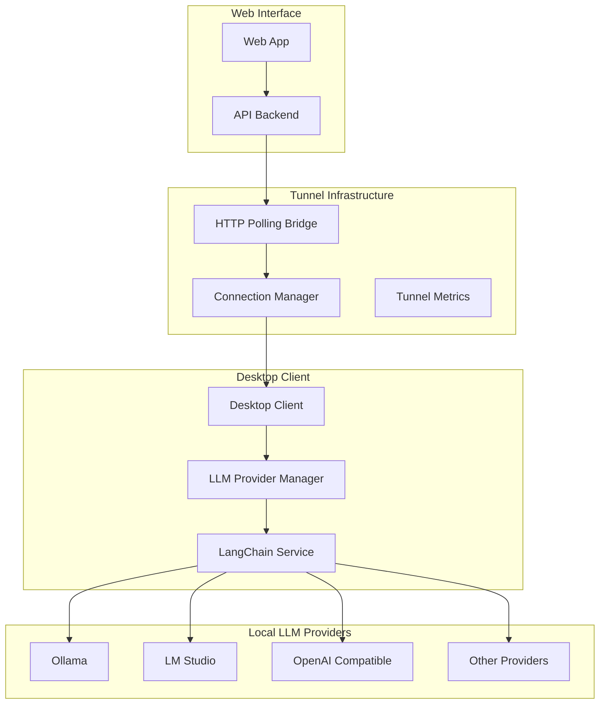

# Design Document

## Overview

This design addresses the tunnel-LLM communication issues by creating a provider-agnostic architecture built around LangChain Dart. The solution will fix the current communication problems between the HTTP polling bridge and local LLM providers while making the system extensible to support multiple LLM providers beyond just Ollama.

The design leverages the existing HTTP polling bridge infrastructure and enhances it with proper LLM provider abstraction, improved error handling, and robust connection management.

## Architecture

### High-Level Architecture



### Component Architecture

#### 1. Enhanced HTTP Polling Bridge
- **Purpose**: Handles communication between web interface and desktop clients
- **Enhancements**: 
  - LLM-specific request routing
  - Extended timeouts for LLM operations
  - Provider-aware error handling
  - Request prioritization based on operation type

#### 2. LLM Provider Manager (Desktop Client)
- **Purpose**: Manages discovery, connection, and health monitoring of local LLM providers
- **Responsibilities**:
  - Auto-discovery of available providers
  - Provider health monitoring
  - Connection pooling and management
  - Failover handling

#### 3. LangChain Service Layer
- **Purpose**: Provides unified interface to all LLM providers using LangChain Dart
- **Benefits**:
  - Standardized API across providers
  - Built-in provider implementations
  - Consistent response formatting
  - Advanced features like streaming, embeddings, etc.

## Components and Interfaces

### 1. LLM Provider Manager Interface

```dart
abstract class LLMProviderManager {
  Future<List<LLMProvider>> discoverProviders();
  Future<void> registerProvider(LLMProvider provider);
  Future<LLMProvider?> getPreferredProvider();
  Future<List<LLMProvider>> getAvailableProviders();
  Future<bool> testProviderConnection(String providerId);
  Stream<ProviderHealthStatus> monitorProviderHealth();
}
```

### 2. Enhanced Tunnel Request Handler

```dart
class TunnelLLMRequestHandler {
  Future<TunnelResponse> handleLLMRequest(TunnelRequest request);
  Future<TunnelResponse> handleStreamingRequest(TunnelRequest request);
  Future<TunnelResponse> handleModelOperation(TunnelRequest request);
  Future<void> validateRequest(TunnelRequest request);
}
```

### 3. LangChain Integration Service

```dart
class LangChainIntegrationService {
  Future<void> initializeProviders();
  Future<LangChainLLM> getLLMForProvider(String providerId);
  Future<String> processTextGeneration(String providerId, String prompt);
  Stream<String> processStreamingGeneration(String providerId, String prompt);
  Future<List<String>> getAvailableModels(String providerId);
}
```

### 4. Provider Discovery Service

```dart
class ProviderDiscoveryService {
  Future<List<ProviderInfo>> scanForProviders();
  Future<ProviderInfo?> detectOllama();
  Future<ProviderInfo?> detectLMStudio();
  Future<List<ProviderInfo>> detectOpenAICompatible();
  Future<bool> validateProviderEndpoint(ProviderInfo provider);
}
```

## Data Models

### Provider Information Model

```dart
class ProviderInfo {
  final String id;
  final String name;
  final ProviderType type;
  final String baseUrl;
  final int port;
  final Map<String, dynamic> capabilities;
  final ProviderStatus status;
  final DateTime lastSeen;
  final List<String> availableModels;
}

enum ProviderType {
  ollama,
  lmStudio,
  openAICompatible,
  custom
}

enum ProviderStatus {
  available,
  unavailable,
  error,
  unknown
}
```

### Enhanced Tunnel Request Model

```dart
class TunnelLLMRequest extends TunnelRequest {
  final LLMRequestType requestType;
  final String? preferredProvider;
  final Duration? customTimeout;
  final bool isStreaming;
  final Map<String, dynamic> llmParameters;
}

enum LLMRequestType {
  textGeneration,
  modelList,
  modelPull,
  modelDelete,
  modelInfo,
  healthCheck
}
```

## Error Handling

### Error Classification System

```dart
enum LLMCommunicationError {
  providerNotFound,
  providerUnavailable,
  connectionTimeout,
  requestTimeout,
  invalidRequest,
  providerError,
  tunnelError,
  authenticationError
}

class LLMErrorHandler {
  TunnelResponse handleError(LLMCommunicationError error, dynamic context);
  String getErrorMessage(LLMCommunicationError error);
  List<String> getTroubleshootingSteps(LLMCommunicationError error);
  bool isRetryableError(LLMCommunicationError error);
}
```

### Retry Strategy

```dart
class LLMRetryStrategy {
  final int maxRetries;
  final Duration initialDelay;
  final double backoffMultiplier;
  final Duration maxDelay;
  final List<LLMCommunicationError> retryableErrors;
  
  Future<T> executeWithRetry<T>(Future<T> Function() operation);
}
```

## Testing Strategy

### Unit Testing
- **Provider Discovery**: Test auto-discovery of different LLM providers
- **LangChain Integration**: Test LangChain service initialization and provider management
- **Error Handling**: Test error classification and retry mechanisms
- **Connection Management**: Test connection pooling and health monitoring

### Integration Testing
- **End-to-End Communication**: Test complete request flow from web interface to LLM provider
- **Provider Switching**: Test failover between different providers
- **Streaming Requests**: Test streaming response handling
- **Timeout Handling**: Test various timeout scenarios

### Performance Testing
- **Request Latency**: Measure response times for different request types
- **Concurrent Requests**: Test handling of multiple simultaneous requests
- **Memory Usage**: Monitor memory consumption during extended operations
- **Connection Pooling**: Test connection reuse and cleanup

### Provider-Specific Testing
- **Ollama Integration**: Test all Ollama API endpoints
- **LM Studio Integration**: Test LM Studio compatibility
- **OpenAI Compatible**: Test various OpenAI-compatible providers
- **Error Scenarios**: Test provider-specific error conditions

## Implementation Phases

### Phase 1: Core Infrastructure
1. Enhance HTTP polling bridge with LLM-specific handling
2. Implement provider discovery service
3. Create LangChain integration service
4. Add enhanced error handling and logging

### Phase 2: Provider Integration
1. Implement Ollama provider (enhance existing)
2. Add LM Studio provider support
3. Add OpenAI-compatible provider support
4. Implement provider health monitoring

### Phase 3: Advanced Features
1. Add streaming request support
2. Implement connection pooling
3. Add request prioritization
4. Implement advanced retry strategies

### Phase 4: Testing and Optimization
1. Comprehensive testing suite
2. Performance optimization
3. Memory usage optimization
4. Documentation and troubleshooting guides

## Configuration Management

### Provider Configuration

```yaml
llm_providers:
  discovery:
    auto_scan: true
    scan_interval: 30s
    timeout: 10s
  
  ollama:
    enabled: true
    base_url: "http://localhost:11434"
    timeout: 60s
    health_check_interval: 30s
  
  lm_studio:
    enabled: true
    base_url: "http://localhost:1234"
    timeout: 60s
    health_check_interval: 30s
  
  openai_compatible:
    enabled: true
    scan_ports: [8080, 5000, 3000]
    timeout: 30s
```

### Tunnel Configuration

```yaml
tunnel:
  llm_requests:
    default_timeout: 60s
    streaming_timeout: 300s
    max_retries: 3
    retry_delay: 2s
    backoff_multiplier: 2.0
  
  connection:
    pool_size: 10
    idle_timeout: 300s
    health_check_interval: 30s
```

## Security Considerations

### Authentication and Authorization
- Maintain existing JWT-based authentication
- Ensure provider access is limited to authenticated users
- Implement request validation and sanitization

### Network Security
- Validate all provider endpoints before connection
- Implement connection timeouts to prevent hanging connections
- Use secure communication protocols where available

### Data Privacy
- Ensure no sensitive data is logged
- Implement proper cleanup of request/response data
- Maintain user data isolation between providers

## Monitoring and Observability

### Metrics Collection
- Provider availability and response times
- Request success/failure rates by provider
- Connection pool utilization
- Error rates by error type

### Logging Strategy
- Structured logging with correlation IDs
- Provider-specific log levels
- Performance metrics logging
- Error context preservation

### Health Checks
- Provider endpoint health monitoring
- Tunnel connectivity verification
- LangChain service health status
- Overall system health aggregation