# ArgoCD api-backend Remediation Plan
# Comprehensive Step-by-Step Recovery Strategy

## Document Control
**Version**: 1.0  
**Status**: Active  
**Created**: 2025-12-24  
**Last Updated**: 2025-12-24  
**Owner**: DevOps Team  
**Approvers**: Platform Engineering, SRE Team

## Executive Summary

This document provides a detailed, step-by-step remediation plan to resolve the degraded status of the `api-backend` application in the `cloudtolocalllm` namespace. The degradation is caused by image pull failures (`ImagePullBackOff`) preventing container initialization, which ArgoCD correctly reports as a health issue.

## Current State Analysis

### Problem Summary
- **Application**: api-backend  
- **Namespace**: cloudtolocalllm  
- **Status**: Degraded (Synced but unhealthy)  
- **Root Cause**: Image pull failures from Azure Container Registry  
- **Impact**: Application unavailable, ArgoCD reports degraded health  
- **Duration**: Persistent issue (2+ days)

### Affected Components
```bash
# Current degraded pods
api-backend-64cd97cb75-x42ms         0/1     Init:ImagePullBackOff   0                 2d16h
api-backend-6965dbcc75-74qqc         0/1     Running                 207 (5m10s ago)   3d2h
```

### Error Analysis
```
Type:     Reason:   Age                        From:     Message
----      ------    ----                       ----      -------
Normal    BackOff   4m42s (x17163 over 2d16h)  kubelet   Back-off pulling image "imrightguycloudtolocalllm.azurecr.io/api-backend:main-1ebf1f7843b7278fc86964ccca37b9268a244160-api-backend"
Warning   Failed    4m42s (x17163 over 2d16h)  kubelet   Error: ImagePullBackOff
```

## Remediation Plan

### Phase 1: Immediate Stabilization (Timeframe: 0-30 minutes)
**Objective**: Stabilize current degraded pods and prevent further degradation

#### Step 1.1: Scale Down Current Deployment
**Action**: Reduce deployment replicas to prevent resource contention
**Command**:
```bash
kubectl scale deployment api-backend --replicas=0 -n cloudtolocalllm
```
**Owner**: DevOps Engineer  
**Time Estimate**: 2 minutes  
**Success Criteria**: Deployment scaled to 0 replicas, no running pods  
**Rollback**: `kubectl scale deployment api-backend --replicas=2 -n cloudtolocalllm`

#### Step 1.2: Clean Up Failed Pods
**Action**: Remove failed pods to clear kubelet backoff
**Command**:
```bash
kubectl delete pod --force --grace-period=0 $(kubectl get pods -n cloudtolocalllm -l app=api-backend -o name) -n cloudtolocalllm
```
**Owner**: DevOps Engineer  
**Time Estimate**: 3 minutes  
**Success Criteria**: All failed pods removed from namespace  
**Rollback**: N/A (pods will be recreated)

#### Step 1.3: Verify Current Image Pull Configuration
**Action**: Check existing image pull secrets and service account configuration
**Commands**:
```bash
# Check existing secrets
kubectl get secret regcred -n cloudtolocalllm -o yaml

# Check service account image pull secrets
kubectl get serviceaccount api-backend-sa -n cloudtolocalllm -o jsonpath='{.imagePullSecrets}'
```
**Owner**: DevOps Engineer  
**Time Estimate**: 5 minutes  
**Success Criteria**: Current configuration documented  
**Rollback**: N/A (read-only operation)

### Phase 2: Root Cause Resolution (Timeframe: 30-90 minutes)
**Objective**: Resolve the underlying image pull issues

#### Step 2.1: Validate Azure Container Registry Access
**Action**: Test ACR access and credentials
**Commands**:
```bash
# Test ACR login (requires Azure CLI)
az acr login --name imrightguycloudtolocalllm

# Check ACR authentication
kubectl create secret docker-registry acr-test-credentials \
  --docker-server=imrightguycloudtolocalllm.azurecr.io \
  --docker-username=<service-principal-id> \
  --docker-password=<service-principal-password> \
  --docker-email=devops@cloudtolocalllm.com \
  -n cloudtolocalllm --dry-run=client -o yaml
```
**Owner**: Cloud Engineer  
**Time Estimate**: 15 minutes  
**Success Criteria**: ACR access validated and credentials confirmed working  
**Rollback**: Remove test secret if created

#### Step 2.2: Update Image Pull Secrets
**Action**: Create/Update Docker registry secret with valid ACR credentials
**Commands**:
```bash
# Create new ACR credentials secret
kubectl create secret docker-registry acr-credentials \
  --docker-server=imrightguycloudtolocalllm.azurecr.io \
  --docker-username=$(az acr credential show --name imrightguycloudtolocalllm --query "username" -o tsv) \
  --docker-password=$(az acr credential show --name imrightguycloudtolocalllm --query "passwords[0].value" -o tsv) \
  --docker-email=devops@cloudtolocalllm.com \
  -n cloudtolocalllm --dry-run=client -o yaml | kubectl apply -f -

# Verify secret creation
kubectl get secret acr-credentials -n cloudtolocalllm -o yaml
```
**Owner**: Cloud Engineer  
**Time Estimate**: 10 minutes  
**Success Criteria**: New ACR credentials secret created successfully  
**Rollback**: `kubectl delete secret acr-credentials -n cloudtolocalllm`

#### Step 2.3: Update Service Account Configuration
**Action**: Configure service account to use updated image pull secrets
**Commands**:
```bash
# Patch service account to use new credentials
kubectl patch serviceaccount api-backend-sa \
  -p '{"imagePullSecrets": [{"name": "acr-credentials"}, {"name": "regcred"}]}' \
  -n cloudtolocalllm

# Verify service account update
kubectl get serviceaccount api-backend-sa -n cloudtolocalllm -o yaml
```
**Owner**: DevOps Engineer  
**Time Estimate**: 5 minutes  
**Success Criteria**: Service account updated with new image pull secrets  
**Rollback**: Restore original imagePullSecrets configuration

#### Step 2.4: Test Image Pull with Temporary Pod
**Action**: Validate image pull works with new credentials
**Commands**:
```bash
# Create test pod to validate image pull
cat <<EOF | kubectl apply -f -
apiVersion: v1
kind: Pod
metadata:
  name: api-backend-image-test
  namespace: cloudtolocalllm
spec:
  serviceAccountName: api-backend-sa
  containers:
  - name: test
    image: imrightguycloudtolocalllm.azurecr.io/api-backend:main-1ebf1f7843b7278fc86964ccca37b9268a244160-api-backend
    command: ["echo", "Image pull successful"]
  restartPolicy: Never
EOF

# Monitor test pod
kubectl get pod api-backend-image-test -n cloudtolocalllm -w

# Check logs if successful
kubectl logs api-backend-image-test -n cloudtolocalllm
```
**Owner**: DevOps Engineer  
**Time Estimate**: 15 minutes  
**Success Criteria**: Test pod successfully pulls image and completes  
**Rollback**: `kubectl delete pod api-backend-image-test -n cloudtolocalllm`

### Phase 3: Configuration Updates (Timeframe: 90-120 minutes)
**Objective**: Update ArgoCD Application manifest and Kubernetes resources

#### Step 3.1: Update ArgoCD Application Manifest
**Action**: Modify application manifest to ensure proper synchronization
**Commands**:
```bash
# Get current application manifest
kubectl get application api-backend -n argocd -o yaml > api-backend-application-backup.yaml

# Update sync strategy to be more resilient
cat <<EOF | kubectl apply -f -
apiVersion: argoproj.io/v1alpha1
kind: Application
metadata:
  name: api-backend
  namespace: argocd
spec:
  # ... existing spec ...
  syncPolicy:
    automated:
      prune: true
      selfHeal: true
      allowEmpty: false
    syncOptions:
    - CreateNamespace=true
    - RespectIgnoreDifferences=true
    - ApplyOutOfSyncOnly=true
    - ServerSideApply=true
    retry:
      limit: 5
      backoff:
        duration: 5s
        factor: 2
        maxDuration: 3m
EOF
```
**Owner**: GitOps Engineer  
**Time Estimate**: 15 minutes  
**Success Criteria**: Application manifest updated with improved sync strategy  
**Rollback**: `kubectl apply -f api-backend-application-backup.yaml`

#### Step 3.2: Update Deployment Resource Limits
**Action**: Ensure proper resource allocation to prevent OOM issues
**Commands**:
```bash
# Check current resource limits
kubectl get deployment api-backend -n cloudtolocalllm -o jsonpath='{.spec.template.spec.containers[0].resources}'

# Update deployment with optimized resource limits
kubectl patch deployment api-backend -n cloudtolocalllm --type='json' -p='[
  {"op": "replace", "path": "/spec/template/spec/containers/0/resources", "value": {
    "limits": {"cpu": "500m", "memory": "768Mi"},
    "requests": {"cpu": "250m", "memory": "384Mi"}
  }}
]'
```
**Owner**: DevOps Engineer  
**Time Estimate**: 10 minutes  
**Success Criteria**: Deployment updated with optimized resource configuration  
**Rollback**: Restore previous resource limits

#### Step 3.3: Add Health Checks and Probes
**Action**: Enhance deployment with comprehensive health monitoring
**Commands**:
```bash
# Update deployment with enhanced health checks
kubectl patch deployment api-backend -n cloudtolocalllm --type='json' -p='[
  {"op": "replace", "path": "/spec/template/spec/containers/0/livenessProbe", "value": {
    "httpGet": {"path": "/health", "port": 8080},
    "initialDelaySeconds": 60,
    "timeoutSeconds": 5,
    "periodSeconds": 15,
    "successThreshold": 1,
    "failureThreshold": 3
  }},
  {"op": "replace", "path": "/spec/template/spec/containers/0/readinessProbe", "value": {
    "httpGet": {"path": "/health", "port": 8080},
    "initialDelaySeconds": 30,
    "timeoutSeconds": 3,
    "periodSeconds": 10,
    "successThreshold": 1,
    "failureThreshold": 2
  }},
  {"op": "replace", "path": "/spec/template/spec/containers/0/startupProbe", "value": {
    "httpGet": {"path": "/health", "port": 8080},
    "initialDelaySeconds": 10,
    "timeoutSeconds": 3,
    "periodSeconds": 5,
    "successThreshold": 1,
    "failureThreshold": 30
  }}
]'
```
**Owner**: DevOps Engineer  
**Time Estimate**: 10 minutes  
**Success Criteria**: Deployment updated with comprehensive health probes  
**Rollback**: Restore previous probe configuration

### Phase 4: Validation and Testing (Timeframe: 120-150 minutes)
**Objective**: Validate fixes and confirm system health

#### Step 4.1: Gradual Deployment Scale-Up
**Action**: Slowly increase replicas to monitor stability
**Commands**:
```bash
# Scale to 1 replica and monitor
kubectl scale deployment api-backend --replicas=1 -n cloudtolocalllm

# Monitor pod creation and health
kubectl get pods -n cloudtolocalllm -l app=api-backend -w

# Check pod events
kubectl describe pod $(kubectl get pods -n cloudtolocalllm -l app=api-backend -o name) -n cloudtolocalllm
```
**Owner**: DevOps Engineer  
**Time Estimate**: 15 minutes  
**Success Criteria**: Single pod starts successfully and reaches Ready state  
**Rollback**: `kubectl scale deployment api-backend --replicas=0 -n cloudtolocalllm`

#### Step 4.2: Health Status Verification
**Action**: Verify application health through multiple channels
**Commands**:
```bash
# Check pod health status
kubectl get pods -n cloudtolocalllm -l app=api-backend

# Check deployment status
kubectl get deployment api-backend -n cloudtolocalllm

# Check ArgoCD application health
kubectl get application api-backend -n argocd

# Check application logs
kubectl logs -l app=api-backend -n cloudtolocalllm --tail=50
```
**Owner**: DevOps Engineer  
**Time Estimate**: 10 minutes  
**Success Criteria**: All health checks pass, logs show normal operation  
**Rollback**: N/A (monitoring only)

#### Step 4.3: Full Deployment Scale-Up
**Action**: Scale to full replica count if single pod is stable
**Commands**:
```bash
# Scale to full replica count (assuming 2 replicas)
kubectl scale deployment api-backend --replicas=2 -n cloudtolocalllm

# Monitor rolling update
kubectl rollout status deployment/api-backend -n cloudtolocalllm

# Check all pods reach Ready state
kubectl wait --for=condition=Ready pod -l app=api-backend -n cloudtolocalllm --timeout=300s
```
**Owner**: DevOps Engineer  
**Time Estimate**: 15 minutes  
**Success Criteria**: All replicas running and Ready  
**Rollback**: `kubectl scale deployment api-backend --replicas=1 -n cloudtolocalllm`

#### Step 4.4: ArgoCD Synchronization Verification
**Action**: Ensure ArgoCD correctly reflects the healthy state
**Commands**:
```bash
# Check ArgoCD application status
kubectl get application api-backend -n argocd

# Check sync status
kubectl get application api-backend -n argocd -o jsonpath='{.status.sync.status}'

# Check health status
kubectl get application api-backend -n argocd -o jsonpath='{.status.health.status}'

# Force refresh if needed
kubectl patch application api-backend -n argocd --type='json' -p='[{"op": "replace", "path": "/metadata/annotations/argocd.argoproj.io~1refresh", "value": "'$(date +%s)'"}]'
```
**Owner**: GitOps Engineer  
**Time Estimate**: 10 minutes  
**Success Criteria**: ArgoCD reports "Healthy" status for the application  
**Rollback**: N/A (monitoring only)

### Phase 5: Preventive Measures (Timeframe: 150-180 minutes)
**Objective**: Implement measures to prevent recurrence

#### Step 5.1: Image Pull Secret Rotation Strategy
**Action**: Implement automated secret rotation
**Commands**:
```bash
# Create Kubernetes CronJob for secret rotation
cat <<EOF | kubectl apply -f -
apiVersion: batch/v1
kind: CronJob
metadata:
  name: acr-credentials-rotator
  namespace: cloudtolocalllm
spec:
  schedule: "0 3 * * *"  # Daily at 3 AM
  jobTemplate:
    spec:
      template:
        spec:
          serviceAccountName: api-backend-sa
          containers:
          - name: rotator
            image: bitnami/kubectl:latest
            command:
            - /bin/sh
            - -c
            - |
              # Get new ACR credentials
              NEW_USERNAME=$(az acr credential show --name imrightguycloudtolocalllm --query "username" -o tsv)
              NEW_PASSWORD=$(az acr credential show --name imrightguycloudtolocalllm --query "passwords[0].value" -o tsv)
              
              # Create new secret
              kubectl create secret docker-registry acr-credentials-new \
                --docker-server=imrightguycloudtolocalllm.azurecr.io \
                --docker-username=$NEW_USERNAME \
                --docker-password=$NEW_PASSWORD \
                --docker-email=devops@cloudtolocalllm.com \
                --dry-run=client -o yaml | kubectl apply -f -
              
              # Update service accounts to use new secret
              kubectl patch serviceaccount api-backend-sa \
                -p '{"imagePullSecrets": [{"name": "acr-credentials-new"}]}' \
                -n cloudtolocalllm
              
              # Clean up old secret after 24 hours
              kubectl delete secret acr-credentials --ignore-not-found -n cloudtolocalllm
              kubectl rename secret acr-credentials-new acr-credentials -n cloudtolocalllm
          restartPolicy: OnFailure
EOF
```
**Owner**: Cloud Engineer  
**Time Estimate**: 20 minutes  
**Success Criteria**: CronJob created and tested successfully  
**Rollback**: `kubectl delete cronjob acr-credentials-rotator -n cloudtolocalllm`

#### Step 5.2: Enhanced Monitoring and Alerting
**Action**: Add comprehensive monitoring for image pull issues
**Commands**:
```bash
# Create Prometheus alert rules
cat <<EOF | kubectl apply -f -
apiVersion: monitoring.coreos.com/v1
kind: PrometheusRule
metadata:
  name: api-backend-health-rules
  namespace: monitoring
  labels:
    app: prometheus-operator
    release: prometheus
spec:
  groups:
  - name: api-backend.rules
    rules:
    - alert: ApiBackendImagePullFailed
      expr: kube_pod_container_status_waiting_reason{reason="ImagePullBackOff", namespace="cloudtolocalllm", pod=~"api-backend-.*"} == 1
      for: 5m
      labels:
        severity: critical
        component: api-backend
        namespace: cloudtolocalllm
      annotations:
        summary: "API Backend image pull failed"
        description: "Pod {{ $labels.pod }} in namespace {{ $labels.namespace }} is failing to pull image: {{ $labels.image }}"
        runbook_url: "https://wiki.cloudtolocalllm.com/runbooks/api-backend-image-pull-failure"
    
    - alert: ApiBackendDegraded
      expr: argocd_app_info{name="api-backend", health_status="Degraded"} == 1
      for: 10m
      labels:
        severity: warning
        component: api-backend
        namespace: argocd
      annotations:
        summary: "API Backend application degraded"
        description: "ArgoCD application {{ $labels.name }} has been in degraded state for 10 minutes"
        runbook_url: "https://wiki.cloudtolocalllm.com/runbooks/argocd-application-degraded"
EOF
```
**Owner**: SRE Engineer  
**Time Estimate**: 15 minutes  
**Success Criteria**: Alert rules created and tested  
**Rollback**: `kubectl delete prometheusrules api-backend-health-rules -n monitoring`

#### Step 5.3: Resource Optimization
**Action**: Implement Horizontal Pod Autoscaler with proper metrics
**Commands**:
```bash
# Create HPA for api-backend
cat <<EOF | kubectl apply -f -
apiVersion: autoscaling/v2
kind: HorizontalPodAutoscaler
metadata:
  name: api-backend-hpa
  namespace: cloudtolocalllm
spec:
  scaleTargetRef:
    apiVersion: apps/v1
    kind: Deployment
    name: api-backend
  minReplicas: 2
  maxReplicas: 6
  metrics:
  - type: Resource
    resource:
      name: cpu
      target:
        type: Utilization
        averageUtilization: 70
  - type: Resource
    resource:
      name: memory
      target:
        type: Utilization
        averageUtilization: 80
  behavior:
    scaleDown:
      stabilizationWindowSeconds: 300
      policies:
      - type: Percent
        value: 10
        periodSeconds: 60
    scaleUp:
      stabilizationWindowSeconds: 60
      policies:
      - type: Percent
        value: 20
        periodSeconds: 60
      - type: Pods
        value: 2
        periodSeconds: 60
        selectPolicy: Max
EOF
```
**Owner**: DevOps Engineer  
**Time Estimate**: 10 minutes  
**Success Criteria**: HPA created and responding to metrics  
**Rollback**: `kubectl delete hpa api-backend-hpa -n cloudtolocalllm`

#### Step 5.4: Documentation and Runbook Updates
**Action**: Update operational documentation
**Tasks**:
1. Update runbook with image pull failure resolution steps
2. Add ArgoCD status interpretation guide
3. Document service account credential rotation procedure
4. Create troubleshooting guide for ImagePullBackOff errors

**Owner**: Documentation Team  
**Time Estimate**: 30 minutes  
**Success Criteria**: Documentation updated and published  
**Rollback**: N/A

## Rollback Procedures

### Full Rollback Plan
**Trigger Conditions**:
- Any step fails and cannot be resolved within 15 minutes
- New issues introduced during remediation
- Application health degrades further

**Rollback Steps**:
```bash
# 1. Scale down deployment
kubectl scale deployment api-backend --replicas=0 -n cloudtolocalllm

# 2. Restore original configuration
kubectl apply -f api-backend-application-backup.yaml

# 3. Restore service account
kubectl apply -f api-backend-sa-backup.yaml

# 4. Clean up new resources
kubectl delete secret acr-credentials -n cloudtolocalllm
kubectl delete cronjob acr-credentials-rotator -n cloudtolocalllm
kubectl delete hpa api-backend-hpa -n cloudtolocalllm

# 5. Restore original deployment
kubectl apply -f api-backend-deployment-backup.yaml
```

## Success Criteria

### Phase-Specific Success Metrics

**Phase 1 - Immediate Stabilization**:
- ✅ All degraded pods terminated cleanly
- ✅ No resource contention or cluster pressure
- ✅ Current configuration documented

**Phase 2 - Root Cause Resolution**:
- ✅ ACR access validated and working
- ✅ New image pull secrets created and tested
- ✅ Service account updated successfully
- ✅ Test pod successfully pulls image

**Phase 3 - Configuration Updates**:
- ✅ ArgoCD application manifest updated
- ✅ Resource limits optimized
- ✅ Health probes enhanced
- ✅ All changes synchronized

**Phase 4 - Validation and Testing**:
- ✅ Single pod starts successfully
- ✅ All health checks pass
- ✅ Full deployment scales up successfully
- ✅ ArgoCD reports "Healthy" status

**Phase 5 - Preventive Measures**:
- ✅ Secret rotation strategy implemented
- ✅ Enhanced monitoring deployed
- ✅ HPA configured and working
- ✅ Documentation updated

### Overall Success Criteria
- ✅ `api-backend` application status changes from "Degraded" to "Healthy" in ArgoCD
- ✅ All pods in `cloudtolocalllm` namespace show "Running" and "Ready" status
- ✅ No `ImagePullBackOff` errors in pod events
- ✅ Application responds to health checks on `/health` endpoint
- ✅ ArgoCD synchronization completes successfully
- ✅ Monitoring alerts show healthy state

## Timeline and Resource Allocation

### Estimated Timeline

```mermaid
gantt
    title Api-Backend Remediation Timeline
    dateFormat  HH:mm
    section Phase 1: Immediate Stabilization
    Scale Down           :a1, 00:00, 00:02
    Clean Up Pods        :a2, 00:02, 00:05
    Verify Config        :a3, 00:05, 00:10
    
    section Phase 2: Root Cause Resolution
    Validate ACR         :b1, 00:30, 00:45
    Update Secrets       :b2, 00:45, 00:55
    Update SA            :b3, 00:55, 01:00
    Test Image Pull      :b4, 01:00, 01:15
    
    section Phase 3: Configuration Updates
    Update Manifest      :c1, 01:30, 01:45
    Update Resources     :c2, 01:45, 01:55
    Update Probes        :c3, 01:55, 02:05
    
    section Phase 4: Validation
    Scale Up (1)         :d1, 02:00, 02:15
    Health Check         :d2, 02:15, 02:25
    Full Scale Up        :d3, 02:25, 02:40
    ArgoCD Sync          :d4, 02:40, 02:50
    
    section Phase 5: Preventive
    Secret Rotation      :e1, 03:00, 03:20
    Monitoring           :e2, 03:20, 03:35
    HPA Setup            :e3, 03:35, 03:45
    Documentation        :e4, 03:45, 04:15
```


### Resource Requirements
- **Personnel**: 2 DevOps Engineers, 1 Cloud Engineer, 1 SRE Engineer, 1 Documentation Specialist
- **Time**: 3 hours total (with buffer)
- **Tools**: kubectl, Azure CLI, ArgoCD CLI, Prometheus, Grafana
- **Access**: Kubernetes cluster admin, Azure Container Registry admin

## Risk Assessment and Mitigation

### Identified Risks

| Risk | Likelihood | Impact | Mitigation Strategy |
|------|-----------|--------|---------------------|
| Image pull still fails after credential update | Medium | High | Test with temporary pod before full deployment, have fallback credentials ready |
| ArgoCD synchronization issues | Low | Medium | Use server-side apply, implement retry logic, monitor sync status |
| Resource contention during scale-up | Medium | Medium | Gradual scale-up, monitor cluster resources, implement resource limits |
| Service disruption during updates | High | Medium | Use rolling updates, implement health checks, monitor during changes |
| Credential exposure | Low | High | Use Kubernetes secrets, implement RBAC, rotate credentials regularly |

### Mitigation Strategies
1. **Incremental Testing**: Test each change in isolation before full deployment
2. **Rollback Planning**: Comprehensive rollback procedures for each step
3. **Monitoring**: Real-time monitoring during all critical operations
4. **Communication**: Team coordination and status updates throughout
5. **Documentation**: Detailed logging of all changes and decisions

## Post-Remediation Verification

### Immediate Verification (Within 1 hour)
```bash
# 1. Check application health
kubectl get application api-backend -n argocd

# 2. Check pod status
kubectl get pods -n cloudtolocalllm -l app=api-backend

# 3. Check service availability
kubectl get service api-backend -n cloudtolocalllm

# 4. Test endpoint
kubectl run curl-test --image=curlimages/curl -it --rm --restart=Never -- \
  curl -s http://api-backend.cloudtolocalllm.svc.cluster.local:8080/health
```

### Ongoing Monitoring (First 24 hours)
1. **Pod Restarts**: Monitor for unexpected pod restarts
2. **Resource Usage**: Check CPU/memory usage stays within limits
3. **Health Checks**: Verify continuous health check success
4. **ArgoCD Sync**: Ensure no synchronization drift occurs
5. **User Traffic**: Monitor application responds correctly to requests

### Long-Term Verification (First week)
1. **Secret Rotation**: Verify automated secret rotation works
2. **HPA Behavior**: Monitor autoscaling responds to load changes
3. **Alert Testing**: Trigger test alerts to verify monitoring
4. **Documentation Usage**: Ensure team can follow updated runbooks

## Communication Plan

### Stakeholder Updates
- **Immediate Team**: Real-time updates in #devops channel
- **Management**: Summary report after each phase completion
- **Support Team**: Notification before and after changes
- **Users**: Maintenance notification if any downtime expected

### Status Reporting
```bash
# Current status command
echo "=== Api-Backend Remediation Status ==="
echo "Phase: $(kubectl get application api-backend -n argocd -o jsonpath='{.status.health.status}')"
echo "Pods: $(kubectl get pods -n cloudtolocalllm -l app=api-backend --no-headers | wc -l) total"
echo "Ready: $(kubectl get pods -n cloudtolocalllm -l app=api-backend --field-selector=status.phase=Running --no-headers | grep -c '1/1')"
echo "Last Sync: $(kubectl get application api-backend -n argocd -o jsonpath='{.status.operationState.finishedAt}')"
```

## Appendix: Reference Commands

### Common Troubleshooting Commands
```bash
# Check pod events
kubectl get events -n cloudtolocalllm --sort-by='.lastTimestamp'

# Check pod logs
kubectl logs -l app=api-backend -n cloudtolocalllm --tail=100

# Check ArgoCD sync status
argocd app get api-backend

# Force ArgoCD sync
argocd app sync api-backend

# Check resource usage
kubectl top pods -n cloudtolocalllm -l app=api-backend
```

### Backup Commands
```bash
# Backup current state
kubectl get all -n cloudtolocalllm -o yaml > cloudtolocalllm-backup-$(date +%Y%m%d-%H%M%S).yaml

# Backup ArgoCD application
kubectl get application api-backend -n argocd -o yaml > api-backend-app-backup-$(date +%Y%m%d-%H%M%S).yaml

# Backup secrets (excluding data)
kubectl get secrets -n cloudtolocalllm -o yaml > secrets-backup-$(date +%Y%m%d-%H%M%S).yaml
```

## Conclusion

This comprehensive remediation plan addresses the root cause of the api-backend degraded status while implementing preventive measures to avoid recurrence. The phased approach ensures minimal disruption and provides clear rollback paths at each stage. Successful implementation will restore the application to healthy status and improve the overall resilience of the deployment pipeline.