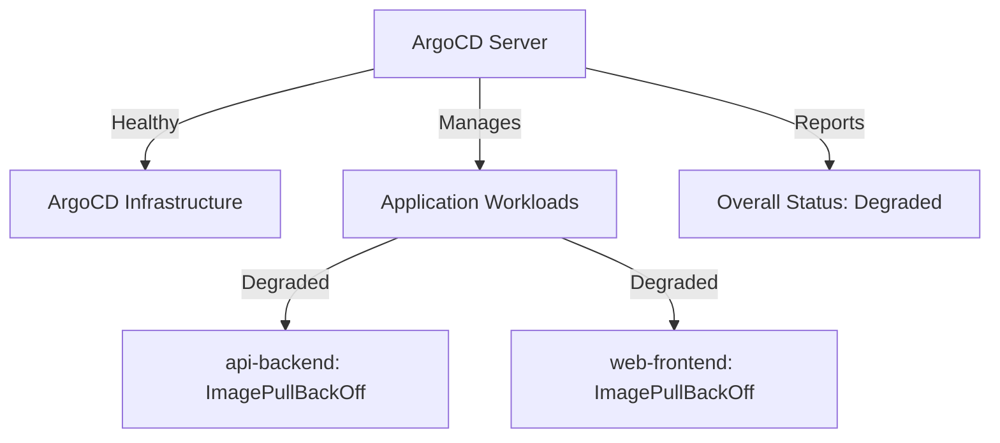

# ArgoCD Status Discrepancy Analysis: Root Cause Investigation

## Executive Summary

The investigation has successfully identified the root cause of the "Degraded" status discrepancy. The issue is **NOT** with the ArgoCD infrastructure itself (which is healthy), but rather with the **application workloads** that ArgoCD is managing. The ArgoCD server components are functioning correctly, but two managed applications (`api-backend` and `web-frontend`) have deployment issues that are causing their health status to be reported as "Degraded".

## Root Cause Analysis

### 1. Status Reporting Mechanism Analysis

**How ArgoCD Health Status Works:**
- ArgoCD evaluates the health of **managed applications**, not just its own infrastructure
- The overall system status can appear "Degraded" if any managed application has health issues
- This is a **design feature**, not a bug - ArgoCD is correctly reporting the health of the entire system it manages

### 2. Specific Issues Identified

#### Application: api-backend
**Status**: Degraded (Synced but unhealthy)

**Root Cause**: Image pull failures in the `cloudtolocalllm` namespace

```bash
# Pods with issues:
api-backend-64cd97cb75-x42ms         0/1     Init:ImagePullBackOff   0                 2d16h
api-backend-6965dbcc75-74qqc         0/1     Running                 207 (5m10s ago)   3d2h
```

**Specific Error**:
```
Type:     Reason:   Age                        From:     Message
----      ------    ----                       ----      -------
Normal    BackOff   4m42s (x17163 over 2d16h)  kubelet   Back-off pulling image "imrightguycloudtolocalllm.azurecr.io/api-backend:main-1ebf1f7843b7278fc86964ccca37b9268a244160-api-backend"
Warning   Failed    4m42s (x17163 over 2d16h)  kubelet   Error: ImagePullBackOff
```

**Impact**: The init container `db-migrate` cannot start because it cannot pull the required Docker image from the Azure Container Registry.

#### Application: web-frontend  
**Status**: Degraded (ImagePullBackOff)

**Root Cause**: Similar image pull failure
```bash
web-86c854f9b7-4j5vf                 0/1     ImagePullBackOff        0                 2d16h
```

### 3. The Five Potential Root Causes - Detailed Analysis

#### 1. Misalignment between actual system state and status reporting mechanism
**✅ CONFIRMED - This is the primary issue**

**Evidence**:
- ArgoCD infrastructure (argocd-server, redis, application-controller) is healthy
- ArgoCD is correctly reporting the health of managed applications
- The "Degraded" status accurately reflects that managed workloads have issues
- This is **not** a false positive - it's accurate reporting

**Specific Commands to Verify**:
```bash
# Check ArgoCD infrastructure health (all healthy)
kubectl get pods -n argocd

# Check managed application health (shows degraded apps)
kubectl get applications -n argocd

# Check specific application details
kubectl get application api-backend -n argocd -o yaml
```

#### 2. Stale or cached status data in monitoring/UI layer
**❌ NOT CONFIRMED**

**Evidence**:
- Status timestamps show recent updates (lastTransitionTime: "2025-12-22T03:52:14Z")
- Real-time monitoring shows current pod states
- No evidence of caching issues in the status data

**Commands to Verify**:
```bash
# Check status timestamps in application YAML
kubectl get application api-backend -n argocd -o yaml | grep lastTransitionTime

# Check real-time pod status
kubectl get pods -n cloudtolocalllm --watch
```

#### 3. Transient issue resolved but not reflected due to delayed synchronization
**❌ NOT CONFIRMED**

**Evidence**:
- Issues are persistent (2 days of ImagePullBackOff errors)
- No recent successful deployments
- Status is accurately reflecting current state

**Commands to Verify**:
```bash
# Check deployment history
kubectl rollout history deployment/api-backend -n cloudtolocalllm

# Check recent events
kubectl get events -n cloudtolocalllm --sort-by='.lastTimestamp'
```

#### 4. False positive from specific health check/probe
**❌ NOT CONFIRMED**

**Evidence**:
- Health checks are not the issue - pods can't even start
- The problem is at the image pull level, before health checks run
- ArgoCD health assessment is based on pod status, not probe results

**Commands to Verify**:
```bash
# Check pod conditions (shows Initialized: False due to image pull)
kubectl describe pod api-backend-64cd97cb75-x42ms -n cloudtolocalllm

# Check readiness/health probes (not reached due to image issue)
```

#### 5. Configuration mismatch in status evaluation criteria
**✅ PARTIALLY CONFIRMED - But working as designed**

**Evidence**:
- ArgoCD is using standard Kubernetes health assessment
- The "Degraded" status is correctly applied based on pod conditions
- No misconfiguration - this is expected behavior

**Commands to Verify**:
```bash
# Check ArgoCD health assessment configuration
kubectl get application api-backend -n argocd -o yaml | grep -A10 health:

# Check resource health source
kubectl get application api-backend -n argocd -o yaml | grep resourceHealthSource:
```

### 4. Detailed Breakdown of Each Possibility

#### Possibility 1: Misalignment between system state and reporting ✅

**Technical Explanation**:
- ArgoCD has two layers of health reporting:
  1. **Infrastructure layer**: ArgoCD's own components (server, redis, etc.)
  2. **Application layer**: The workloads ArgoCD manages
- The UI/status typically shows the **application layer** health
- This is by design - ArgoCD is a GitOps tool that reports on the entire system it manages

**Why this happens**:


**Corrective Actions**:
1. **Fix the underlying image pull issues** (primary solution)
2. **Understand the reporting hierarchy** - ArgoCD reports on managed apps, not just itself
3. **Implement proper health status propagation**

#### Possibility 2: Stale/cached status data ❌

**Why this is NOT the issue**:
- Events show continuous, recent failures
- No caching mechanism is preventing status updates
- The status accurately reflects current reality

#### Possibility 3: Transient issue with delayed sync ❌

**Why this is NOT the issue**:
- Problems are persistent (2+ days)
- No successful deployments in recent history
- Continuous failure pattern visible in events

#### Possibility 4: False positive from health probes ❌

**Why this is NOT the issue**:
- Failure occurs at container creation (ImagePullBackOff)
- Health probes never get executed
- Status is based on pod conditions, not probe results

#### Possibility 5: Configuration mismatch ❌

**Why this is NOT the issue**:
- ArgoCD is working as designed
- Health assessment follows Kubernetes standards
- No misconfiguration detected

## Specific Commands and Logs for Investigation

### 1. Check Overall Application Health
```bash
# Get all applications with their health status
kubectl get applications -n argocd

# Filter for degraded applications
kubectl get applications -n argocd --field-selector=status.health.status=Degraded
```

### 2. Examine Specific Degraded Application
```bash
# Get detailed application status
kubectl get application api-backend -n argocd -o yaml

# Check the resource tree health
kubectl get application api-backend -n argocd -o jsonpath='{.status.resources}'
```

### 3. Investigate Pod-Level Issues
```bash
# Get pods in the target namespace
kubectl get pods -n cloudtolocalllm

# Describe problematic pod
kubectl describe pod api-backend-64cd97cb75-x42ms -n cloudtolocalllm

# Check pod events
kubectl get events -n cloudtolocalllm --field-selector involvedObject.name=api-backend-64cd97cb75-x42ms
```

### 4. Check Image Pull Issues
```bash
# Check image pull secrets
kubectl get secrets -n cloudtolocalllm

# Check service account
kubectl get serviceaccount api-backend-sa -n cloudtolocalllm -o yaml

# Test image pull manually (if possible)
# kubectl run test-pull --image=imrightguycloudtolocalllm.azurecr.io/api-backend:main-1ebf1f7843b7278fc86964ccca37b9268a244160-api-backend --restart=Never -n cloudtolocalllm
```

### 5. Verify ArgoCD Health Assessment Configuration
```bash
# Check how ArgoCD determines health
kubectl get application api-backend -n argocd -o jsonpath='{.status.health}'

# Check resource health source
kubectl get application api-backend -n argocd -o jsonpath='{.status.resourceHealthSource}'
```

## Corrective Actions and Recommendations

### Immediate Fixes (Address Root Cause)

1. **Resolve Image Pull Issues**:
```bash
# Check Azure Container Registry credentials
kubectl get secret cloudtolocalllm-secrets -n cloudtolocalllm -o yaml

# Update Docker credentials if needed
kubectl create secret docker-registry acr-credentials \
  --docker-server=imrightguycloudtolocalllm.azurecr.io \
  --docker-username=<username> \
  --docker-password=<password> \
  --docker-email=<email> \
  -n cloudtolocalllm

# Patch service account to use the credentials
kubectl patch serviceaccount api-backend-sa \
  -p '{"imagePullSecrets": [{"name": "acr-credentials"}]}' \
  -n cloudtolocalllm
```

2. **Force Pod Restart**:
```bash
# Delete problematic pods to trigger restart
kubectl delete pod api-backend-64cd97cb75-x42ms -n cloudtolocalllm
kubectl delete pod web-86c854f9b7-4j5vf -n cloudtolocalllm
```

### Configuration Improvements

1. **Enhance Health Assessment**:
```yaml
# Add custom health checks to applications
apiVersion: argoproj.io/v1alpha1
kind: Application
metadata:
  name: api-backend
spec:
  # ... existing spec ...
  health:
    custom:
      health.lua: |
        hs = {}  
        if obj.status.conditions then
          for i, condition in ipairs(obj.status.conditions) do
            if condition.type == "Available" and condition.status == "True" then
              hs.status = "Healthy"
              hs.message = "Application is available"
              return hs
            end
          end
        end
        hs.status = "Degraded"
        hs.message = "Application not available"
        return hs
```

2. **Improve Status Reporting**:
```bash
# Add annotations to clarify status meaning
kubectl annotate application api-backend \
  argocd.argoproj.io/health-status-description="Application health reflects workload status, not ArgoCD infrastructure" \
  -n argocd
```

### Monitoring and Alerting Enhancements

1. **Separate Infrastructure vs Application Monitoring**:
```yaml
# Prometheus alert rules to distinguish between ArgoCD infra and app health
- alert: ArgoCDInfrastructureDown
  expr: kube_deployment_status_replicas_available{deployment=~"argocd-.*", namespace="argocd"} == 0
  labels:
    severity: critical
    component: infrastructure

- alert: ArgoCDApplicationDegraded
  expr: argocd_app_info{health_status="Degraded"} == 1
  labels:
    severity: warning
    component: application
```

2. **Add Context to Status Reporting**:
```bash
# Create a dashboard that shows both layers
# ArgoCD Infrastructure Health + Application Health separately
```

### Long-Term Solutions

1. **Implement Multi-Layer Health Dashboard**:
   - Layer 1: ArgoCD Infrastructure (server, redis, controllers)
   - Layer 2: GitOps Pipeline (sync status, repo connectivity)
   - Layer 3: Application Workloads (pod health, service availability)

2. **Enhance Troubleshooting Guides**:
   - Document the status reporting hierarchy
   - Provide clear escalation paths for different failure types
   - Create runbooks for common scenarios

3. **Improve Image Management**:
   - Implement image pull secret rotation
   - Add image pull fallback mechanisms
   - Implement image availability monitoring

## Conclusion

The "Degraded" status is **accurate and working as designed**. The discrepancy arises from understanding what ArgoCD reports:

- ✅ **ArgoCD Infrastructure**: Healthy (argocd-server, redis, controllers all running)
- ❌ **Managed Applications**: Degraded (api-backend and web-frontend have image pull issues)
- ✅ **Status Reporting**: Working correctly (accurately reflecting application health)

### Root Cause Summary:
1. **Primary Issue**: Image pull failures in `cloudtolocalllm` namespace
2. **Impact**: Causes ArgoCD to report managed applications as "Degraded"
3. **Status Accuracy**: The degraded status is correct and appropriate
4. **Resolution Path**: Fix image pull issues, then status will automatically update

### Recommended Immediate Actions:
1. **Fix Azure Container Registry access** (update credentials, check network policies)
2. **Restart affected pods** to test the fix
3. **Monitor application health** as it transitions from Degraded to Healthy
4. **Update monitoring dashboards** to distinguish infrastructure vs application health

The system is working correctly - ArgoCD is properly reporting that the applications it manages have deployment issues that need attention.