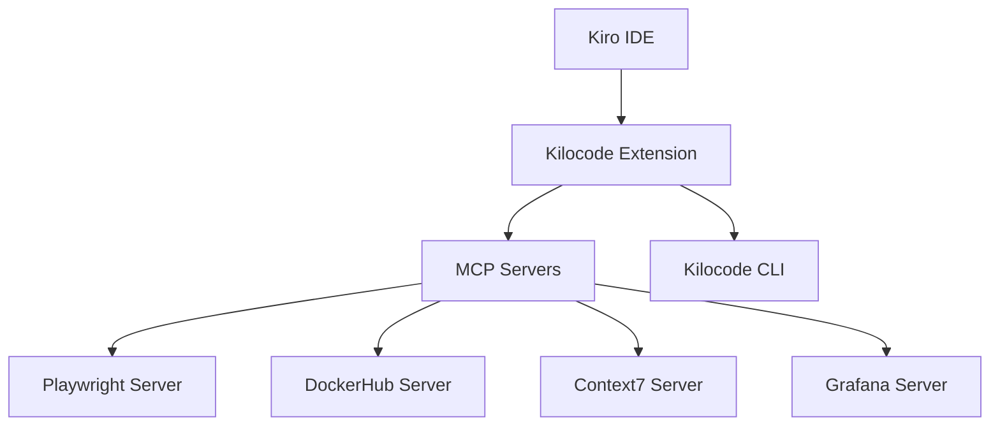
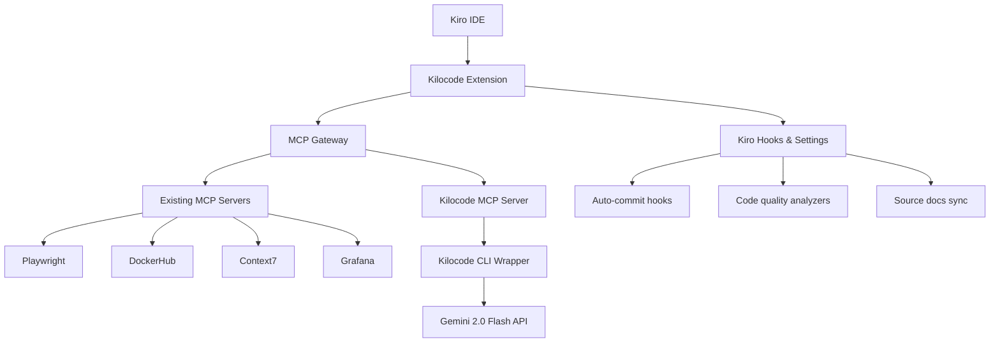

# Kilocode Integration Architecture

## Overview

This document outlines the integration of Kilocode extension configurations, settings, and functionalities into the Kiro IDE environment, with full MCP (Model Context Protocol) tool support.

## Current Architecture

## Proposed Integration

## Integration Components

### 1. MCP Server for Kilocode CLI
- Wraps the existing `kilocode-cli.cjs` as an MCP tool
- Provides AI-powered code analysis capabilities
- Enables semantic version analysis and platform detection
- Supports automated commit message generation

### 2. Enhanced MCP Configuration
- Updates `.kiro/settings/mcp.json` with Kilocode server
- Configures environment variables (GEMINI_API_KEY)
- Enables auto-approval for safe operations

### 3. Kiro IDE Features
- Auto-commit and push hooks
- Flutter lint fix automation
- Source documentation synchronization
- Code quality analysis integration

## Implementation Steps

1. **Create Kilocode MCP Server**
   - Bootstrap TypeScript MCP server project
   - Implement tool for code analysis
   - Add version bump analysis tool
   - Configure Gemini API integration

2. **Update MCP Configuration**
   - Add server to `.kiro/settings/mcp.json`
   - Set environment variables
   - Configure auto-approval rules

3. **Enable Kiro Features**
   - Verify hooks are executable
   - Test automation workflows
   - Ensure settings compatibility

4. **Testing & Verification**
   - Test MCP server connectivity
   - Verify tool execution
   - Validate integration with existing features

## Benefits

- **Unified AI Assistance**: Access Kilocode's AI capabilities through MCP
- **Automated Workflows**: CI/CD analysis and version management
- **Enhanced Productivity**: Integrated code quality and documentation tools
- **Seamless Compatibility**: Full integration with Kiro IDE features