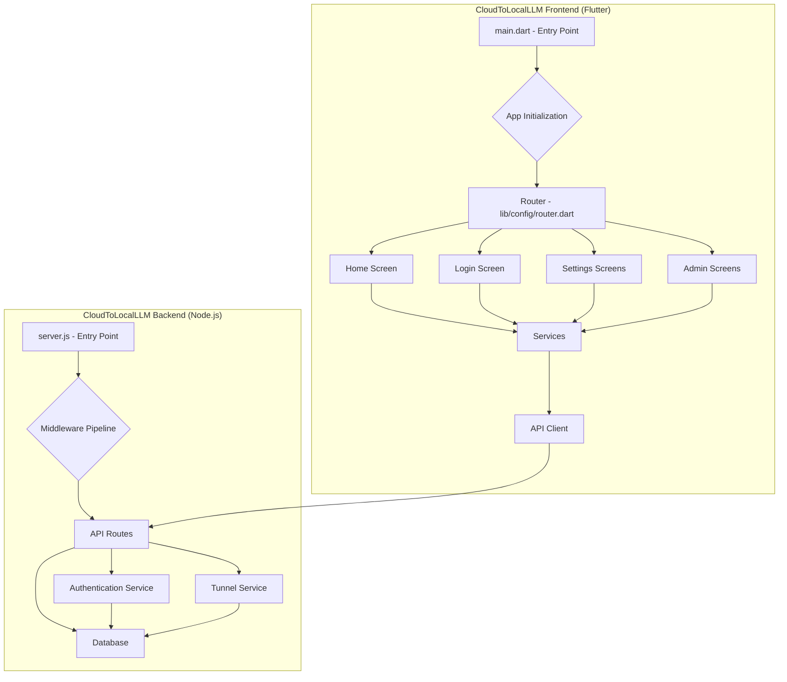

# Architecture and Optimization Plan

This document outlines the current architecture of the CloudToLocalLLM application and presents a strategic plan for optimizing module loading to improve performance.

## 1. Code Map and Architecture Visualization

Here is a Mermaid diagram visualizing the high-level architecture of the project, including the Flutter frontend, Node.js backend, and their key modules.

### Key Observations:

*   **Monolithic Frontend:** The Flutter application is structured as a single, monolithic module. All screens and services are bundled together, leading to a large initial download size and slower startup times.
*   **Centralized Routing:** The routing is handled by `go_router` in a centralized file ([`lib/config/router.dart`](lib/config/router.dart:1)), which is a good starting point for implementing lazy loading.
*   **Backend Services:** The backend is well-structured with a clear separation of concerns between routes, middleware, and services.

## 2. Strategic Plan for Optimizing Module Loading

The primary goal is to improve the Critical Rendering Path and reduce the Time to Interactive (TTI) by implementing code splitting, lazy loading, and asynchronous imports.

### 2.1. Code Splitting and Lazy Loading in Flutter

The Flutter application will be refactored to lazy-load routes and their associated widgets and services. This will be achieved by using deferred loading (also known as deferred imports) in Dart.

**Key Areas for Lazy Loading:**

*   **Settings Screens:** The various settings screens are not required on initial load and can be loaded on demand.
*   **Admin Screens:** The admin screens are only accessible to a subset of users and should be loaded only when an authorized user navigates to them.
*   **Ollama Test Screen:** This is a debugging and testing screen and is not part of the core user flow.
*   **Marketing Pages (Web):** The marketing pages are only relevant for the web version of the application and can be loaded separately.

### 2.2. Asynchronous Imports

We will use Dart's `deferred as` syntax to mark libraries for deferred loading. This will create separate JavaScript files (split points) for the web build, which will be loaded by the browser only when needed.

## 3. Step-by-Step Refactoring Roadmap

This roadmap is designed to be executed in a phased approach to ensure a zero-regression policy.

### Phase 1: Refactor the Router for Lazy Loading

1.  **Identify Routes for Lazy Loading:** Based on the analysis above, we will identify the routes to be lazy-loaded.
2.  **Create Deferred Libraries:** For each lazy-loaded route, we will create a separate Dart library file that contains the screen widget and any specific services it requires.
3.  **Implement Deferred Imports:** In the main router file ([`lib/config/router.dart`](lib/config/router.dart:1)), we will use `deferred as` to import the new libraries.
4.  **Update Route Builders:** The `GoRoute` builders will be updated to use a `FutureBuilder` that calls the `loadLibrary()` function and displays a loading indicator while the module is being fetched.

### Phase 2: Implement Lazy Loading for Individual Screens

1.  **Admin Screens:**
    *   Create a new library `lib/screens/admin/admin_lazy.dart`.
    *   Move the `AdminCenterScreen` and `AdminDataFlushScreen` imports and route definitions into this new library.
    *   Update the main router to use a deferred import for `admin_lazy.dart`.
2.  **Settings Screens:**
    *   Create a new library `lib/screens/settings/settings_lazy.dart`.
    *   Move the `UnifiedSettingsScreen` and other settings screens into this new library.
    *   Update the main router to use a deferred import for `settings_lazy.dart`.
3.  **Ollama Test Screen:**
    *   Create a new library `lib/screens/ollama_test_lazy.dart`.
    *   Move the `OllamaTestScreen` into this new library.
    *   Update the main router to use a deferred import for `ollama_test_lazy.dart`.

### Phase 3: Verification and Performance Monitoring

1.  **Manual Testing:** Thoroughly test all application routes to ensure that the lazy loading is working correctly and that there are no regressions.
2.  **Performance Analysis:** Use Flutter's performance profiling tools and Chrome DevTools to measure the impact of the optimizations on the TTI and initial load time.
3.  **Automated Testing:** Update existing integration and end-to-end tests to account for the new lazy-loading behavior.

By following this plan, we can significantly improve the performance of the CloudToLocalLLM application without compromising its functionality or stability.