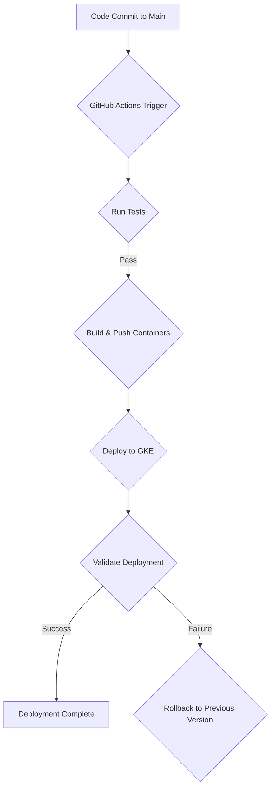

# CloudToLocalLLM CI/CD Pipeline Guide

This document describes the comprehensive CI/CD pipeline for CloudToLocalLLM, which automates the testing, building, and deployment of the application to Google Kubernetes Engine (GKE).

## Overview

## Domain, IP, and SSL Configuration

The GKE deployment uses domain-based routing, managed through a single static IP and secured with Google-managed SSL certificates.

- **Static IP:** The entire deployment is accessible via a single global static IP address named `cloudtolocalllm-static-ip`.
- **Google-Managed SSL:** SSL is handled automatically by a `ManagedCertificate` resource defined in `gke/managed-certificate.yaml`. This certificate covers all necessary domains and is provisioned and renewed by Google Cloud.
- **DNS Configuration:** To point your domains to the application, you must create the following `A` records at your domain registrar:

| Type | Host / Name | Value (points to) |
| :--- | :--- | :--- |
| A | @ | The static IP address |
| A | app | The static IP address |
| A | docs | The static IP address |
| A | api | The static IP address |
| A | streaming | The static IP address |

*(Note: The specific IP address can be found by running `gcloud compute addresses describe cloudtolocalllm-static-ip --global`)*

The CI/CD pipeline is managed through a single, unified GitHub Actions workflow: `.github/workflows/gke-deploy.yml`. This workflow is responsible for:

1.  **Testing**: Running a comprehensive suite of tests to ensure code quality and stability.
2.  **Building**: Creating Docker container images for the web, API, and streaming services.
3.  **Deploying**: Pushing the container images to Google Artifact Registry and deploying them to GKE.
4.  **Validating**: Performing post-deployment health checks to verify the deployment's success.
5.  **Rolling Back**: Automatically reverting to the previous stable version if the validation fails.

## Architecture

## Workflow Breakdown

### 1. Testing

The first stage of the pipeline is to run a comprehensive suite of tests to ensure that the new code is stable and does not introduce any regressions. The following tests are run in parallel:

*   **Flutter Tests**: Unit and widget tests for the Flutter web application.
*   **Node.js API Tests**: Unit and integration tests for the API backend service.
*   **PowerShell Tests**: Tests for the PowerShell deployment and utility scripts.
*   **Playwright E2E Tests**: End-to-end tests that simulate user interactions with the web application.

If any of these tests fail, the workflow will stop, and the deployment will be aborted.

### 2. Building

Once all the tests have passed, the workflow proceeds to build the Docker container images for the web, API, and streaming services. These images are then pushed to the Google Artifact Registry, where they are stored and versioned.

### 3. Deploying

After the container images have been successfully built and pushed, the workflow deploys them to the GKE cluster. The deployment is managed through Kubernetes manifest files located in the `k8s` directory of each service.

**Important Note:** The CI/CD pipeline is configured to apply specific, known manifest files. If you add a new manifest file to the project (such as the `gke/managed-certificate.yaml`), it will not be applied automatically. You must either apply it manually via `kubectl apply -f <file-path>` or update the `gke-deploy.yml` workflow to include it in the deployment steps.

### 4. Validating

After the deployment is complete, a post-deployment validation job is run to ensure that the new version of the application is healthy and functioning correctly. This job runs the `run_tunnel_validation.sh` script, which performs a series of health checks against the deployed services.

### 5. Rolling Back

If the post-deployment validation fails, the workflow will automatically trigger a rollback to the previous stable deployment revision within Kubernetes. This is handled by the `kubectl rollout undo` command, which is a safe and standard way to revert to a last known good state.

## Required Secrets

The CI/CD pipeline requires the following secrets to be configured in the GitHub repository:

| Secret Name | Description |
|---|---|
| `WIF_PROVIDER` | The Workload Identity Federation provider for authenticating with Google Cloud. |
| `WIF_SERVICE_ACCOUNT` | The service account used by the WIF provider. |
| `GCP_PROJECT_ID` | The ID of the Google Cloud project. |
| `TEST_JWT_TOKEN` | A valid JWT token for running the deployment validation tests. |
| `TEST_USER_ID` | A user ID for running the deployment validation tests. |
| `K6_CLOUD_TOKEN` | The API token for the k6 Cloud service. |
| `SENTRY_DSN` | The DSN for the Sentry project. |

## Developer Workflow

1.  **Create a new branch** for your feature or bug fix.
2.  **Make your changes** and commit them to your branch.
3.  **Push your branch** to the GitHub repository.
4.  **Create a pull request** to merge your changes into the `main` branch.
5.  **Wait for the CI/CD pipeline to complete**. If all tests pass, your changes will be automatically deployed to the GKE production environment.
6.  **Verify your changes** in the production environment.
7.  **Merge your pull request** into the `main` branch.
