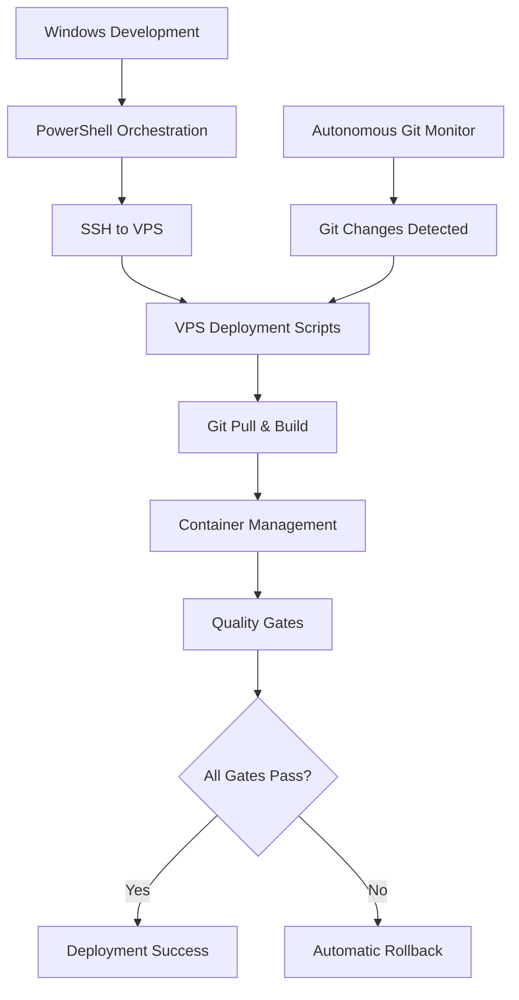

# CloudToLocalLLM Restored VPS Deployment Guide

## Overview

This guide documents the restored VPS-based deployment methodology for CloudToLocalLLM, featuring autonomous VPS-based automation while preserving the proven Windows-to-VPS orchestration model that existed before GitHub Actions.

## Architecture Overview

### Environment Separation

**Windows Development Environment:**
- **Role**: Development, orchestration, and build coordination
- **Tools**: PowerShell scripts, Git Bash for SSH operations
- **Responsibilities**: Version management, Flutter builds, SSH orchestration
- **Key Script**: `scripts/powershell/Deploy-CloudToLocalLLM.ps1`

**VPS Linux Production Environment:**
- **Role**: Production hosting and server-side deployment
- **Tools**: Bash scripts, Docker Compose, Flutter SDK
- **Responsibilities**: Git pulls, container management, SSL verification
- **Key Scripts**: Complete deployment infrastructure in `scripts/deploy/`

### Deployment Flow



## Quick Start

### 1. Windows-Orchestrated Deployment

```powershell
# Navigate to project directory
cd C:\Users\chris\Dev\CloudToLocalLLM

# Execute deployment with automatic VPS orchestration
.\scripts\powershell\Deploy-CloudToLocalLLM.ps1 -Force

# For interactive deployment with prompts
.\scripts\powershell\Deploy-CloudToLocalLLM.ps1
```

### 2. Direct VPS Deployment

```bash
# SSH to VPS
ssh cloudllm@cloudtolocalllm.online

# Navigate to project
cd /opt/cloudtolocalllm

# Execute complete deployment
./scripts/deploy/complete_deployment.sh --force --verbose
```

### 3. Install Autonomous Git Monitoring

```bash
# On VPS: Install autonomous Git monitoring system
cd /opt/cloudtolocalllm
./scripts/deploy/install_vps_automation.sh --install-service --enable-service

# Verify installation
sudo systemctl status cloudtolocalllm-git-monitor
```

## VPS Deployment Scripts

### Core Scripts

#### `update_and_deploy.sh` - Lightweight VPS Deployment
```bash
# Basic deployment with rollback
./scripts/deploy/update_and_deploy.sh --force --verbose

# Dry run to preview actions
./scripts/deploy/update_and_deploy.sh --dry-run
```

**Features:**
- Git pull with automatic cleanup
- Flutter web build on VPS
- Docker container management
- Health checks and SSL verification
- Automatic rollback on failure

#### `complete_deployment.sh` - Enhanced Deployment Orchestration
```bash
# Complete deployment with all quality gates
./scripts/deploy/complete_deployment.sh --force --verbose

# Skip verification (not recommended)
./scripts/deploy/complete_deployment.sh --skip-verification
```

**Features:**
- Version synchronization
- Core deployment execution
- Comprehensive verification
- Automatic rollback with backup restoration
- Configurable quality gates

#### `verify_deployment.sh` - Zero-Tolerance Quality Gates
```bash
# Comprehensive deployment verification
./scripts/deploy/verify_deployment.sh

# Strict mode (warnings count as failures)
./scripts/deploy/verify_deployment.sh --strict
```

**Quality Gates:**
- Basic connectivity tests
- SSL certificate validation
- Container health checks
- Security header validation
- Performance benchmarks

#### `sync_versions.sh` - Version Synchronization
```bash
# Synchronize all version files
./scripts/deploy/sync_versions.sh

# Check consistency without changes
./scripts/deploy/sync_versions.sh --check-only
```

**Synchronizes:**
- `pubspec.yaml` (master version)
- `assets/version.json`
- `lib/shared/lib/version.dart`
- `lib/config/app_config.dart`
- `lib/shared/pubspec.yaml`

### Autonomous Git Monitoring

#### `git_monitor.sh` - Autonomous Git Monitoring
```bash
# Start monitoring daemon
./scripts/deploy/git_monitor.sh start --verbose

# Single check for changes
./scripts/deploy/git_monitor.sh check

# Install as systemd service
./scripts/deploy/git_monitor.sh install
```

**Features:**
- Monitors master branch for new commits
- Automatic deployment on changes detected
- Deployment cooldown and lock management
- Comprehensive logging and state tracking
- Systemd service integration

#### `install_vps_automation.sh` - Complete System Setup
```bash
# Basic installation
./scripts/deploy/install_vps_automation.sh

# Full installation with service
./scripts/deploy/install_vps_automation.sh --install-service --enable-service --test-deployment
```

**Installs:**
- All deployment scripts with proper permissions
- Directory structure and logging
- Systemd service for Git monitoring
- Comprehensive testing and validation

## Windows PowerShell Integration

### Enhanced Deploy-CloudToLocalLLM.ps1

The Windows PowerShell orchestration script has been updated to use the new VPS deployment infrastructure:

```powershell
# Updated VPS deployment logic
$vpsDeploymentScript = "$VPSProjectPath/scripts/deploy/complete_deployment.sh"
$deploymentFlags = "--force"

if ($Verbose) { $deploymentFlags += " --verbose" }
if ($DryRun) { $deploymentFlags += " --dry-run" }

$deploymentCommand = "cd $VPSProjectPath && $vpsDeploymentScript $deploymentFlags"
ssh $VPSUser@$VPSHost "$deploymentCommand"
```

### Integration Testing

Use the provided integration test script to verify Windows-to-VPS connectivity:

```powershell
# Test all integration components
.\scripts\test_vps_integration.ps1 -All -Verbose

# Test specific components
.\scripts\test_vps_integration.ps1 -TestSSH -TestScripts
.\scripts\test_vps_integration.ps1 -TestDeployment
```

## Deployment Workflows

### Manual Deployment Workflow

1. **Development on Windows**
   ```powershell
   # Make changes, commit locally
   git add .
   git commit -m "Your changes"
   ```

2. **Deploy to VPS**
   ```powershell
   # Execute Windows-orchestrated deployment
   .\scripts\powershell\Deploy-CloudToLocalLLM.ps1 -Force
   ```

3. **Verify Deployment**
   ```bash
   # On VPS: Verify deployment success
   ./scripts/deploy/verify_deployment.sh
   ```

4. **Post-Deployment**
   ```powershell
   # Push changes to repository
   git push origin master
   ```

### Automated Deployment Workflow

1. **Install Autonomous Git Monitor**
   ```bash
   # On VPS: Install autonomous Git monitoring
   ./scripts/deploy/install_vps_automation.sh --install-service --enable-service
   ```

2. **Develop and Push**
   ```powershell
   # On Windows: Normal development workflow
   git add .
   git commit -m "Your changes"
   git push origin master
   ```

3. **Automatic Deployment**
   - Autonomous monitor detects Git changes
   - Automatically triggers VPS deployment
   - Monitors deployment success/failure
   - Logs all activities

4. **Monitor Status**
   ```bash
   # Check Git monitor status
   sudo systemctl status cloudtolocalllm-git-monitor
   
   # View deployment logs
   sudo journalctl -u cloudtolocalllm-git-monitor -f
   ```

## Quality Gates and Rollback

### Zero-Tolerance Quality Policy

The system implements strict quality gates that must ALL pass:

1. **Pre-deployment Validation**
   - Environment checks (user, directory, commands)
   - Repository state validation
   - Script availability and permissions

2. **Build Quality Gates**
   - Flutter build success
   - Version synchronization
   - Build artifact validation

3. **Container Quality Gates**
   - Clean container shutdown
   - Successful container startup
   - Health check validation

4. **Application Quality Gates**
   - HTTPS connectivity (200 response)
   - SSL certificate validity
   - Performance thresholds (<5s response)

5. **Security Quality Gates**
   - SSL certificate expiry (>7 days)
   - Security headers validation

### Automatic Rollback

On any quality gate failure:

1. **Immediate Rollback Trigger**
   - Deployment stops immediately
   - Rollback process initiated automatically
   - Previous state restored from backup

2. **Rollback Process**
   ```bash
   # Stop failed containers
   docker-compose down --timeout 30
   
   # Restore from backup
   cp -r "$BACKUP_DIR/$latest_backup" build/web
   
   # Restart with previous version
   docker-compose up -d
   ```

3. **Rollback Verification**
   - Application accessibility confirmed
   - Previous version restored
   - System returned to stable state

## Monitoring and Maintenance

### System Monitoring

#### Git Monitor Service
```bash
# Service status
sudo systemctl status cloudtolocalllm-git-monitor

# Service logs
sudo journalctl -u cloudtolocalllm-git-monitor -f

# Monitor state
cat /var/lib/cloudtolocalllm/git_monitor_state
```

#### Application Health
```bash
# Quick health check
curl -k -f https://app.cloudtolocalllm.online

# Detailed verification
./scripts/deploy/verify_deployment.sh

# Container status
docker-compose ps
```

### Log Files

#### Git Monitor Logs
- **Location**: `/var/log/cloudtolocalllm/git_monitor.log`
- **Content**: Git monitoring, deployment triggers, status
- **Rotation**: Automatic log rotation configured

#### Deployment Logs
- **Location**: Systemd journal (`journalctl`)
- **Content**: Deployment execution, quality gates, rollbacks
- **Access**: `sudo journalctl -u cloudtolocalllm-git-monitor`

### Maintenance Tasks

#### Regular Maintenance
```bash
# Update Git monitor state
./scripts/deploy/git_monitor.sh status

# Verify deployment health
./scripts/deploy/verify_deployment.sh

# Check version synchronization
./scripts/deploy/sync_versions.sh --check-only
```

#### Troubleshooting
```bash
# Stop Git monitoring
sudo systemctl stop cloudtolocalllm-git-monitor

# Manual deployment
./scripts/deploy/complete_deployment.sh --force --verbose

# Check container logs
docker-compose logs -f
```

## Migration from GitHub Actions

### What Changed

1. **Removed GitHub Actions**
   - All workflow files deleted
   - Email notifications stopped
   - CI/CD moved back to VPS

2. **Restored VPS Scripts**
   - Complete deployment infrastructure recreated
   - Based on proven archived implementations
   - Enhanced with modern error handling

3. **Enhanced Windows Integration**
   - PowerShell scripts updated for new VPS infrastructure
   - Improved error handling and rollback notification
   - Preserved environment separation

### Benefits of Restoration

1. **Direct Control**
   - No GitHub Actions dependency
   - Real-time deployment monitoring
   - Immediate feedback and error handling

2. **Proven Methodology**
   - Based on working pre-GitHub Actions system
   - Environment separation maintained
   - Windows development, VPS production

3. **Enhanced Automation**
   - Autonomous Git monitoring
   - Automatic deployment on commits
   - Comprehensive quality gates

4. **Zero-Tolerance Quality**
   - Strict quality gates
   - Automatic rollback on failure
   - Enterprise-grade reliability

## Next Steps

1. **Test Integration**
   ```powershell
   .\scripts\test_vps_integration.ps1 -All
   ```

2. **Install VPS Automation**
   ```bash
   ./scripts/deploy/install_vps_automation.sh --install-service --enable-service
   ```

3. **Verify Deployment**
   ```bash
   ./scripts/deploy/verify_deployment.sh
   ```

4. **Monitor Operations**
   ```bash
   sudo systemctl status cloudtolocalllm-git-monitor
   ```

The restored VPS-based deployment methodology provides enterprise-grade reliability while maintaining the simplicity and directness of the original Windows-to-VPS orchestration model, enhanced with modern autonomous automation capabilities.
