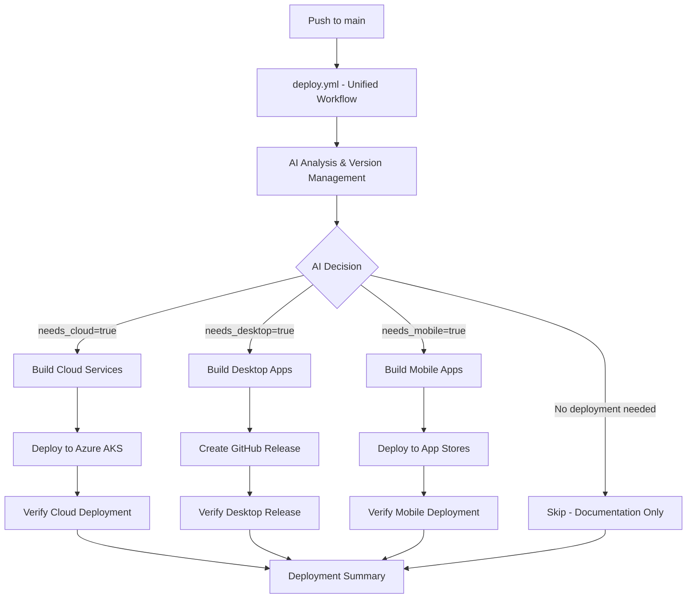

# GitHub Actions Workflows

## Overview

CloudToLocalLLM uses GitHub Actions for automated CI/CD pipelines. This document describes the current workflows and their configurations.

## Active Workflows

### 1. Unified Deployment Workflow (`deploy.yml`)

**Purpose**: Single workflow that handles AI analysis, version management, and multi-platform deployment in one unified process.

**Triggers**:
- **Push to `main` branch**: Direct deployment based on AI analysis
- **Workflow dispatch**: Manual trigger with deployment type override options

**Key Features**:
- **Integrated AI Analysis**: Built-in Gemini CLI with Gemini 2.0 Flash analysis
- **Intelligent Platform Detection**: Determines which platforms need updates based on file changes
- **Semantic Versioning**: Automatically calculates and applies version bumps
- **Conditional Multi-Platform Builds**: Cloud services, desktop apps, and mobile (future)
- **Direct Deployment**: No intermediate orchestration or platform branches required
- **Comprehensive Status Reporting**: Single workflow run shows all deployment status

**Platform Detection Rules**:
- `needs_cloud=true` if ANY of these files changed:
  - `web/`, `lib/`, `services/`, `k8s/`, `config/`
  - `.github/workflows/deploy.yml`
  - `auth0-bridge.js`, `router.dart`
  - Auth providers or web-related functionality
  - **Auth0, authentication, login, web interface changes ALWAYS need cloud deployment**
- `needs_desktop=true` if ANY of these changed:
  - `windows/`, `linux/`, desktop-specific code
  - Flutter desktop dependencies
- `needs_mobile=true` if ANY of these changed:
  - `android/`, `ios/`, mobile-specific code
  - Flutter mobile dependencies

**Workflow Jobs**:
1. **ai_analysis**: AI-powered change analysis and version management
2. **build_cloud_services**: Conditional Docker image building for cloud services
3. **deploy_cloud**: Conditional Azure AKS deployment with health verification
4. **build_desktop**: Conditional Windows desktop application builds
5. **build_mobile**: Placeholder for future mobile deployment
6. **deployment_summary**: Comprehensive deployment status reporting

**Benefits of Unified Approach**:
- **Single Source of Truth**: All deployment status visible in one workflow run
- **Simplified Debugging**: No cross-workflow dependencies to troubleshoot
- **Faster Execution**: Eliminates orchestration overhead and repository dispatch delays
- **Better Visibility**: Complete deployment pipeline visible in GitHub Actions UI
- **Easier Maintenance**: Single workflow to maintain instead of multiple coordinated workflows
- **Direct Triggers**: No complex repository dispatch mechanisms required

### 2. Legacy Version & Distribution Orchestrator (`version-and-distribute.yml`) - DISABLED

**Status**: Main branch trigger disabled to prevent duplicate deployments with unified workflow

**Purpose**: Previously orchestrated AI analysis, version management, and platform-specific deployments

**Current State**: 
- Main branch trigger commented out and disabled
- Workflow preserved for manual use if needed
- All functionality migrated to unified `deploy.yml` workflow

### 3. Legacy Azure AKS Deployment (`deploy-aks.yml`) - REPLACED

**Status**: Replaced by the unified deployment workflow (`deploy.yml`)

**Purpose**: Previously handled Azure AKS deployment via repository dispatch triggers

**Key Features**:
- **Intelligent Change Detection**: Compares against previous cloud tags to determine which services need rebuilding
- **Conditional Service Builds**: Only builds services that have changed since last deployment
- **Dependency-Ordered Deployment**: Deploys services in correct order (PostgreSQL → API → Streaming Proxy → Web + Cloudflared)
- **Health Verification**: Validates deployment success with health checks
- **Cache Management**: Purges Cloudflare cache after successful deployment

**Build Matrix**:
```yaml
Services Built Conditionally:
├── base (Dockerfile.base) - Base image for other services
├── postgres (Dockerfile.postgres) - Database with custom configuration
├── web (web/Dockerfile) - Flutter web application with Nginx
├── api-backend (services/api-backend/Dockerfile) - Express.js API server
└── streaming-proxy (services/streaming-proxy/Dockerfile) - WebSocket proxy
```

**Deployment Flow**:
1. **Version Extraction**: Determines version from branch, tag, or manual input
2. **Change Detection**: Compares file changes against previous cloud deployment
3. **Conditional Builds**: Builds only changed services with semantic versioning
4. **Infrastructure Setup**: Ensures Azure resources (RG, ACR, AKS) exist
5. **Secret Management**: Creates/updates Kubernetes secrets from GitHub secrets
6. **Ordered Deployment**: Deploys services with dependency awareness
7. **Health Verification**: Validates all services are running and accessible
8. **Cache Purge**: Clears Cloudflare cache for immediate updates

**Environment Variables**:
```yaml
AZURE_RESOURCE_GROUP: cloudtolocalllm-rg
AZURE_CLUSTER_NAME: cloudtolocalllm-aks
ACR_NAME: imrightguycloudtolocalllm
```

**Required Secrets**:
- `AZURE_CLIENT_ID`, `AZURE_TENANT_ID`, `AZURE_SUBSCRIPTION_ID` - Azure authentication for current production
- `POSTGRES_PASSWORD`, `JWT_SECRET` - Application secrets
- `STRIPE_*` - Payment processing credentials
- `SENTRY_DSN` - Error tracking
- `CLOUDFLARE_API_TOKEN`, `CLOUDFLARE_TUNNEL_TOKEN` - CDN and tunneling
- `AUTH0_*` - Authentication provider credentials

### 4. Build Release (`build-release.yml`)

**Purpose**: Creates GitHub releases with desktop application binaries.

**Triggers**:
- Push to tags matching `v*` pattern
- Manual workflow dispatch

**Outputs**:
- Windows installer (`.exe`)
- Portable packages (`.zip`)
- SHA256 checksums for verification

### 5. Build Images (`build-images.yml`)

**Purpose**: Validates Docker image builds and Kubernetes manifests.

**Triggers**:
- Push/PR to Dockerfiles or source code
- Validates builds without deployment

## Workflow Integration

### Unified AI-Powered CI/CD System

The CloudToLocalLLM project uses a **unified AI-powered CI/CD system** that consolidates all deployment logic into a single intelligent workflow:



### AI-Powered Platform Detection

The `analyze-platforms.sh` script uses **Gemini AI with Gemini 2.0 Flash** to intelligently determine which platforms need updates:

**Cloud Deployment Triggers** (`needs_cloud=true`):
- Changes to `web/`, `lib/`, `services/`, `k8s/`, `config/`
- Modifications to `.github/workflows/deploy.yml`
- Updates to `auth0-bridge.js`, `router.dart`
- Any authentication provider changes
- **Critical Rule**: Auth0, authentication, login, or web interface changes **ALWAYS** trigger cloud deployment
- **Default Behavior**: When in doubt about web changes, defaults to `needs_cloud=true`

**Desktop Deployment Triggers** (`needs_desktop=true`):
- Changes to `windows/`, `linux/` directories
- Desktop-specific code modifications
- Flutter desktop dependency updates

**Mobile Deployment Triggers** (`needs_mobile=true`):
- Changes to `android/`, `ios/` directories
- Mobile-specific code modifications
- Flutter mobile dependency updates

### Semantic Version Management

The AI system automatically determines semantic version bumps based on commit analysis:

- **Major** (`x.0.0`): Breaking changes detected
- **Minor** (`x.y.0`): New features added
- **Patch** (`x.y.z`): Bug fixes and chores

**Version Validation**:
- New version must always be higher than current version
- Strict semantic versioning compliance
- Automatic validation prevents version conflicts

## AI Analysis System

### Gemini CLI Integration

The CI/CD pipeline integrates **Gemini CLI** with **Gemini 2.0 Flash** for intelligent change analysis:

**Setup**:
```bash
# Install Gemini CLI
chmod +x scripts/gemini-cli.cjs
sudo ln -sf "$(pwd)/scripts/gemini-cli.cjs" /usr/local/bin/gemini-cli

# Test installation
gemini-cli "Respond with just OK"
```

**Analysis Process**:
1. **Commit Analysis**: Reviews recent commits (last 3) for semantic meaning
2. **File Change Detection**: Analyzes changed files over last 5 commits
3. **Platform Impact Assessment**: Determines which platforms are affected
4. **Version Calculation**: Calculates appropriate semantic version bump
5. **JSON Output**: Returns structured decision data

**Example AI Prompt**:
```
Current version: 4.5.0
Recent commits: fix: resolve login loop issue in Auth0 bridge
Changed files: web/auth0-bridge.js lib/services/auth_service.dart

Determine semantic version bump and platform needs...
```

**AI Response Format**:
```json
{
  "bump_type": "patch",
  "new_version": "4.5.1",
  "needs_cloud": true,
  "needs_desktop": false,
  "needs_mobile": false,
  "reasoning": "Auth0 authentication fix requires cloud deployment"
}
```

### Enhanced Platform Detection Rules

The AI system follows **strict rules** for platform detection to ensure reliable deployments:

**Cloud Deployment Priority**:
- **Authentication Changes**: Any Auth0, login, or authentication provider changes automatically trigger cloud deployment
- **Web Interface**: Changes to web UI, routing, or user-facing features
- **API Changes**: Backend service modifications that affect web functionality
- **Infrastructure**: Kubernetes, configuration, or deployment script changes

**Conservative Approach**:
- **Default to Cloud**: When uncertain about web impact, the system defaults to `needs_cloud=true`
- **Safety First**: Better to deploy unnecessarily than miss critical updates
- **Authentication Priority**: Login and authentication changes are treated as high-priority cloud updates

## Migration Status

### Current Production: Azure AKS

The unified `deploy.yml` workflow deploys to **Azure AKS** infrastructure:
- **Resource Group**: `cloudtolocalllm-rg`
- **Cluster**: `cloudtolocalllm-aks` 
- **Registry**: Azure Container Registry (ACR) `imrightguycloudtolocalllm`
- **Authentication**: Azure Service Principal via GitHub secrets

### Platform Agnostic Design

CloudToLocalLLM is designed to be provider agnostic:
- Standard Kubernetes manifests work on any cluster
- Container registry can be ACR, ECR, Docker Hub, etc.
- AWS deployment templates available in `config/cloudformation/`
- Future deployment to AWS EKS or other platforms possible

## Best Practices

### Workflow Security

1. **Least Privilege**: Workflows use minimal required permissions
2. **Secret Management**: All sensitive data stored in GitHub secrets
3. **Branch Protection**: Production deployments restricted to specific branches
4. **Audit Trail**: All deployments logged and traceable

### Performance Optimization

1. **Conditional Builds**: Only rebuild changed services
2. **Docker Layer Caching**: Reuse layers between builds
3. **Parallel Execution**: Build services concurrently when possible
4. **Health Checks**: Fast failure detection with proper timeouts

### Monitoring and Debugging

1. **Structured Logging**: Clear deployment phases with visual separators
2. **Error Collection**: Comprehensive diagnostics on failure
3. **Rollout Verification**: Automated health checks before completion
4. **Cache Management**: Automatic cache purging for immediate updates

## Troubleshooting

### AI Analysis Issues

1. **Gemini CLI Failures**:
   ```bash
   # Test Gemini CLI connectivity
   gemini-cli "Respond with just OK"
   
   # Check Gemini API key
   echo $GEMINI_API_KEY
   
   # Manual analysis run
   ./scripts/analyze-platforms.sh
   ```

2. **Version Validation Errors**:
   ```bash
   # Check current version
   jq -r '.version' assets/version.json
   
   # Verify version format
   echo "4.5.1" | grep -qE '^[0-9]+\.[0-9]+\.[0-9]+$'
   ```

3. **Platform Detection Issues**:
   ```bash
   # Check changed files
   git diff --name-only HEAD~5..HEAD
   
   # Review AI reasoning
   # Look for "reasoning" field in workflow logs
   ```

### Workflow Orchestration Issues

1. **Version Distribution Failures**:
   ```bash
   # Check orchestrator workflow
   gh run list --workflow="version-and-distribute.yml" --limit 3
   
   # Verify repository dispatch trigger
   gh api repos/:owner/:repo/dispatches
   ```

2. **Platform Branch Issues**:
   ```bash
   # Check platform branches
   git branch -r | grep -E "(cloud|desktop|mobile)"
   
   # Verify platform tags
   git tag | grep -E "(cloud|desktop|mobile)"
   ```

### Azure Deployment Issues

1. **Azure Authentication Failures**:
   ```bash
   # Verify service principal permissions
   az role assignment list --assignee $AZURE_CLIENT_ID
   ```

2. **Docker Build Failures**:
   ```bash
   # Check ACR permissions and connectivity
   az acr login --name $ACR_NAME
   ```

3. **Kubernetes Deployment Issues**:
   ```bash
   # Verify cluster connectivity and resources
   kubectl get nodes
   kubectl get pods -n cloudtolocalllm
   ```

### Debug Commands

```bash
# Check complete CI/CD pipeline status
gh run list --limit 10

# Manual orchestrator trigger
gh workflow run version-and-distribute.yml

# Manual deployment trigger (only if orchestrator failed)
gh workflow run deploy-aks.yml -f version_tag=4.5.0-cloud-abc123

# View detailed workflow logs
gh run view <run-id> --log

# Check AI analysis output
grep "Gemini Analysis" <workflow-log>
```

## Future Enhancements

1. **AWS EKS Migration**: New workflow for AWS deployment
2. **Multi-Environment Support**: Staging and production environments
3. **Automated Testing**: Integration and E2E tests before deployment
4. **Release Automation**: Automated GitHub releases with changelogs
5. **Performance Monitoring**: Deployment metrics and alerting