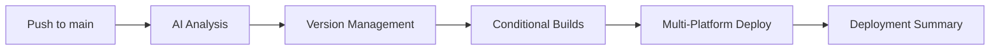

# Unified Deployment Workflow

## Overview

The Unified Deployment Workflow (`deploy.yml`) represents a significant evolution in CloudToLocalLLM's CI/CD system. It consolidates AI analysis, version management, and multi-platform deployment into a single intelligent workflow, eliminating the complexity of the previous orchestrator-based system.

## Architecture

### Single Workflow Design



### Key Components

1. **AI Analysis Job** (`ai_analysis`)
   - Integrated Gemini CLI with Gemini 2.0 Flash
   - Analyzes commits and file changes
   - Determines platform deployment needs
   - Calculates semantic version bumps
   - Makes deployment decisions with reasoning

2. **Conditional Build Jobs**
   - `build_cloud_services`: Docker images for Azure AKS
   - `build_desktop`: Windows desktop applications
   - `build_mobile`: Placeholder for future mobile builds

3. **Deployment Jobs**
   - `deploy_cloud`: Azure AKS deployment with health verification
   - Desktop and mobile deployment (future)

4. **Summary Job** (`deployment_summary`)
   - Comprehensive status reporting
   - Links to deployed services
   - Deployment reasoning and decisions

## Workflow Triggers

### Automatic Triggers

```yaml
on:
  push:
    branches:
      - main
    paths-ignore:
      - 'docs/**'
      - '*.md'
      - '.gitignore'
      - 'LICENSE'
```

**Excluded Paths**: Documentation-only changes don't trigger deployment

### Manual Triggers

```yaml
workflow_dispatch:
  inputs:
    force_deployment:
      description: "Force deployment even if no changes detected"
      type: boolean
      default: false
    deployment_type:
      description: "Override deployment type"
      type: choice
      options: [auto, cloud, desktop, mobile, all]
      default: "auto"
```

## AI Analysis Integration

### Gemini CLI Setup

The workflow automatically sets up and tests Gemini CLI:

```bash
chmod +x scripts/gemini-cli.cjs
sudo ln -sf "$(pwd)/scripts/gemini-cli.cjs" /usr/local/bin/gemini-cli
gemini-cli "Respond with just OK"
```

### Analysis Process

1. **File Change Detection**: Analyzes changed files over last 5 commits
2. **Commit Analysis**: Reviews recent commits for semantic meaning
3. **Platform Impact Assessment**: Determines which platforms are affected
4. **Version Calculation**: Calculates appropriate semantic version bump
5. **Deployment Decision**: Makes intelligent deployment decisions

### AI Output Format

```json
{
  "bump_type": "patch|minor|major",
  "new_version": "X.Y.Z",
  "needs_cloud": true|false,
  "needs_desktop": true|false,
  "needs_mobile": true|false,
  "reasoning": "Human-readable explanation"
}
```

## Platform Detection Rules

### Cloud Deployment (`needs_cloud=true`)

**Always Triggers**:
- Changes to `web/`, `lib/`, `services/`, `k8s/`, `config/`
- Authentication files: `auth0-bridge.js`, `auth_service.dart`
- Infrastructure: Kubernetes manifests, Docker configurations
- **Critical Rule**: Authentication changes always trigger cloud deployment

### Desktop Deployment (`needs_desktop=true`)

**Triggers When**:
- Changes to `windows/`, `linux/` directories
- Desktop-specific Flutter code modifications
- Platform-specific dependencies in `pubspec.yaml`

### Mobile Deployment (`needs_mobile=true`)

**Future Triggers**:
- Changes to `android/`, `ios/` directories
- Mobile-specific Flutter code
- Mobile platform dependencies

## Version Management

### Semantic Versioning

- **Major** (`X.0.0`): Breaking changes detected
- **Minor** (`X.Y.0`): New features added
- **Patch** (`X.Y.Z`): Bug fixes and maintenance

### Version File Updates

The workflow automatically updates:
- `assets/version.json` (primary source)
- `pubspec.yaml` (Flutter version)
- `package.json` (Node.js services)

### Git Operations

```bash
# Commit version changes
git commit -m "chore: bump version to $NEW_VERSION [skip ci]"
git push origin main

# Create version tag
git tag "v$NEW_VERSION"
git push origin "v$NEW_VERSION"
```

## Multi-Platform Builds

### Cloud Services (Azure AKS)

**Conditional Building**: Only builds when `needs_cloud=true`

**Services Built**:
- **Web Service**: Flutter web app with Nginx
- **API Backend**: Express.js API server
- **Streaming Proxy**: WebSocket proxy service

**Docker Registry**: Azure Container Registry (ACR) - `imrightguycloudtolocalllm.azurecr.io` - `imrightguycloudtolocalllm.azurecr.io`

**Build Process**:
```yaml
- name: Build and Push Web Service
  uses: docker/build-push-action@v5
  with:
    context: .
    file: web/Dockerfile
    push: true
    tags: |
      ${{ steps.acr_setup.outputs.login_server }}/web:${{ needs.ai_analysis.outputs.new_version }}
      ${{ steps.acr_setup.outputs.login_server }}/web:latest
    cache-from: type=registry,ref=${{ steps.acr_setup.outputs.login_server }}/web:latest
```

### Desktop Applications

**Conditional Building**: Only builds when `needs_desktop=true`

**Platform**: Windows (Linux planned)

**Build Process**:
```bash
flutter pub get
flutter build windows --release
pwsh scripts/powershell/Deploy-CloudToLocalLLM.ps1 -BuildOnly
```

**Artifacts**:
- Windows installer (`.exe`)
- Portable package (`.zip`)
- SHA256 checksums

## Deployment Process

### Cloud Deployment

**Target**: Azure AKS (current production infrastructure)

**Process**:
1. Azure authentication via service principal
2. Build and push Docker images to Azure Container Registry (ACR)
3. Update Kubernetes manifests with new image tags
4. Apply manifests to AKS cluster
5. Wait for rollout completion
6. Health check verification
7. Cloudflare cache purging

**Health Verification**:
```bash
for i in {1..24}; do
  http_status=$(curl -s -o /dev/null -w "%{http_code}" https://app.cloudtolocalllm.online/health)
  if [ "$http_status" = "200" ]; then
    echo "✅ Health check passed"
    exit 0
  fi
  sleep 5
done
```

### Desktop Deployment

**Process**:
1. Build Windows desktop application
2. Create installer and portable packages
3. Upload artifacts to GitHub Actions
4. Future: Create GitHub release automatically

## Manual Override Options

### Force Deployment

```bash
gh workflow run deploy.yml -f force_deployment=true
```

Forces deployment regardless of AI analysis results.

### Override Deployment Type

```bash
# Deploy only to cloud
gh workflow run deploy.yml -f deployment_type=cloud

# Deploy to all platforms
gh workflow run deploy.yml -f deployment_type=all
```

Overrides AI platform detection decisions.

### Skip Deployment

```bash
# Skip entire CI/CD pipeline
git commit -m "docs: update README [skip ci]"

# Skip version management only
git commit -m "chore: minor cleanup [no-version]"
```

## Deployment Summary

### Comprehensive Reporting

The workflow generates a detailed deployment summary:

```markdown
# Unified Deployment Summary

**Version:** 4.5.1
**AI Reasoning:** Authentication fix requires cloud deployment

## Platform Deployment Status

☁️ **Cloud:** ✅ Deployed successfully
   - Web: https://app.cloudtolocalllm.online
   - API: https://api.cloudtolocalllm.online

🖥️ **Desktop:** ⏭️ Skipped (no changes detected)

📱 **Mobile:** ⏭️ Skipped (no changes detected)
```

### Status Indicators

- ✅ **Success**: Deployment completed successfully
- ❌ **Failed**: Deployment encountered errors
- ⏭️ **Skipped**: No changes detected for platform
- 🚧 **Not Implemented**: Feature not yet available

## Monitoring and Debugging

### Workflow Monitoring

```bash
# List recent deployments
gh run list --workflow="deploy.yml" --limit 5

# View deployment details
gh run view <run-id>

# Check AI analysis
gh run view <run-id> --log | grep "Gemini Analysis"

# View deployment summary
gh run view <run-id> --log | grep "Deployment Decision Summary" -A 10
```

### Common Issues

1. **AI Analysis Failures**
   - Check Gemini API key validity
   - Verify Gemini CLI installation
   - Review analysis script execution

2. **Build Failures**
   - Check Docker registry connectivity
   - Verify service Dockerfiles
   - Review build context and dependencies

3. **Deployment Failures**
   - Verify Azure/AWS credentials
   - Check Kubernetes cluster connectivity
   - Review manifest syntax and resources

### Debug Commands

```bash
# Test AI analysis locally
./scripts/analyze-platforms.sh

# Check Gemini CLI
gemini-cli "Respond with just OK"

# Verify version files
jq -r '.version' assets/version.json
```

## Migration Benefits

### From Orchestrator to Unified

**Previous System Issues**:
- Multiple workflows with complex dependencies
- Repository dispatch mechanisms
- Platform-specific branches
- Distributed status across workflows
- Difficult debugging and maintenance

**Unified System Benefits**:
- Single workflow execution
- Direct triggers and dependencies
- Main branch deployment
- Consolidated status reporting
- Simplified debugging and maintenance

### Performance Improvements

- **Faster Execution**: Eliminates orchestration overhead
- **Better Caching**: Optimized Docker layer caching
- **Parallel Builds**: Concurrent service building
- **Reduced Complexity**: Fewer moving parts

## Future Enhancements

### Future AWS Migration

The workflow is designed to support future AWS EKS migration when ready:

- AWS infrastructure templates exist in `config/cloudformation/`
- OIDC authentication patterns prepared for AWS
- Workflow can be updated to target AWS EKS when migration occurs

### Mobile Platform Support

When mobile deployment is needed:
1. Expand `build_mobile` job implementation
2. Add Android/iOS build processes
3. Integrate app store deployment
4. Update AI analysis for mobile detection

### Enhanced AI Analysis

- Multi-model support for redundancy
- Learning from deployment outcomes
- Cost-aware deployment decisions
- Performance-based optimization

## Best Practices

### For Developers

1. **Use Conventional Commits**: Help AI make better decisions
2. **Test Locally**: Verify changes before pushing
3. **Monitor Deployments**: Check workflow execution
4. **Use Manual Overrides Sparingly**: Trust AI analysis when possible

### For Maintainers

1. **Review AI Decisions**: Periodically audit analysis accuracy
2. **Update Detection Rules**: Refine platform detection logic
3. **Monitor Performance**: Track deployment times and success rates
4. **Maintain Documentation**: Keep workflow documentation current

## Conclusion

The Unified Deployment Workflow represents a significant advancement in CloudToLocalLLM's CI/CD capabilities, providing:

- **Simplified Architecture**: Single workflow instead of orchestrated system
- **Intelligent Decisions**: AI-powered analysis and deployment logic
- **Better Visibility**: Complete deployment status in one place
- **Easier Maintenance**: Reduced complexity and fewer dependencies
- **Future Ready**: Designed for AWS migration and mobile platform support

This system enables rapid, reliable deployments while maintaining the sophisticated AI-powered decision making that makes CloudToLocalLLM's CI/CD system unique.