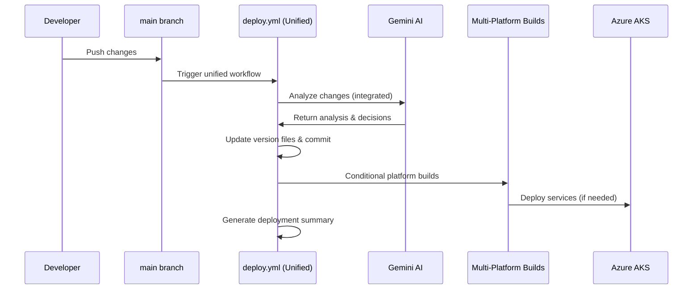

# AI-Powered CI/CD System

## Overview

CloudToLocalLLM uses an innovative **unified AI-powered CI/CD system** that consolidates analysis, building, and deployment into a single intelligent workflow. This system leverages **Gemini CLI** with **Gemini 2.0 Flash** to make intelligent decisions about when and where to deploy changes, eliminating the complexity of orchestrated workflows while maintaining sophisticated deployment logic.

## Architecture

### Core Components

1. **Unified Deployment Workflow** (`deploy.yml`)
   - Single workflow handling all deployment types
   - Triggered on every push to `main` branch
   - Integrates AI analysis, version management, and multi-platform deployment
   - Replaces the previous orchestrator-based system

2. **AI Analysis Engine** (Integrated)
   - Uses Gemini CLI with Gemini 2.0 Flash
   - Analyzes commits and file changes within the unified workflow
   - Determines platform deployment needs and version bumps
   - Provides intelligent deployment decisions with reasoning

3. **Multi-Platform Build System**
   - Conditional cloud service building (web, api-backend, streaming-proxy)
   - Desktop application builds (Windows, future Linux)
   - Mobile build support (placeholder for future implementation)
   - All platforms handled within single workflow execution

### Unified Workflow Sequence



## AI Analysis System

### Gemini CLI Integration

**Installation**:
```bash
# The CLI is automatically set up in GitHub Actions
chmod +x scripts/gemini-cli.cjs
sudo ln -sf "$(pwd)/scripts/gemini-cli.cjs" /usr/local/bin/gemini-cli
```

**Configuration**:
- **Model**: Gemini 2.0 Flash
- **API Key**: Stored in `GEMINI_API_KEY` environment variable
- **Timeout**: Configured for reliable analysis
- **Fallback**: Graceful error handling with manual override options

### Analysis Process

The AI system analyzes multiple data points to make deployment decisions:

1. **Recent Commits** (last 3 commits)
   - Commit messages and semantic meaning
   - Conventional commit patterns (feat:, fix:, BREAKING:)
   - Developer intent and change scope

2. **Changed Files** (last 5 commits)
   - File paths and extensions
   - Directory structure changes
   - Dependency modifications

3. **Platform Impact Assessment**
   - Web-related changes (frontend, backend, auth)
   - Desktop-specific modifications
   - Mobile platform changes
   - Infrastructure and configuration updates

### Platform Detection Rules

#### Cloud Deployment (`needs_cloud=true`)

**Always Triggers Cloud Deployment**:
- Changes to `web/`, `lib/`, `services/` directories
- Modifications to `k8s/`, `config/` directories
- Updates to `.github/workflows/deploy-aks.yml`
- Changes to `auth0-bridge.js`, `router.dart`
- Any authentication provider modifications
- **Critical**: Auth0, authentication, login, web interface changes

**File Pattern Matching**:
```bash
# Examples of cloud-triggering changes
web/auth0-bridge.js                    # Auth0 integration
lib/services/auth_service.dart         # Authentication service
services/api-backend/src/auth.js       # API authentication
k8s/web-deployment.yaml               # Kubernetes deployment
config/nginx/nginx.conf               # Web server configuration
```

#### Desktop Deployment (`needs_desktop=true`)

**Triggers Desktop Builds**:
- Changes to `windows/`, `linux/` directories
- Desktop-specific Flutter code
- Platform-specific dependencies in `pubspec.yaml`
- Desktop window management or system integration

#### Mobile Deployment (`needs_mobile=true`)

**Triggers Mobile Builds**:
- Changes to `android/`, `ios/` directories
- Mobile-specific Flutter code
- Mobile platform dependencies
- Mobile-specific permissions or configurations

### Conservative Decision Making

The AI system follows a **conservative approach** to ensure reliability:

- **Default to Cloud**: When uncertain about web impact, defaults to `needs_cloud=true`
- **Authentication Priority**: Any authentication-related changes trigger cloud deployment
- **Safety First**: Better to deploy unnecessarily than miss critical updates
- **Explicit Rules**: Clear, documented rules prevent ambiguous decisions

## Version Management

### Semantic Versioning

The AI automatically determines appropriate version bumps:

**Major Version** (`x.0.0`):
- Breaking changes detected in commits
- API changes that break compatibility
- Major architectural modifications

**Minor Version** (`x.y.0`):
- New features added
- Non-breaking enhancements
- New functionality introduction

**Patch Version** (`x.y.z`):
- Bug fixes and patches
- Chores and maintenance
- Documentation updates
- Performance improvements

### Version Validation

**Strict Validation Rules**:
```bash
# Version must be higher than current version
if [ "$NEW_VERSION" <= "$CURRENT_VERSION" ]; then
    echo "ERROR: Version must increase"
    exit 1
fi

# Version must follow semantic versioning format
if ! echo "$NEW_VERSION" | grep -qE '^[0-9]+\.[0-9]+\.[0-9]+$'; then
    echo "ERROR: Invalid version format"
    exit 1
fi
```

**Version Synchronization**:
- Updates `assets/version.json` (primary source)
- Synchronizes `pubspec.yaml` for Flutter
- Updates `package.json` for Node.js services
- Creates git tags for tracking

## Platform Distribution

### Branch Strategy

The orchestrator creates and manages platform-specific branches:

**Cloud Branch** (`cloud`):
- Contains web-ready code
- Triggers Azure AKS deployment
- Tagged with `{version}-cloud-{sha}`

**Desktop Branch** (`desktop`):
- Contains desktop-optimized code
- Triggers desktop application builds
- Tagged with `{version}-desktop-{sha}`

**Mobile Branch** (`mobile`):
- Contains mobile-ready code
- Future: Will trigger mobile app builds
- Tagged with `{version}-mobile-{sha}`

### Repository Dispatch

When cloud deployment is needed, the orchestrator triggers the deployment workflow:

```bash
curl -X POST \
  -H "Authorization: token $PAT_TOKEN" \
  -H "Accept: application/vnd.github.v3+json" \
  https://api.github.com/repos/owner/repo/dispatches \
  -d '{"event_type":"cloud-deploy-4.5.1","client_payload":{"version":"4.5.1","branch":"cloud"}}'
```

## Development Workflow

### For Developers

**Normal Development**:
1. Make changes and commit to feature branch
2. Create pull request to `main`
3. Merge PR - **AI automatically handles the rest in unified workflow**
4. Monitor single workflow execution in GitHub Actions

**Manual Deployments**:
```bash
# Manual unified workflow trigger
gh workflow run deploy.yml

# Force deployment regardless of AI analysis
gh workflow run deploy.yml -f force_deployment=true

# Override deployment type
gh workflow run deploy.yml -f deployment_type=cloud
gh workflow run deploy.yml -f deployment_type=desktop
gh workflow run deploy.yml -f deployment_type=all
```

**Skip Deployment**:
```bash
# Skip CI/CD entirely
git commit -m "docs: update README [skip ci]"

# Skip version bumping but allow other CI
git commit -m "chore: minor cleanup [no-version]"
```

### Commit Message Best Practices

To help the AI make better decisions, use conventional commit messages:

```bash
# Feature additions (minor version bump)
git commit -m "feat: add new user dashboard component"
git commit -m "feat(auth): implement OAuth2 refresh token rotation"

# Bug fixes (patch version bump)
git commit -m "fix: resolve login loop in Auth0 bridge"
git commit -m "fix(api): handle null user profile gracefully"

# Breaking changes (major version bump)
git commit -m "feat!: redesign authentication API"
git commit -m "BREAKING CHANGE: remove deprecated user endpoints"

# Chores and maintenance (patch version bump)
git commit -m "chore: update dependencies to latest versions"
git commit -m "docs: improve API documentation"
```

## Monitoring and Debugging

### Workflow Monitoring

**Check Unified Workflow Status**:
```bash
# List recent deployment runs
gh run list --workflow="deploy.yml" --limit 5

# View specific run details
gh run view <run-id>

# Check AI analysis output
gh run view <run-id> --log | grep "Gemini Analysis"

# Check deployment decision summary
gh run view <run-id> --log | grep "Deployment Decision Summary" -A 10
```

**Monitor Deployment Status**:
```bash
# Check all deployment jobs in single workflow
gh run view <run-id> --log | grep -E "(ai_analysis|build_cloud_services|deploy_cloud|build_desktop)"

# Check version tags (created directly on main)
git tag | tail -10

# Verify deployment summary
gh run view <run-id> --log | grep "Unified Deployment Summary" -A 20
```

### Debugging AI Decisions

**Local Testing**:
```bash
# Run analysis locally
./scripts/analyze-platforms.sh

# Test Gemini CLI
gemini-cli "Analyze this change: fix auth login loop"

# Check environment
echo $GEMINI_API_KEY
```

**Common Issues**:

1. **AI Analysis Fails**:
   - Check Gemini API key validity
   - Verify network connectivity
   - Review prompt formatting

2. **Wrong Platform Detection**:
   - Review changed files list
   - Check AI reasoning in logs
   - Verify detection rules

3. **Version Conflicts**:
   - Ensure version.json is up to date
   - Check for concurrent workflow runs
   - Verify git tag consistency

## Best Practices

### For Contributors

1. **Clear Commit Messages**: Use conventional commit format to help AI analysis
2. **Logical Changes**: Group related changes in single commits
3. **Test Locally**: Verify changes work before pushing
4. **Monitor Deployments**: Check that AI made correct deployment decisions

### For Maintainers

1. **Review AI Decisions**: Periodically audit AI analysis accuracy
2. **Update Rules**: Refine platform detection rules based on experience
3. **Monitor Costs**: Track AI API usage and deployment frequency
4. **Backup Plans**: Maintain manual override procedures

### Security Considerations

1. **API Key Management**: Secure Gemini API key in GitHub Secrets
2. **Branch Protection**: Protect platform branches from direct pushes
3. **Audit Trail**: All AI decisions logged in workflow runs
4. **Fallback Procedures**: Manual deployment options available

## Future Enhancements

### Planned Improvements

1. **Enhanced AI Prompts**: More sophisticated analysis prompts
2. **Learning System**: AI learns from deployment outcomes
3. **Multi-Model Support**: Fallback to different AI models
4. **Cost Optimization**: Intelligent deployment scheduling
5. **Mobile Integration**: Complete mobile deployment automation

### Current Infrastructure: Azure AKS

The project currently runs on Azure AKS with plans for future AWS migration:

1. **Azure AKS Production**: Current deployment target `cloudtolocalllm-aks`
2. **Azure Container Registry**: Images stored in `imrightguycloudtolocalllm.azurecr.io`
3. **Service Principal Auth**: Azure authentication via GitHub secrets
4. **Future AWS Migration**: CloudFormation templates prepared for eventual migration

## Migration to Unified Workflow - COMPLETED

### From Orchestrator to Unified System

CloudToLocalLLM has successfully migrated from a complex orchestrator-based system to a streamlined unified workflow:

**Previous System** (`version-and-distribute.yml` + `deploy-aks.yml`) - **DISABLED**:
- Multiple workflows with repository dispatch coordination
- Platform-specific branches (cloud, desktop, mobile)
- Distributed status across multiple workflow runs
- Complex debugging across workflow dependencies
- **Status**: Main branch triggers disabled to prevent duplicate deployments

**New Unified System** (`deploy.yml`) - **ACTIVE**:
- Single workflow handling all deployment logic
- Direct deployment from main branch to Azure AKS
- Consolidated status in single workflow run
- Simplified debugging and maintenance
- Azure Container Registry (ACR) for Docker images
- Azure AKS for Kubernetes deployment
- **Status**: Only workflow triggering on main branch pushes

**Migration Status**: ✅ **COMPLETED**
- Legacy orchestrator workflow disabled
- Unified workflow handles all deployment scenarios
- No duplicate CI/CD systems running
- Complete consolidation achieved

See **[Unified Deployment Workflow Documentation](../OPERATIONS/cicd/UNIFIED_DEPLOYMENT_WORKFLOW.md)** for complete technical details.

## Conclusion

The unified AI-powered CI/CD system represents a significant advancement in deployment automation, providing:

- **Simplified Architecture**: Single workflow instead of complex orchestration
- **Intelligent Decision Making**: AI analyzes changes and determines optimal deployment strategy
- **Reduced Manual Overhead**: Developers focus on code, AI handles deployment logistics
- **Consistent Versioning**: Automated semantic versioning prevents conflicts
- **Platform Optimization**: Each platform gets only necessary updates
- **Better Visibility**: Complete deployment status in one workflow run
- **Safety and Reliability**: Conservative approach ensures critical updates are never missed

This system enables CloudToLocalLLM to maintain rapid development velocity while ensuring reliable, consistent deployments to Azure AKS with significantly reduced complexity. The platform-agnostic design allows for future deployment to AWS EKS or other Kubernetes platforms when needed.