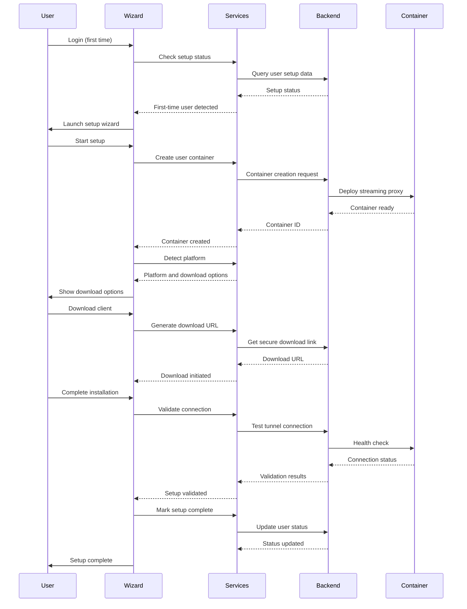

# First-Time Setup Wizard

## Overview

The First-Time Setup Wizard is a comprehensive onboarding experience that guides new CloudToLocalLLM users through downloading, installing, and configuring the desktop client needed to connect to their local LLM. This feature replaces the previous homepage download card with a more guided and user-friendly approach.

## Table of Contents

- [Features](#features)
- [Architecture](#architecture)
- [User Experience](#user-experience)
- [Technical Implementation](#technical-implementation)
- [Deployment Strategy](#deployment-strategy)
- [Monitoring and Analytics](#monitoring-and-analytics)
- [Documentation Links](#documentation-links)

## Features

### Core Functionality
- **Guided Multi-Step Process**: 8-step wizard that walks users through the entire setup
- **Automatic Platform Detection**: Detects user's operating system and recommends appropriate downloads
- **Container Creation**: Automatically creates isolated streaming proxy containers for each user
- **Real-Time Validation**: Tests connections and validates setup completion
- **Error Recovery**: Comprehensive error handling with retry mechanisms and troubleshooting guidance
- **Progress Persistence**: Saves progress across browser sessions for interrupted setups

### User Experience Enhancements
- **Responsive Design**: Works seamlessly on desktop and mobile devices
- **Accessibility Compliant**: Screen reader support and keyboard navigation
- **Visual Feedback**: Progress indicators, animations, and clear status updates
- **Skip Options**: Allows users to skip non-critical steps with appropriate warnings
- **Troubleshooting Integration**: Context-sensitive help and error resolution guidance

### Technical Features
- **Feature Flag Control**: Gradual rollout capability with remote configuration
- **Analytics Integration**: Comprehensive tracking of user behavior and success metrics
- **Security First**: Secure container isolation and encrypted data transmission
- **Performance Optimized**: Lazy loading and efficient resource management
- **Cross-Platform Support**: Windows, Linux, and macOS compatibility

## Architecture

### High-Level Components

```
┌─────────────────────────────────────────────────────────────┐
│                    Setup Wizard Frontend                    │
├─────────────────────────────────────────────────────────────┤
│ • FirstTimeSetupWizard Widget                              │
│ • Step Components (Welcome, Download, Install, etc.)       │
│ • Progress Management                                       │
│ • Error Handling                                           │
└─────────────────────────────────────────────────────────────┘
                              │
                              ▼
┌─────────────────────────────────────────────────────────────┐
│                     Service Layer                          │
├─────────────────────────────────────────────────────────────┤
│ • SetupStatusService                                       │
│ • UserContainerService                                     │
│ • PlatformDetectionService                                 │
│ • DownloadManagementService                                │
│ • ConnectionValidationService                              │
└─────────────────────────────────────────────────────────────┘
                              │
                              ▼
┌─────────────────────────────────────────────────────────────┐
│                    Backend Services                        │
├─────────────────────────────────────────────────────────────┤
│ • Container Management API                                 │
│ • Download URL Generation                                  │
│ • Setup Status Persistence                                 │
│ • Analytics Collection                                     │
└─────────────────────────────────────────────────────────────┘
```

### Data Flow



## User Experience

### Setup Flow Overview

1. **Welcome & Overview** (30 seconds)
   - Introduction to CloudToLocalLLM
   - Explanation of why desktop client is needed
   - Overview of setup process

2. **Container Creation** (1-2 minutes)
   - Automatic creation of user's isolated container
   - Real-time progress updates
   - Error handling with retry options

3. **Platform Detection** (15 seconds)
   - Automatic OS detection
   - Display of recommended download options
   - Manual platform selection if needed

4. **Download Client** (2-5 minutes)
   - Platform-specific download options
   - File size and description information
   - Download progress tracking where possible

5. **Installation Guide** (3-10 minutes)
   - Step-by-step installation instructions
   - Platform-specific screenshots and commands
   - Installation validation and confirmation

6. **Tunnel Configuration** (1-2 minutes)
   - Connection parameter display
   - Desktop client configuration guidance
   - Real-time connection status monitoring

7. **Validation & Testing** (1-2 minutes)
   - Comprehensive connection testing
   - LLM accessibility verification
   - Streaming functionality validation

8. **Completion** (30 seconds)
   - Success confirmation
   - Setup summary
   - Transition to main application

### Error Handling and Recovery

- **Automatic Retry**: Failed operations automatically retry with exponential backoff
- **Skip Options**: Non-critical steps can be skipped with user confirmation
- **Troubleshooting Guides**: Context-sensitive help for common issues
- **Support Integration**: Direct links to documentation and support channels
- **Progress Preservation**: Setup state saved to allow resuming after interruptions

## Technical Implementation

### Key Services

#### SetupStatusService
```dart
class SetupStatusService {
  Future<bool> isFirstTimeUser(String userId);
  Future<void> markSetupComplete(String userId);
  Future<SetupProgress?> getSavedProgress(String userId);
  Future<void> saveProgress(String userId, SetupProgress progress);
}
```

#### UserContainerService
```dart
class UserContainerService {
  Future<ContainerCreationResult> createUserContainer(String userId);
  Future<bool> validateContainerHealth(String containerId);
  Future<ContainerInfo> getContainerInfo(String containerId);
}
```

#### PlatformDetectionService
```dart
class PlatformDetectionService {
  PlatformType detectPlatform();
  List<DownloadOption> getDownloadOptions(PlatformType platform);
  String getInstallationInstructions(PlatformType platform, String downloadType);
}
```

### State Management

The wizard uses a centralized state management approach:

```dart
class SetupWizardState {
  int currentStep;
  String? userContainerId;
  PlatformType detectedPlatform;
  String? selectedDownloadOption;
  Map<String, bool> completedSteps;
  Map<String, dynamic> stepData;
  List<String> encounteredErrors;
}
```

### Data Models

#### SetupProgress
```dart
class SetupProgress {
  final String userId;
  final int currentStep;
  final Map<String, bool> completedSteps;
  final DateTime startedAt;
  final DateTime? lastUpdatedAt;
  final Map<String, dynamic> stepData;
  final List<String> encounteredErrors;
}
```

#### ContainerCreationResult
```dart
class ContainerCreationResult {
  final bool success;
  final String? containerId;
  final String? errorMessage;
  final Map<String, dynamic> containerInfo;
}
```

## Deployment Strategy

### Feature Flag Configuration

The setup wizard uses feature flags for safe deployment:

```dart
class SetupWizardFeatureFlags {
  bool get isEnabled;                    // Master enable/disable switch
  int get rolloutPercentage;            // Percentage of users (0-100)
  bool get allowSkipping;               // Allow step skipping
  int get maxRetries;                   // Maximum retry attempts
  Duration get stepTimeout;             // Timeout per step
  bool get analyticsEnabled;            // Analytics collection
}
```

### Gradual Rollout Plan

1. **Phase 1: Internal Testing (0% rollout)**
   - Internal team testing
   - QA validation
   - Performance benchmarking

2. **Phase 2: Beta Users (10% rollout)**
   - Limited user group
   - Feedback collection
   - Issue identification

3. **Phase 3: Limited Rollout (25% rollout)**
   - Broader user base
   - Performance monitoring
   - Support team preparation

4. **Phase 4: Moderate Rollout (50% rollout)**
   - Majority of users
   - System stability validation
   - Resource usage monitoring

5. **Phase 5: Full Rollout (100% rollout)**
   - All users
   - Complete feature activation
   - Legacy system removal

### Rollback Procedures

- **Immediate Rollback**: Disable feature flag to revert to legacy flow
- **Partial Rollback**: Reduce rollout percentage to limit impact
- **Data Cleanup**: Reset incomplete setup states if necessary

## Monitoring and Analytics

### Key Metrics

#### Success Metrics
- **Completion Rate**: Percentage of users who complete the entire wizard
- **Step Completion Rates**: Success rate for each individual step
- **Time to Complete**: Average time for full setup completion
- **Error Recovery Rate**: Percentage of users who recover from errors

#### Performance Metrics
- **Container Creation Time**: Average time to create user containers
- **Download Success Rate**: Percentage of successful downloads
- **Connection Validation Time**: Time to validate tunnel connections
- **Page Load Times**: Performance of wizard step loading

#### User Experience Metrics
- **Abandonment Rate**: Percentage of users who abandon setup
- **Skip Rate**: How often users skip optional steps
- **Error Frequency**: Most common errors encountered
- **Support Ticket Volume**: Impact on customer support

### Analytics Implementation

```dart
class SetupAnalyticsService {
  Future<void> trackSetupStarted(String userId, PlatformType platform);
  Future<void> trackStepCompleted(String userId, int step, Duration duration);
  Future<void> trackSetupCompleted(String userId, Duration totalDuration);
  Future<void> trackError(String userId, SetupError error);
  Future<void> trackUserAction(String userId, String action, Map<String, dynamic> properties);
}
```

### Monitoring Dashboards

- **Real-time Setup Metrics**: Live completion rates and error tracking
- **Performance Dashboard**: Container creation and validation times
- **User Flow Analysis**: Step-by-step user journey visualization
- **Error Analysis**: Detailed error categorization and frequency

## Documentation Links

### User Documentation
- [First-Time Setup Guide](../USER_DOCUMENTATION/FIRST_TIME_SETUP_GUIDE.md) - Complete user walkthrough
- [Setup Troubleshooting & FAQ](../USER_DOCUMENTATION/SETUP_TROUBLESHOOTING_FAQ.md) - Common issues and solutions

### Developer Documentation
- [Developer Guide](../DEVELOPMENT/FIRST_TIME_SETUP_WIZARD_DEVELOPMENT.md) - Technical implementation details
- [API Documentation](../API/SETUP_WIZARD_API.md) - Backend service endpoints

### Deployment Documentation
- [Deployment Checklist](../DEPLOYMENT/SETUP_WIZARD_DEPLOYMENT_CHECKLIST.md) - Complete deployment process
- [Feature Flag Configuration](../../config/setup_wizard_remote_config.json) - Remote configuration options

### Testing Documentation
- [Test Strategy](../TESTING/SETUP_WIZARD_TESTING.md) - Comprehensive testing approach
- [Test Cases](../TESTING/SETUP_WIZARD_TEST_CASES.md) - Detailed test scenarios

## Success Criteria

### Minimum Viable Success
- Setup completion rate > 75%
- Error rate < 10%
- Average setup time < 12 minutes
- No critical system outages

### Target Success
- Setup completion rate > 85%
- Error rate < 5%
- Average setup time < 8 minutes
- User satisfaction score > 4.0/5.0

### Exceptional Success
- Setup completion rate > 90%
- Error rate < 2%
- Average setup time < 6 minutes
- User satisfaction score > 4.5/5.0
- Reduction in support tickets related to setup issues

## Future Enhancements

### Planned Improvements
- **Video Tutorials**: Embedded video guides for complex steps
- **Advanced Troubleshooting**: AI-powered issue diagnosis
- **Personalization**: Customized setup flow based on user preferences
- **Offline Support**: Partial setup capability without internet connection

### Potential Features
- **Setup Wizard API**: Public API for third-party integrations
- **Custom Branding**: White-label setup experience for enterprise customers
- **Multi-Language Support**: Localized setup wizard for international users
- **Voice Guidance**: Audio instructions for accessibility

## Contributing

For developers interested in contributing to the setup wizard:

1. Review the [Developer Guide](../DEVELOPMENT/FIRST_TIME_SETUP_WIZARD_DEVELOPMENT.md)
2. Check the [Contributing Guidelines](../../CONTRIBUTING.md)
3. Follow the [Code Style Guide](../DEVELOPMENT/CODE_STYLE_GUIDE.md)
4. Submit pull requests with comprehensive tests

## Support

For issues related to the setup wizard:

- **User Issues**: Check the [Troubleshooting Guide](../USER_DOCUMENTATION/SETUP_TROUBLESHOOTING_FAQ.md)
- **Developer Issues**: Review the [Developer Guide](../DEVELOPMENT/FIRST_TIME_SETUP_WIZARD_DEVELOPMENT.md)
- **Bug Reports**: Submit issues via GitHub with detailed reproduction steps
- **Feature Requests**: Discuss proposals in GitHub Discussions

---

The First-Time Setup Wizard represents a significant improvement in user onboarding for CloudToLocalLLM, providing a guided, secure, and user-friendly way to get started with local LLM access through the web interface.