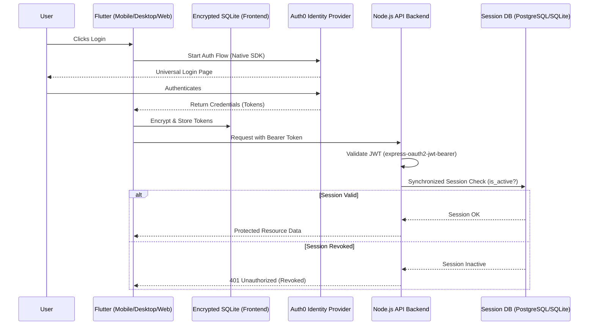

# Technical Plan: Refactoring Auth0 Authentication Flow (Refined)

## 1. Overview
This plan outlines the refactoring of the Auth0 authentication flow to remove legacy custom wrappers, simplify the architecture, and implement a robust, secure persistence and validation strategy.

## 2. Current State vs. Future State

| Feature | Current State | Future State (Refactored) |
|---------|---------------|---------------------------|
| **Web Auth** | Custom `web/auth0-bridge.js` | Native `auth0_flutter` Web support |
| **Backend Validation** | Custom `AuthService.validateToken` | `express-oauth2-jwt-bearer` + DB Session Sync |
| **Session Tracking** | Inconsistent manual registration | Synchronized check against `user_sessions` |
| **Frontend Storage** | `FlutterSecureStorage` (standard) | Encrypted SQLite Persistence Layer |
| **Database Support** | Mixed/Inconsistent | SQLite (Local/Dev) & PostgreSQL (Cloud/Prod) |

## 3. Refined Architecture (Mermaid)

## 4. Implementation Steps

### Phase 1: Frontend (Flutter)
- **Remove `web/auth0-bridge.js`**: Delete custom bridge and references.
- **Implement Secure SQLite Layer**:
    - Create `TokenStorageService` using `sqflite` (mobile) and `sqflite_common_ffi` (desktop).
    - Implement encryption for sensitive fields (access/refresh tokens) using AES.
    - Update `Auth0AuthProvider.initialize()` to recover state from this layer on app restart.
- **Update `Auth0AuthProvider`**:
    - Use native `auth0_flutter` for Web.
    - Synchronize Auth0 credentials with the new `TokenStorageService`.
- **Refactor `AuthService`**:
    - Streamline state management and provider communication.

### Phase 2: Backend (Node.js)
- **Overhaul Validation Strategy**:
    - Implement `express-oauth2-jwt-bearer` and `jwks-rsa`.
    - Configure strict audience, issuer, and scope verification.
- **Synchronized Session Middleware**:
    - Create a middleware that checks the validated JWT's `sub` or `token_hash` against the `user_sessions` table.
    - Ensure it handles both SQLite (local) and PostgreSQL (cloud) via the existing `runQuery` abstraction.
    - Implement revocation logic (marking sessions as inactive in DB).
- **Streamline User Resolution**:
    - Trigger `resolveUserId` from validated JWT payload.

### Phase 3: Cleanup & Testing
- Remove unused dependencies (e.g., `jwks-rsa` if covered by new middleware, `jwt_decoder` if not needed).
- Verify cross-platform login: Android, iOS, Windows, and Web.
- Perform security audit on token handling.

## 5. Security Compliance
- **OIDC Standards**: Strict adherence to OpenID Connect standards.
- **Token Security**: Tokens never exposed to application logs.
- **Statelessness**: Reduces DB dependency for auth, improving scalability and reducing attack surface.