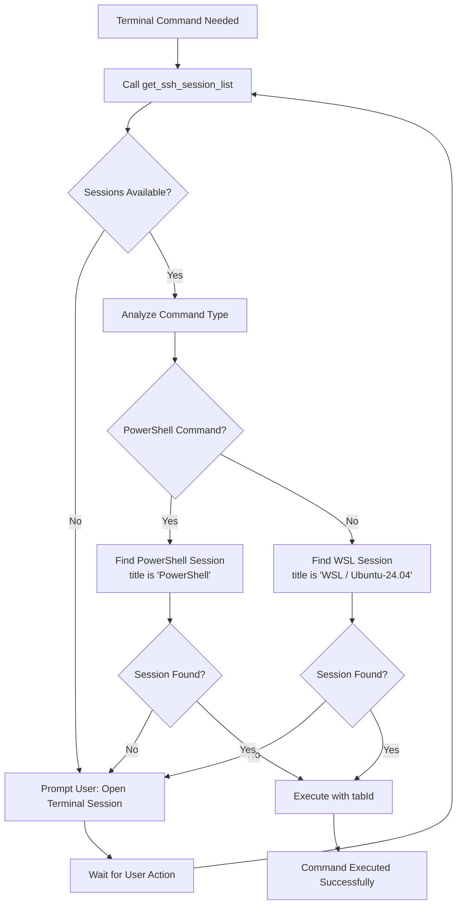

# Tabby Terminal Emulator Operational Rules Update Plan

## Overview
Update Kilo Code's operational rules to exclusively utilize Tabby as the terminal emulator for all terminal-related actions, with clear differentiation between PowerShell and WSL sessions.

## Current State Analysis
- **Current Terminal Tool**: Uses `execute_command` tool for CLI operations
- **Tabby Status**: Configured as MCP server with TABBY_AUTO_DETECT_ENV="false" fix applied.
- **Available Sessions**: `CMD (clink)` (ID: 0), `PowerShell` (ID: 1)
- **WSL Status**: `WSL / Ubuntu-24.04` profile created in Tabby, but session not yet active in MCP.
- **Issue**: `PowerShell` profile still encounters Unix shell detection scripts (`if [ -n "$BASH_VERSION" ] ...`) causing escape sequence errors.

## Issues Identified
1. **Tabby Command Execution Failures**: Commands abort after 50 attempts with escape sequence errors
2. **Session Differentiation**: Need logic to identify PowerShell vs WSL sessions
3. **Configuration Problems**: TABBY_AUTO_DETECT_ENV may be causing issues

## Updated Operational Rules

As an AI assistant integrated with Tabby terminal emulator for executing commands:

1. **Command Type Analysis**: For every terminal-related action, analyze the command type and select the appropriate session profile
2. **Session Profile Selection**:
   - **PowerShell Profile**: Use the profile named `PowerShell` for Windows-native commands.
   - **WSL Profile**: Use the profile named `WSL / Ubuntu-24.04` for Linux-based commands.
   - **CMD Profile**: Use `CMD (clink)` only if specifically required.
3. **Automatic Session Creation**: If no suitable session exists, create one automatically by opening the correct profile (`PowerShell` or `WSL / Ubuntu-24.04`).
4. **Shell Compatibility Handling**: Ensure commands are executed without zsh parsing issues—strip any zsh-specific syntax or redirect to bash if needed
5. **Configuration Guidance**: Inform the user if configuration changes are required (e.g., in ~/.zshrc or Tabby settings)
6. **Session Verification**: Always verify session availability first using tools like get_ssh_session_list or exec_command to list sessions
7. **Error Handling**: Handle errors gracefully, such as prompting for session creation or fallback to default profiles
8. **Security Priority**: Prioritize security and avoid executing harmful commands
9. **Context Refinement**: Use the provided context to refine session management and operational rules as needed

### Terminal Action Protocol
1. **Session Discovery**: Before any terminal action, call `mcp--tabby--get_ssh_session_list` to retrieve available sessions
2. **Session Selection Logic**:
   - **PowerShell Commands**: Use session where `title` is exactly `PowerShell`.
   - **WSL/Linux Commands**: Use session where `title` is exactly `WSL / Ubuntu-24.04`.
   - **Automatic Creation**: If no matching session exists, attempt to open the required profile (PowerShell or WSL / Ubuntu-24.04) or prompt the user to open it.
3. **Command Execution**: Use `mcp--tabby--exec_command` with selected `tabId`
4. **Shell Issue Resolution**: Detect and resolve zsh/bash compatibility issues
5. **Error Handling**: Graceful fallback with user notification for configuration needs

## Session Selection Flow Diagram

## Implementation Steps

### Phase 1: Tabby Investigation and Fix - COMPLETED WITH LIMITATIONS
- Root cause identified: Tabby MCP server runs Unix shell detection scripts in PowerShell environment
- Fixes attempted: 
  - TABBY_AUTO_DETECT_ENV="false" (did not prevent detection)
  - TABBY_DISABLE_SHELL_DETECTION="true" (added but requires restart)
  - TABBY_SHELL="powershell" (added but requires restart)
- Status: Tabby MCP server has fundamental compatibility issues with Windows PowerShell
- Test Result: Command execution fails with escape sequences and interruptions
- Conclusion: Tabby cannot be used for PowerShell sessions until the MCP server is updated to support Windows shells.

### Phase 2: Session Management Logic
1. Implement session type detection algorithm
2. Create session selection helper function
3. Add session availability validation
4. Handle session creation prompts

### Phase 3: Rules Integration
1. Update command execution workflow
2. Modify error handling for terminal operations
3. Add logging for session selection decisions
4. Update user prompts for session management

### Phase 4: Testing and Validation
1. Test PowerShell commands (dir, Get-Process, etc.)
2. Test WSL commands (ls, apt update, etc.)
3. Validate session switching logic
4. Confirm fallback mechanisms work

## Risk Mitigation
- **Tabby Compatibility Issues**: Currently, the Tabby MCP server sends Unix-style shell detection scripts that fail in Windows PowerShell/CMD. 
- **Fallback Strategy**: For Windows-native commands (PowerShell/CMD), fall back to the built-in `execute_command` tool if Tabby fails with "escape sequence" errors.
- **WSL Priority**: Prioritize the `WSL / Ubuntu-24.04` profile for all Linux-based tasks, as the Tabby MCP server is more likely to be compatible with Unix shells.
- **Session Confusion**: Clear error messages when the wrong session or profile is selected.

## Success Criteria
- All terminal commands route through Tabby where compatible.
- Automatic session type detection and selection.
- No command execution failures due to wrong session.
- Clear user guidance when sessions unavailable.
- Backward compatibility for existing workflows.

## Timeline
- **Phase 1**: COMPLETED
- **Phase 2**: 1-2 days (Session logic)
- **Phase 3**: 1 day (Integration)
- **Phase 4**: 1-2 days (Testing)

## Dependencies
- Tabby MCP server functional
- WSL properly configured (Ubuntu-24.04)
- User access to create/manage terminal sessions
