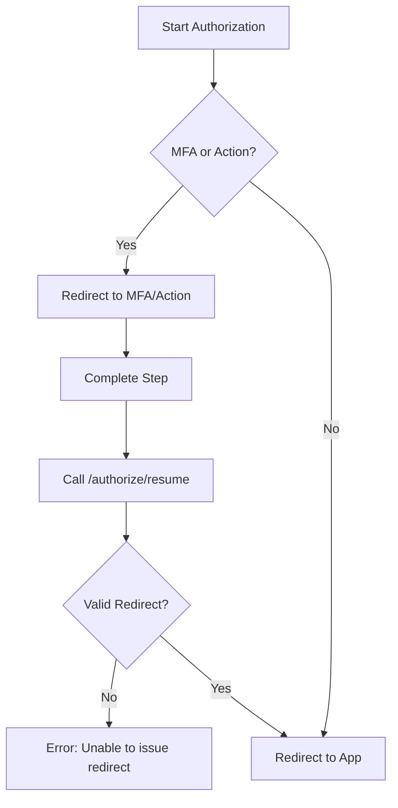

# Auth0 Troubleshooting Plan: resolving "Unable to issue redirect"

This plan outlines the steps to troubleshoot and resolve the Auth0 error `server_error: Unable to issue redirect for OAuth 2.0 transaction` occurring at the `/authorize/resume` endpoint.

## Problem Analysis
The error usually indicates a mismatch between the requested `redirect_uri` and the configured "Allowed Callback URLs", or a session/state loss during the authorization flow (e.g., after an Action or MFA).

## Troubleshooting Steps

### 1. Authenticate with Auth0 CLI
Login to the specific tenant:
```bash
auth0 login --tenant dev-v2f2p008x3dr74ww.us.auth0.com
```

### 2. Inspect Application Configuration
Retrieve the current settings for the main application:
```bash
auth0 apps show FuXPnevXpp311CdYHGsbNZe9t3D8Ts7A --json
```

### 3. Verify URLs and Origins
Check the output of the previous command for:
- `callbacks`: Should include all valid redirect targets (e.g., `https://api.cloudtolocalllm.online/callback`).
- `web_origins`: Should include the origin of the requesting application (e.g., `https://app.cloudtolocalllm.online`).

### 4. Tail Logs for Session/State Mismatches
Start tailing logs and trigger the error to see detailed failure reasons:
```bash
auth0 logs tail
```
Look for `fapi` (failed API) or `fce` (failed cross-origin authentication) events. Specifically, check if the `description` field mentions:
- "The redirect URI is not authorized"
- "Session not found" or "Transaction not found"
- "Invalid state"

### 5. Diagnosis & Validation
Based on common occurrences, the issue is likely:
1.  **Redirect URI Mismatch:** The URL the app is trying to return to after a step (like MFA or an Action) is not in the allowed list.
2.  **Session/State Loss:** The browser is blocking the Auth0 session cookie (SameSite issues) or the transaction has timed out.

**Validation:**
Check the `details` object in the `auth0 logs tail` output. If you see a `redirect_uri` that differs from `https://api.cloudtolocalllm.online/callback`, that is the mismatch.

### 6. Update Application Settings
If a mismatch is found, update the application settings using the following syntax:
```bash
auth0 apps update FuXPnevXpp311CdYHGsbNZe9t3D8Ts7A \
  --callbacks "https://api.cloudtolocalllm.online/callback,http://localhost:3000/callback" \
  --web-origins "https://api.cloudtolocalllm.online,http://localhost:3000" \
  --origins "https://api.cloudtolocalllm.online,http://localhost:3000"
```

## Mermaid Workflow



## Proposed Actions
1. Execute `auth0 login`.
2. Compare CLI output with `config/auth0/config.json`.
3. Verify if `https://api.cloudtolocalllm.online/callback` is the actual URI being sent by the client.
4. Add missing URIs if necessary.
