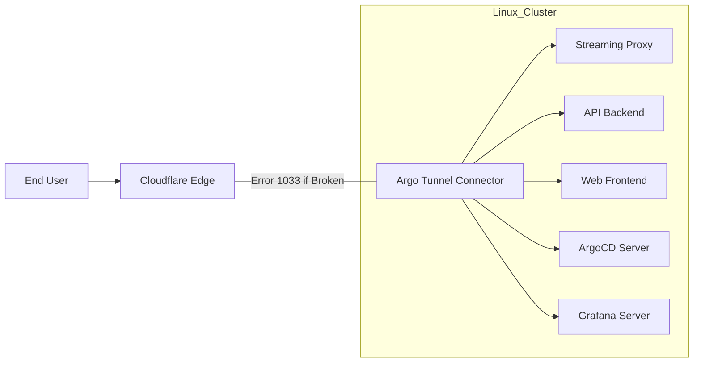

# SOP: Cloudflare Error 1033 Restoration Protocol
**High-Priority Technical Restoration for CloudToLocalLLM**

## 1. Executive Summary
This Standard Operating Procedure (SOP) defines the restoration workflow for resolving Cloudflare Error 1033 (Argo Tunnel Connection Refused) affecting the entire `cloudtolocalllm.online` service stack. 

### ⚠️ Security Warning: Credential Management
- **Mandatory Practice:** Use Environment Variables, Kubernetes Secrets, or GitHub Secrets to inject credentials at runtime.

## 2. Administrative Profile
- **Admin Email:** `cmaltais@cloudtolocalllm.online`
- **Tunnel Name:** `cloudtolocalllm-aks`
- **Tunnel UUID:** `62da6c19-947b-4bf6-acad-100a73de4e0d`

## 3. System Architecture Flow


## 4. Phase 1: Diagnostic Suite (Cloudflare API v4)
Execute these commands using secure environment variables.

### 4.1. Initialize Environment Variables (Interactive Prompt)
```bash
# Read credentials from user input to avoid history logging
read -rs -p "Enter Cloudflare Global API Key: " CF_KEY
export CF_KEY
export CF_EMAIL="cmaltais@cloudtolocalllm.online"
export TUNNEL_ID="62da6c19-947b-4bf6-acad-100a73de4e0d"
```

### 4.2. Query Tunnel Health
```bash
# Get Account ID and verify tunnel status
ACCOUNT_ID=$(curl -s -X GET "https://api.cloudflare.com/client/v4/accounts" \
     -H "X-Auth-Email: $CF_EMAIL" \
     -H "X-Auth-Key: $CF_KEY" | jq -r '.result[0].id')

curl -s -X GET "https://api.cloudflare.com/client/v4/accounts/$ACCOUNT_ID/cfd_tunnel/$TUNNEL_ID/connections" \
     -H "X-Auth-Email: $CF_EMAIL" \
     -H "X-Auth-Key: $CF_KEY" | jq .result[]
```

## 5. Phase 2: Exhaustive Ingress Audit
Audit `config.yaml` to ensure all critical service paths are correctly routed.

### 5.1. Ingress Rule Checklist
| Hostname | Path | Service URL |
| :--- | :--- | :--- |
| `app.cloudtolocalllm.online` | `/ws` | `http://streaming-proxy.cloudtolocalllm.svc.cluster.local:3001` |
| `app.cloudtolocalllm.online` | `/api/tunnel` | `http://streaming-proxy.cloudtolocalllm.svc.cluster.local:3001` |
| `app.cloudtolocalllm.online` | `/health` | `http://api-backend.cloudtolocalllm.svc.cluster.local:8080` |
| `app.cloudtolocalllm.online` | `/api` | `http://api-backend.cloudtolocalllm.svc.cluster.local:8080` |
| `app.cloudtolocalllm.online` | `(root)` | `http://web.cloudtolocalllm.svc.cluster.local:8080` |
| `api.cloudtolocalllm.online` | `/health` | `http://api-backend.cloudtolocalllm.svc.cluster.local:8080` |
| `api.cloudtolocalllm.online` | `(root)` | `http://api-backend.cloudtolocalllm.svc.cluster.local:8080` |
| `argocd.cloudtolocalllm.online`| `(root)` | `http://argocd-server.argocd.svc.cluster.local:80` |
| `grafana.cloudtolocalllm.online`| `(root)` | `http://grafana.cloudtolocalllm.svc.cluster.local:3000` |
| `cloudtolocalllm.online` | `(root)` | `http://web.cloudtolocalllm.svc.cluster.local:8080` |

## 6. Phase 3: Automated Secret Management (CI/CD)
Integrate GitHub Actions for secure provisioning.

### 6.1. GitHub Actions Permission Verification
**CRITICAL:** Ensure the workflow has the following permissions defined:
```yaml
permissions:
  contents: read
  id-token: write
```

### 6.2. GitHub Actions Workflow (Snippet)
```yaml
jobs:
  deploy-secrets:
    runs-on: ubuntu-latest
    permissions:
      contents: read
      id-token: write
    steps:
      - name: Checkout Code
        uses: actions/checkout@v4

      - name: Provision Tunnel Credentials
        run: |
          kubectl create secret generic tunnel-credentials \
            --from-literal=token=${{ secrets.CLOUDFLARE_TUNNEL_TOKEN }} \
            --namespace=cloudtolocalllm \
            --dry-run=client -o yaml | kubectl apply -f -
```

## 7. Phase 4: Linux-Specific Remediation
```bash
# Restart service and monitor logs
sudo systemctl restart cloudflared
sudo journalctl -u cloudflared -f -n 200
```

## 8. Phase 5: Stack-Wide Verification
```bash
# Verify CNAMEs
for endpoint in "cloudtolocalllm.online" "app.cloudtolocalllm.online" "api.cloudtolocalllm.online" "argocd.cloudtolocalllm.online" "grafana.cloudtolocalllm.online"; do
    dig +short $endpoint CNAME
done

# Test HTTP/2 Handshake
urls=("https://cloudtolocalllm.online/" "https://app.cloudtolocalllm.online/health" "https://argocd.cloudtolocalllm.online/")
for url in "${urls[@]}"; do
    curl -I -s --http2 "$url" | grep -E "HTTP/2|server:|CF-Ray:"
done
```

---
**SOP VERSION:** 1.5.0 (INGRESS-EXHAUSTIVE)
**DATE:** 2025-12-27
**STATUS:** HIGH-PRIORITY RESTORATION - EXHAUSTIVE INGRESS READY
